# 学习文档

> Spring Cloud 包括 Spring Cloud Netflix 和 Spring Cloud Alibaba
>
> Docker + K8S
>
> MiniIO
>
> Redis

## Spring Cloud

Spring Cloud 是分布式微服务架构的一站式解决方案，它提供了一套简单易用的编程模型，使我们能在 Spring Boot 的基础上轻松地实现微服务系统的构建。

Spring Cloud 被称为构建分布式微服务系统的“全家桶”，它并不是某一门技术，而是一系列微服务解决方案或框架的有序集合。它将市面上成熟的、经过验证的微服务框架整合起来，并通过 Spring Boot 的思想进行再封装，屏蔽调其中复杂的配置和实现原理，最终为开发人员提供了一套简单易懂、易部署和易维护的分布式系统开发工具包。

Spring Cloud 本身并不是一个拿来即可用的框架，它是一套微服务规范，共有两代实现。

- Spring Cloud Netflix 是 Spring Cloud 的第一代实现，主要由 Eureka、Ribbon、Feign、Hystrix 等组件组成。
- Spring Cloud Alibaba 是 Spring Cloud 的第二代实现，主要由 Nacos、Sentinel、Seata 等组件组成。

### 微服务是什么?

微服务（MicroServices）最初是由 Martin Fowler 于 2014 年发表的论文 《[MicroServices](https://martinfowler.com/articles/microservices.html)》 中提出的名词，它一经提出就成为了技术圈的热门话题。

微服务，我们可以从字面上去理解，即“微小的服务”，我们可以分为“服务”和“微小”两个方面：

1. 所谓“服务”，其实指的是项目中的功能模块，它可以帮助用户解决某一个或一组问题，在开发过程中表现为 IDE（集成开发环境，例如 Eclipse 或 IntelliJ IDEA）中的一个工程或 Moudle。
2. “微小”则强调的是单个服务的大小，主要体现为以下两个方面：
    - 微服务体积小，复杂度低：一个微服务通常只提供单个业务功能的服务，即一个微服务只专注于做好一件事，因此微服务通常代码较少，体积较小，复杂度也较低。
    - 微服务团队所需成员少：一般情况下，一个微服务团队只需要 8 到 10 名人员（开发人员 2 到 5 名）即可完成从设计、开发、测试到运维的全部工作。

#### 微服务架构

**微服务架构是一种系统架构的设计风格**。与传统的单体式架构（ALL IN ONE）不同，微服务架构提倡将一个单一的应用程序拆分成多个小型服务，这些小型服务都在各自独立的进程中运行，服务之间使用轻量级通信机制（通常是 HTTP RESTFUL API）进行通讯。

通常情况下，**这些小型服务都是围绕着某个特定的业务进行构建的，每一个服务只专注于完成一项任务并把它做好** ，即“专业的人做专业的事”。

每个服务都能够独立地部署到各种环境中，例如开发环境、测试环境和生产环境等，每个服务都能独立启动或销毁而不会对其他服务造成影响。

这些服务之间的交互是使用标准的通讯技术进行的，因此不同的服务可以使用不同数据存储技术，甚至使用不同的编程语言。

#### 微服务架构 vs 单体架构

单体架构是微服务架构出现之前业界最经典的软件架构类型，许多早期的项目采用的也都是单体架构。单体架构将应用程序中所有业务逻辑都编写在同一个工程中，最终经过编译、打包，部署在一台服务器上运行。

在项目的初期，单体架构无论是在开发速度还是运维难度上都具有明显的优势。但随着业务复杂度的不断提高，单体架构的许多弊端也逐渐凸显出来：

- 随着业务复杂度的提高，单体应用（采用单体架构的应用程序）的代码量也越来越大，**导致代码的可读性、可维护性以及扩展性下降**。
- 随着用户越来越多，程序所承受的并发越来越高，而**单体应用处理高并发的能力有限**。
- 单体应用将所有的业务都集中在同一个工程中，修改或增加业务都可能会对其他业务造成一定的影响，**导致测试难度增加**。

对比微服务架构和单体架构的不同

| 不同点       | 微服务架构                                                   | 单体架构                                                     |
| ------------ | ------------------------------------------------------------ | ------------------------------------------------------------ |
| 团队规模     | 微服务架构可以将传统模式下的单个应用拆分为多个独立的服务，每个微服务都可以单独开发、部署和维护。每个服务从设计、开发到维护所需的团队规模小，团队管理成本小。 | 单体架构的应用程序通常需要一个大型团队，围绕一个庞大的应用程序工作，团队管理的成本大。 |
| 数据存储方式 | 不同的微服务可以使用不同的数据存储方式，例如有的用 Redis，有的使用 MySQL。 | 单一架构的所有模块共享同一个公共数据库，存储方式相对单一。   |
| 部署方式     | 微服务架构中每个服务都可以独立部署，也可以独立于其他服务进行扩展。如果部署得当，基于微服务的架构可以帮助企业提高应用程序的部署效率。 | 采用单体架构的应用程序的每一次功能更改或 bug 修复都必须对整个应用程序重新进行部署。 |
| 开发模式     | 在采用微服务架构的应用程序中，不同模块可以使用不同的技术或语言进行开发，开发模式更加灵活。 | 在采用单体架构的应用程序中，所有模块使用的技术和语言必须相同，开发模式受限。 |
| 故障隔离     | 在微服务架构中，故障被隔离在单个服务中，避免系统的整体崩溃。 | 在单体架构中，当一个组件出现故障时，故障很可能会在进程中蔓延，导致系统全局不可用。 |
| 项目结构     | 微服务架构将单个应用程序拆分为多个独立的小型服务，每个服务都可以独立的开发、部署和维护，每个服务都能完成一项特定的业务需求。 | 单体架构的应用程序，所有的业务逻辑都集中在同一个工程中。     |

#### 微服务特点

微服务具有以下特点：

- 服务按照业务来划分，每个服务通常**只专注于某一个特定的业务、所需代码量小，复杂度低、易于维护**。
- 每个微服都可以独立开发、部署和运行，且代码量较少，因此启动和运行速度较快。
- 每个服务从设计、开发、测试到维护所需的团队规模小，一般 8 到 10 人，团队管理成本小。
- 采用单体架构的应用程序只要有任何修改，就需要重新部署整个应用才能生效，而微服务则完美地解决了这一问题。在微服架构中，某个微服务修改后，只需要重新部署这个服务即可，而不需要重新部署整个应用程序。
- 在微服务架构中，开发人员可以结合项目业务及团队的特点，合理地选择语言和工具进行开发和部署，**不同的微服务可以使用不同的语言和工具**。
- **微服务具备良好的可扩展性**。随着业务的不断增加，微服务的体积和代码量都会急剧膨胀，此时我们可以根据业务将微服务再次进行拆分；除此之外，当用户量和并发量的增加时，我们还可以将微服务集群化部署，从而增加系统的负载能力。
- 微服务能够与容器（Docker）配合使用，**实现快速迭代、快速构建、快速部署**。
- 微服务具有良好的**故障隔离能力**，当应用程序中的某个微服发生故障时，该故障会被隔离在当前服务中，而不会波及到其他微服务造成整个系统的瘫痪。
- 微服务系统**具有链路追踪的能力**。

#### 微服务框架

微服务架构是一种系统架构风格和思想，想要真正地搭建一套微服务系统，则需要微服务框架的支持。

##### Java微服务框架

市面上的 Java 微服务框架主要有以下 5 种：

- Spring Cloud：它能够基于 REST 服务来构建服务，帮助架构师构建出一套完整的微服务技术生态链。
- Dropwizard：用于开发高性能和 Restful 的 Web 服务，对配置、应用程序指标、日志记录和操作工具都提供了开箱即用的支持。
- Restlet： 该框架遵循 RST 架构风格，可以帮助 Java 开发人员构建微服务。
- Spark：最好的 Java 微服务框架之一，该框架支持通过 Java 8 和 Kotlin 创建微服务架构的应用程序。
- Dubbo：由阿里巴巴开源的分布式服务治理框架。

### Spring Cloud是什么?

Spring Cloud 是一款基于 Spring Boot 实现的微服务框架。Spring Cloud 源自 Spring 社区，主要由 Pivotal 和 Netflix 两大公司提供技术迭代和维护。

随着微服务的火爆流行，国内外各大互联网公司都相继分享了他们在微服务架构中，针对不同场景出现的各种问题的解决方案和开源框架。

- **服务治理**：阿里巴巴开源的 Dubbo 和当当网在其基础上扩展出来的 DubboX、Netflix 的 Eureka 以及 Apache 的 Consul 等。
- **分布式配置管理**：百度的 Disconf、Netflix 的 Archaius、360 的 QConf、携程的 Apollo 以及 Spring Cloud 的 Config 等。
- **批量任务**：当当网的 Elastic-Job、LinkedIn 的 Azkaban 以及 Spring Cloud 的 Task 等。
- **服务跟踪**：京东的 Hydra、Spring Cloud 的 Sleuth 以及 Twitter 的 Zipkin 等。
- **……**

以上这些微服务框架或解决方案都具有以下 2 个特点：

- 对于同一个微服务问题，**各互联网公司给出的解决方案各不相同**。
- **一个微服务框架或解决方案都只能解决微服务中的某一个或某几个问题**，对于其他问题则无能为力。

Spring Cloud 被称为构建分布式微服务系统的“全家桶”，它并不是某一门技术，而是一系列微服务解决方案或框架的有序集合。它将市面上成熟的、经过验证的微服务框架整合起来，并通过 Spring Boot 的思想进行再封装，屏蔽调其中复杂的配置和实现原理，最终为开发人员提供了一套简单易懂、易部署和易维护的分布式系统开发工具包。

#### Spring Cloud常用组件

Spring Cloud 包括 Spring Cloud Gateway、Spring Cloud Config、Spring Cloud Bus 等近 20 个服务组件，这些组件提供了服务治理、服务网关、智能路由、负载均衡、熔断器、监控跟踪、分布式消息队列、配置管理等领域的解决方案。

| Spring Cloud 组件            | 描述                                                         |
| ---------------------------- | ------------------------------------------------------------ |
| Spring Cloud Netflix Eureka  | Spring Cloud Netflix 中的服务治理组件，包含服务注册中心、服务注册与发现机制的实现。 |
| Spring Cloud Netflix Ribbon  | Spring Cloud Netflix 中的服务调用和客户端负载均衡组件。      |
| Spring Cloud Netflix Hystrix | 人称“豪猪哥”，Spring Cloud Netflix 的容错管理组件，为服务中出现的延迟和故障提供强大的容错能力。 |
| Spring Cloud Netflix Feign   | 基于 Ribbon 和 Hystrix 的声明式服务调用组件。                |
| Spring Cloud Netflix Zuul    | Spring Cloud Netflix 中的网关组件，提供了智能路由、访问过滤等功能。 |
| Spring Cloud Gateway         | 一个基于 Spring 5.0，Spring Boot 2.0 和 Project Reactor 等技术开发的网关框架，它使用 Filter 链的方式提供了网关的基本功能，例如安全、监控/指标和限流等。 |
| Spring Cloud Config          | Spring Cloud 的配置管理工具，支持使用 Git 存储配置内容，实现应用配置的外部化存储，并支持在客户端对配置进行刷新、加密、解密等操作。 |
| Spring Cloud Bus             | Spring Cloud 的事件和消息总线，主要用于在集群中传播事件或状态变化，以触发后续的处理，例如动态刷新配置。 |
| Spring Cloud Stream          | Spring Cloud 的消息中间件组件，它集成了 Apache Kafka 和 RabbitMQ 等消息中间件，并通过定义绑定器作为中间层，完美地实现了应用程序与消息中间件之间的隔离。通过向应用程序暴露统一的 Channel 通道，使得应用程序不需要再考虑各种不同的消息中间件实现，就能轻松地发送和接收消息。 |
| Spring Cloud Sleuth          | Spring Cloud 分布式链路跟踪组件，能够完美的整合 Twitter 的 Zipkin。 |

#### Spring Boot 和 Spring Cloud的区别和联系

Spring Boot 和 Spring Cloud 都是 Spring 大家族的一员，它们在微服务开发中都扮演着十分重要的角色，两者之间既存在区别也存在联系。

1. Spring Boot 和 Sprng Cloud 分工不同

    Spring Boot 是一个基于 Spring 的快速开发框架，它能够帮助开发者迅速搭 Web 工程。在微服务开发中，Spring Boot 专注于快速、方便地开发单个微服务。

    Spring Cloud 是微服务架构下的一站式解决方案。Spring Cloud 专注于全局微服务的协调和治理工作。换句话说，Spring Cloud 相当于微服务的大管家，负责将 Spring Boot 开发的一个个微服务管理起来，并为它们提供配置管理、服务发现、断路器、路由、微代理、事件总线、决策竞选以及分布式会话等服务。

2. Spring Cloud 是基于 Spring Boot 实现的

    Spring Cloud 是基于 Spring Boot 实现的。与 Spring Boot 类似，Spring Cloud 也为提供了一系列 Starter，这些 Starter 是 Spring Cloud 使用 Spring Boot 思想对各个微服务框架进行再封装的产物。它们屏蔽了这些微服务框架中复杂的配置和实现原理，使开发人员能够快速、方便地使用 Spring Cloud 搭建一套分布式微服务系统。

3. Spring Boot 和 Spring Cloud 依赖项数量不同

    Spring Boot 属于一种轻量级的框架，构建 Spring Boot 工程所需的依赖较少。

    Spring Cloud 是一系列微服务框架技术的集合体，它的每个组件都需要一个独立的依赖项（Starter POM），因此想要构建一套完整的 Spring Cloud 工程往往需要大量的依赖项。

4. Spring Cloud 不能脱离 Spring Boot 单独运行

    Spring Boot 不需要 Spring Cloud，就能直接创建可独立运行的工程或模块。

    Spring Cloud 是基于 Spring Boot 实现的，它不能独立创建工程或模块，更不能脱离 Spring Boot 独立运行。

### Spring Cloud Eureka

> Eureka：Spring Cloud服务注册与发现组件

Eureka 一词来源于古希腊词汇，是“发现了”的意思。在软件领域，Eureka 是 Netflix 公司开发的一款开源的服务注册与发现组件。

Spring Cloud 将 Eureka 与 Netflix 中的其他开源服务组件（例如 Ribbon、Feign 以及 Hystrix 等）一起整合进 Spring Cloud Netflix 模块中，整合后的组件全称为 Spring Cloud Netflix Eureka。

Eureka 是 Spring Cloud Netflix 模块的子模块，它是 Spring Cloud 对 Netflix Eureka 的二次封装，主要负责 Spring Cloud 的服务注册与发现功能。

Spring Cloud 使用 Spring Boot 思想为 Eureka 增加了自动化配置，开发人员只需要引入相关依赖和注解，就能将 Spring Boot 构建的微服务轻松地与 Eureka 进行整合。

#### Eureka 两大组件

Eureka 采用 CS（Client/Server，客户端/服务器） 架构，它包括以下两大组件：

- **Eureka Server**：Eureka 服务注册中心，**主要用于提供服务注册功能**。当微服务启动时，会将自己的服务注册到 Eureka Server。Eureka Server 维护了一个可用服务列表，存储了所有注册到 Eureka Server 的可用服务的信息，这些可用服务可以在 Eureka Server 的管理界面中直观看到。
- **Eureka Client**：Eureka 客户端，**通常指的是微服务系统中各个微服务**，主要用于和 Eureka Server 进行交互。在微服务应用启动后，Eureka Client 会向 Eureka Server 发送心跳（默认周期为 30 秒）。若 Eureka Server 在多个心跳周期内没有接收到某个 Eureka Client 的心跳，Eureka Server 将它从可用服务列表中移除（默认 90 秒）。

#### Eureka 服务注册与发现

Eureka实现服务注册与发现的原理图


上图中共涉及到以下 3 个角色：

- **服务注册中心（Register Service）**：它是一个 Eureka Server，用于提供服务注册和发现功能。
- **服务提供者（Provider Service）**：它是一个 Eureka Client，用于提供服务。它将自己提供的服务注册到服务注册中心，以供服务消费者发现。
- **服务消费者（Consumer Service）**：它是一个 Eureka Client，用于消费服务。它可以从服务注册中心获取服务列表，调用所需的服务。


Eureka 实现服务注册与发现的流程如下：

1. 搭建一个 Eureka Server 作为服务注册中心；
2. 服务提供者 Eureka Client 启动时，会把当前服务器的信息以服务名（spring.application.name）的方式注册到服务注册中心；
3. 服务消费者 Eureka Client 启动时，也会向服务注册中心注册；
4. 服务消费者还会获取一份可用服务列表，该列表中包含了所有注册到服务注册中心的服务信息（包括服务提供者和自身的信息）；
5. 在获得了可用服务列表后，服务消费者通过 HTTP 或消息中间件远程调用服务提供者提供的服务。

服务注册中心（Eureka Server）所扮演的角色十分重要，它是服务提供者和服务消费者之间的桥梁。服务提供者只有将自己的服务注册到服务注册中心才可能被服务消费者调用，而服务消费者也只有通过服务注册中心获取可用服务列表后，才能调用所需的服务。

#### Eureka Server集群

在微服务架构中，一个系统往往由十几甚至几十个服务组成，若将这些服务全部注册到同一个 Eureka Server 中，就极有可能导致 Eureka Server 因不堪重负而崩溃，最终导致整个系统瘫痪。**解决这个问题最直接的办法就是部署 Eureka Server 集群。**

我们知道，在 Eureka 实现服务注册与发现时一共涉及了 3 个角色：服务注册中心、服务提供者以及服务消费者，这三个角色分工明确，各司其职。但是其实在 Eureka 中，**所有服务都既是服务消费者也是服务提供者**，服务注册中心 Eureka Server 也不例外。

我们在搭建服务注册中心时，在 application.yml 中涉及了这样的配置：

```yml
eureka:  
  client:    
    register-with-eureka: false  #false 表示不向注册中心注册自己。    
    fetch-registry: false  #false表示自己端就是注册中心，职责就是维护服务实例，并不需要去检索服务
```

举个例子，有两个 Eureka Server 分别为 A 和 B，虽然 A 不能将自己注册到 A 上，B 也不能将自己注册到 B 上，但 A 是可以作为一个服务把自己注册到 B 上的，同理 B 也可以将自己注册到 A 上。

这样就可以**形成一组互相注册的 Eureka Server 集群**，当服务提供者发送注册请求到 Eureka Server 时，Eureka Server 会将请求转发给集群中所有与之相连的 Eureka Server 上，以实现 Eureka Server 之间的服务同步。

通过服务同步，服务消费者可以在集群中的任意一台 Eureka Server 上获取服务提供者提供的服务。这样，即使集群中的某个服务注册中心发生故障，服务消费者仍然可以从集群中的其他 Eureka Server 中获取服务信息并调用，而不会导致系统的整体瘫痪，这就是 Eureka Server 集群的高可用性。

#### Eureka 自我保护机制

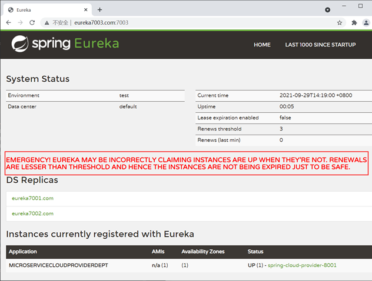

这个警告是触发了 Eureka 的自我保护机制而出现的。默认情况下，如果 Eureka Server 在一段时间内（默认为 90 秒）没有接收到某个服务提供者（Eureka Client）的心跳，就会将这个服务提供者提供的服务从服务注册表中移除。 这样服务消费者就再也无法从服务注册中心中获取到这个服务了，更无法调用该服务。

但在实际的分布式微服务系统中，健康的服务（Eureka Client）也有可能会由于网络故障（例如网络延迟、卡顿、拥挤等原因）而无法与 Eureka Server 正常通讯。若此时 Eureka Server 因为没有接收心跳而误将健康的服务从服务列表中移除，这显然是不合理的。而 Eureka 的自我保护机制就是来解决此问题的。

**所谓 “Eureka 的自我保护机制”，其中心思想就是“好死不如赖活着”。**如果 Eureka Server 在一段时间内没有接收到 Eureka Client 的心跳，那么 Eureka Server 就会开启自我保护模式，**将所有的 Eureka Client 的注册信息保护起来，而不是直接从服务注册表中移除**。一旦网络恢复，这些 Eureka Client 提供的服务还可以继续被服务消费者消费。

综上，Eureka 的自我保护机制是一种应对网络异常的安全保护措施。它的架构哲学是：宁可同时保留所有微服务（健康的服务和不健康的服务都会保留）也不盲目移除任何健康的服务。通过 Eureka 的自我保护机制，可以让 Eureka Server 集群更加的健壮、稳定。

默认情况下，Eureka 的自我保护机制是开启的，如果想要关闭，则需要在配置文件中添加以下配置。

```yml
eureka:
  server:
    enable-self-preservation: false # false 关闭 Eureka 的自我保护机制，默认是开启,一般不建议大家修改
```

### Spring Cloud Ribbon

> Ribbon：Spring Cloud负载均衡与服务调用组件

Spring Cloud Ribbon 是一套基于 Netflix Ribbon 实现的**客户端负载均衡和服务调用工具**。

Netflix Ribbon 是 Netflix 公司发布的开源组件，其主要功能是提供客户端的负载均衡算法和服务调用。Spring Cloud 将其与 Netflix 中的其他开源服务组件（例如 Eureka、Feign 以及 Hystrix 等）一起整合进 Spring Cloud Netflix 模块中，整合后全称为 Spring Cloud Netflix Ribbon。

Ribbon 是 Spring Cloud Netflix 模块的子模块，它是 Spring Cloud 对 Netflix Ribbon 的二次封装。通过它，我们可以将面向服务的 REST 模板（RestTemplate）请求转换为客户端负载均衡的服务调用。

Ribbon 是 Spring Cloud 体系中最核心、最重要的组件之一。它虽然只是一个工具类型的框架，并不像 Eureka Server（服务注册中心）那样需要独立部署，但它几乎存在于每一个使用 Spring Cloud 构建的微服务中。

**Spring Cloud 微服务之间的调用，API 网关的请求转发等内容，实际上都是通过 Spring Cloud Ribbon 来实现的**，包括后续我们要介绍的 [OpenFeign](http://c.biancheng.net/springcloud/open-feign.html) 也是基于它实现的。

#### 负载均衡

在任何一个系统中，负载均衡都是一个十分重要且不得不去实施的内容，它是系统处理高并发、缓解网络压力和服务端扩容的重要手段之一。

负载均衡（Load Balance） ，简单点说就是将用户的请求平摊分配到多个服务器上运行，以达到扩展服务器带宽、增强数据处理能力、增加吞吐量、提高网络的可用性和灵活性的目的。

常见的负载均衡方式有两种：

- 服务端负载均衡
- 客户端负载均衡

##### 服务器负载均衡

服务端负载均衡是最常见的负载均衡方式，其工作原理如下图。


服务端负载均衡是在客户端和服务端之间建立一个独立的负载均衡服务器，该服务器既可以是硬件设备（例如 F5），也可以是软件（例如 Nginx）。这个负载均衡服务器维护了一份可用服务端清单，然后通过心跳机制来删除故障的服务端节点，以保证清单中的所有服务节点都是可以正常访问的。

当客户端发送请求时，该请求不会直接发送到服务端进行处理，而是全部交给负载均衡服务器，由负载均衡服务器按照某种算法（例如轮询、随机等），从其维护的可用服务清单中选择一个服务端，然后进行转发。

服务端负载均衡具有以下特点：

- 需要建立一个独立的负载均衡服务器。
- 负载均衡是在客户端发送请求后进行的，因此客户端并不知道到底是哪个服务端提供的服务。
- 可用服务端清单存储在负载均衡服务器上。

##### 客户端负载均衡

相较于服务端负载均衡，客户端服务在均衡则是一个比较小众的概念，客户端负载均衡的工作原理如下图。

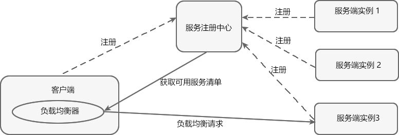

客户端负载均衡是将负载均衡逻辑以代码的形式封装到客户端上，即负载均衡器位于客户端。客户端通过服务注册中心（例如 Eureka Server）获取到一份服务端提供的可用服务清单。有了服务清单后，负载均衡器会在客户端发送请求前通过负载均衡算法选择一个服务端实例再进行访问，以达到负载均衡的目的。

客户端负载均衡也需要心跳机制去维护服务端清单的有效性，这个过程需要配合服务注册中心一起完成。

**Ribbon 就是一个基于 HTTP 和 TCP 的客户端负载均衡器**，当我们将 Ribbon 和 Eureka 一起使用时，Ribbon 会从 Eureka Server（服务注册中心）中获取服务端列表，然后通过负载均衡策略将请求分摊给多个服务提供者，从而达到负载均衡的目的。

客户端负载均衡具有以下特点：

- 负载均衡器位于客户端，不需要单独搭建一个负载均衡服务器。
- 负载均衡是在客户端发送请求前进行的，因此客户端清楚地知道是哪个服务端提供的服务。
- 客户端都维护了一份可用服务清单，而这份清单都是从服务注册中心获取的。

##### 服务器负载均衡 VS 客户端负载均衡

| 不同点                       | 服务端负载均衡                                               | 客户端负载均衡                                               |
| ---------------------------- | ------------------------------------------------------------ | ------------------------------------------------------------ |
| 是否需要建立负载均衡服务器   | 需要在客户端和服务端之间建立一个独立的负载均衡服务器。       | 将负载均衡的逻辑以代码的形式封装到客户端上，因此不需要单独建立负载均衡服务器。 |
| 是否需要服务注册中心         | 不需要服务注册中心。                                         | 需要服务注册中心。  在客户端负载均衡中，所有的客户端和服务端都需要将其提供的服务注册到服务注册中心上。 |
| 可用服务清单存储的位置       | 可用服务清单存储在位于客户端与服务器之间的负载均衡服务器上。 | 所有的客户端都维护了一份可用服务清单，这些清单都是从服务注册中心获取的。 |
| 负载均衡的时机               | 先将请求发送到负载均衡服务器，然后由负载均衡服务器通过负载均衡算法，在多个服务端之间选择一个进行访问；即在服务器端再进行负载均衡算法分配。  简单点说就是，先发送请求，再进行负载均衡。 | 在发送请求前，由位于客户端的服务负载均衡器（例如 Ribbon）通过负载均衡算法选择一个服务器，然后进行访问。  简单点说就是，先进行负载均衡，再发送请求。 |
| 客户端是否了解服务提供方信息 | 由于负载均衡是在客户端发送请求后进行的，因此客户端并不知道到底是哪个服务端提供的服务。 | 负载均衡是在客户端发送请求前进行的，因此客户端清楚的知道是哪个服务端提供的服务。 |

#### Ribbon 实现服务调用

Ribbon 可以与 RestTemplate（Rest 模板）配合使用，以实现微服务之间的调用。

RestTemplate 是 Spring 家族中的一个用于消费第三方 REST 服务的请求框架。RestTemplate 实现了对 HTTP 请求的封装，提供了一套模板化的服务调用方法。通过它，Spring 应用可以很方便地对各种类型的 HTTP 请求进行访问。

RestTemplate 针对各种类型的 HTTP 请求都提供了相应的方法进行处理，例如 HEAD、GET、POST、PUT、DELETE 等类型的 HTTP 请求，分别对应 RestTemplate 中的 headForHeaders()、getForObject()、postForObject()、put() 以及 delete() 方法。

#### Ribbon 实现负载均衡

Ribbon 是一个客户端的负载均衡器，它可以与 Eureka 配合使用轻松地实现客户端的负载均衡。Ribbon 会先从 Eureka Server（服务注册中心）去获取服务端列表，然后通过负载均衡策略将请求分摊给多个服务端，从而达到负载均衡的目的。

Spring Cloud Ribbon 提供了一个 IRule 接口，该接口主要用来定义负载均衡策略，它有 7 个默认实现类，每一个实现类都是一种负载均衡策略。

| 序号 | 实现类                    | 负载均衡策略                                                 |
| ---- | ------------------------- | ------------------------------------------------------------ |
| 1    | RoundRobinRule            | 按照线性轮询策略，即按照一定的顺序依次选取服务实例           |
| 2    | RandomRule                | 随机选取一个服务实例                                         |
| 3    | RetryRule                 | 按照 RoundRobinRule（轮询）的策略来获取服务，如果获取的服务实例为 null 或已经失效，则在指定的时间之内不断地进行重试（重试时获取服务的策略还是 RoundRobinRule 中定义的策略），如果超过指定时间依然没获取到服务实例则返回 null 。 |
| 4    | WeightedResponseTimeRule  | WeightedResponseTimeRule 是 RoundRobinRule 的一个子类，它对 RoundRobinRule 的功能进行了扩展。  根据平均响应时间，来计算所有服务实例的权重，响应时间越短的服务实例权重越高，被选中的概率越大。刚启动时，如果统计信息不足，则使用线性轮询策略，等信息足够时，再切换到 WeightedResponseTimeRule。 |
| 5    | BestAvailableRule         | 继承自 ClientConfigEnabledRoundRobinRule。先过滤点故障或失效的服务实例，然后再选择并发量最小的服务实例。 |
| 6    | AvailabilityFilteringRule | 先过滤掉故障或失效的服务实例，然后再选择并发量较小的服务实例。 |
| 7    | ZoneAvoidanceRule         | 默认的负载均衡策略，综合判断服务所在区域（zone）的性能和服务（server）的可用性，来选择服务实例。在没有区域的环境下，该策略与轮询策略类似。 |

#### 切换负载均衡策略

Spring Cloud Ribbon 默认使用轮询策略选取服务实例，我们也可以根据自身的需求切换负载均衡策略。

切换负载均衡策略的方法很简单，我们只需要在服务消费者（客户端）的配置类中，将 IRule 的其他实现类注入到容器中即可。

```java
@Bean
public IRule myRule() {
    // RandomRule 为随机策略
    return  new RandomRule();
}
```

#### 定制负载均衡策略

通常情况下，Ribbon 提供的这些默认负载均衡策略是可以满足我们的需求的，如果有特殊的要求，我们还可以根据自身需求定制负载均衡策略。

```java
//自定义 Ribbon 负载均衡策略在主启动类上使用 RibbonClient 注解，在该微服务启动时，就能自动去加载我们自定义的 Ribbon 配置类，从而是配置生效
// name 为需要定制负载均衡策略的微服务名称（application name）
// configuration 为定制的负载均衡策略的配置类，
// 且官方文档中明确提出，该配置类不能在 ComponentScan 注解（SpringBootApplication 注解中包含了该注解）下的包或其子包中，即自定义负载均衡配置类不能在 net.biancheng.c 包及其子包下
@RibbonClient(name = "MICROSERVICECLOUDPROVIDERDEPT", configuration = MySelfRibbonRuleConfig.class)
```

### Spring Cloud OpenFeign

> OpenFeign：Spring Cloud声明式服务调用组件

Netflix Feign 是 Netflix 公司发布的一种实现负载均衡和服务调用的开源组件。Spring Cloud 将其与 Netflix 中的其他开源服务组件（例如 Eureka、Ribbon 以及 Hystrix 等）一起整合进 Spring Cloud Netflix 模块中，整合后全称为 Spring Cloud Netflix Feign。

Feign 对 [Ribbon](http://c.biancheng.net/springcloud/ribbon.html) 进行了集成，利用 Ribbon 维护了一份可用服务清单，并通过 Ribbon 实现了客户端的负载均衡。

Feign 是一种声明式服务调用组件，它在 RestTemplate 的基础上做了进一步的封装。通过 Feign，我们只需要声明一个接口并通过注解进行简单的配置（类似于 Dao 接口上面的 Mapper 注解一样）即可实现对 HTTP 接口的绑定。

通过 Feign，我们可以像调用本地方法一样来调用远程服务，而完全感觉不到这是在进行远程调用。

Feign 支持多种注解，例如 Feign 自带的注解以及 JAX-RS 注解等，但遗憾的是 **Feign 本身并不支持 Spring MVC 注解**，这无疑会给广大 Spring 用户带来不便。

2019 年 Netflix 公司宣布 Feign 组件正式进入停更维护状态，于是 Spring 官方便推出了一个名为 OpenFeign 的组件作为 Feign 的替代方案。

#### OpenFeign

OpenFeign 全称 Spring Cloud OpenFeign，它是 Spring 官方推出的一种声明式服务调用与负载均衡组件，它的出现就是为了替代进入停更维护状态的 Feign。

OpenFeign 是 Spring Cloud 对 Feign 的二次封装，它具有 Feign 的所有功能，并在 Feign 的基础上增加了对 Spring MVC 注解的支持，例如 @RequestMapping、@GetMapping 和 @PostMapping 等。

##### OpenFeign常用注解

| 注解                | 说明                                                         |
| ------------------- | ------------------------------------------------------------ |
| @FeignClient        | 该注解用于通知 OpenFeign 组件对 @RequestMapping 注解下的接口进行解析，并通过动态代理的方式产生实现类，实现负载均衡和服务调用。 |
| @EnableFeignClients | 该注解用于开启 OpenFeign 功能，当 Spring Cloud 应用启动时，OpenFeign 会扫描标有 @FeignClient 注解的接口，生成代理并注册到 Spring 容器中。 |
| @RequestMapping     | Spring MVC 注解，在 Spring MVC 中使用该注解映射请求，通过它来指定控制器（Controller）可以处理哪些 URL 请求，相当于 Servlet 中 web.xml 的配置。 |
| @GetMapping         | Spring MVC 注解，用来映射 GET 请求，它是一个组合注解，相当于 @RequestMapping(method = RequestMethod.GET) 。 |
| @PostMapping        | Spring MVC 注解，用来映射 POST 请求，它是一个组合注解，相当于 @RequestMapping(method = RequestMethod.POST) 。 |

#### Feign VS OpenFeign

下面我们就来对比下 Feign 和 OpenFeign 的异同。

##### 相同点

Feign 和 OpenFegin 具有以下相同点：

- Feign 和 OpenFeign 都是 Spring Cloud 下的远程调用和负载均衡组件。
- Feign 和 OpenFeign 作用一样，都可以实现服务的远程调用和负载均衡。
- Feign 和 OpenFeign 都对 Ribbon 进行了集成，都利用 Ribbon 维护了可用服务清单，并通过 Ribbon 实现了客户端的负载均衡。
- Feign 和 OpenFeign 都是在服务消费者（客户端）定义服务绑定接口并通过注解的方式进行配置，以实现远程服务的调用。

##### 不同点

Feign 和 OpenFeign 具有以下不同：

- Feign 和 OpenFeign 的依赖项不同，Feign 的依赖为 spring-cloud-starter-feign，而 OpenFeign 的依赖为 spring-cloud-starter-openfeign。
- Feign 和 OpenFeign 支持的注解不同，Feign 支持 Feign 注解和 JAX-RS 注解，但不支持 Spring MVC 注解；OpenFeign 除了支持 Feign 注解和 JAX-RS 注解外，还支持 Spring MVC 注解。

#### OpenFeign 实现远程服务调用

由于 OpenFeign 集成了 Ribbon，因此它也实现了客户端的负载均衡，其默认负载均衡策略为轮询策略。

在编写服务绑定接口时，需要注意以下 2 点：

- 在 @FeignClient 注解中，value 属性的取值为：服务提供者的服务名，即服务提供者配置文件（application.yml）中 spring.application.name 的取值。
- 接口中定义的每个方法都与服务提供者（即 micro-service-cloud-provider-dept-8001 等）中 Controller 定义的服务方法对应。

Spring Cloud 应用在启动时，OpenFeign 会扫描标有 @FeignClient 注解的接口生成代理，并注入到 Spring 容器中。

#### OpenFeign 超时控制

OpenFeign 客户端的默认超时时间为 1 秒钟，如果服务端处理请求的时间超过 1 秒就会报错。为了避免这样的情况，我们需要对 OpenFeign 客户端的超时时间进行控制。

> 注：由于 OpenFeign 集成了 Ribbon ，其服务调用以及负载均衡在底层都是依靠 Ribbon 实现的，因此 OpenFeign 超时控制也是通过 Ribbon 来实现的。

#### OpenFeign 日志增强

OpenFeign 提供了日志打印功能，我们可以通过配置调整日志级别，来了解请求的细节。

Feign 为每一个 FeignClient 都提供了一个 feign.Logger 实例，通过它可以对 OpenFeign 服务绑定接口的调用情况进行监控。

```yml
logging:
  level:
    #feign 日志以什么样的级别监控该接口
    net.biancheng.c.service.DeptFeignService: debug
```

以上配置说明如下：

- net.biancheng.c.service.DeptFeignService 是开启 @FeignClient 注解的接口（即服务绑定接口）的完整类名。也可以只配置部分路径，表示监控该路径下的所有服务绑定接口
- debug：表示监听该接口的日志级别。

以上配置的含义就是，OpenFeign 以 debug 级别监控 net.biancheng.c.service.DeptFeignService 接口。

### Spring Cloud Hystrix

> Hystrix：Spring Cloud服务熔断与降级组件

在微服务架构中，一个应用往往由多个服务组成，这些服务之间相互依赖，依赖关系错综复杂。

例如一个微服务系统中存在 A、B、C、D、E、F 等多个服务，它们的依赖关系如下图。


通常情况下，一个用户请求往往需要多个服务配合才能完成。如图 1 所示，在所有服务都处于可用状态时，请求 1 需要调用 A、D、E、F 四个服务才能完成，请求 2 需要调用 B、E、D 三个服务才能完成，请求 3 需要调用服务 C、F、E、D 四个服务才能完成。

当服务 E 发生故障或网络延迟时，会出现以下情况：

1. 即使其他所有服务都可用，由于服务 E 的不可用，那么用户请求 1、2、3 都会处于阻塞状态，等待服务 E 的响应。在高并发的场景下，会导致整个服务器的线程资源在短时间内迅速消耗殆尽。

2. 所有依赖于服务 E 的其他服务，例如服务 B、D 以及 F 也都会处于线程阻塞状态，等待服务 E 的响应，导致这些服务的不可用。

3. 所有依赖服务B、D 和 F 的服务，例如服务 A 和服务 C 也会处于线程阻塞状态，以等待服务 D 和服务 F 的响应，导致服务 A 和服务 C 也不可用。

从以上过程可以看出，**当微服务系统的一个服务出现故障时，故障会沿着服务的调用链路在系统中疯狂蔓延，最终导致整个微服务系统的瘫痪，这就是“雪崩效应”**。为了防止此类事件的发生，微服务架构引入了“熔断器”的一系列服务容错和保护机制。

#### 熔断器

熔断器（Circuit Breaker）一词来源物理学中的电路知识，它的作用是当线路出现故障时，迅速切断电源以保护电路的安全。

在微服务领域，熔断器最早是由 Martin Fowler 在他发表的 《[Circuit Breake](https://martinfowler.com/bliki/CircuitBreaker.html)r》一文中提出。与物理学中的熔断器作用相似，**微服务架构中的熔断器能够在某个服务发生故障后，向服务调用方返回一个符合预期的、可处理的降级响应（FallBack）**，而不是长时间的等待或者抛出调用方无法处理的异常。这样就保证了服务调用方的线程不会被长时间、不必要地占用，避免故障在微服务系统中的蔓延，防止系统雪崩效应的发生。

#### Spring Cloud Hystrix 

Spring Cloud Hystrix 是一款优秀的服务容错与保护组件，也是 Spring Cloud 中最重要的组件之一。

Spring Cloud Hystrix 是基于 Netflix 公司的开源组件 Hystrix 实现的，它提供了熔断器功能，能够有效地阻止分布式微服务系统中出现联动故障，以提高微服务系统的弹性。Spring Cloud Hystrix 具有服务降级、服务熔断、线程隔离、请求缓存、请求合并以及实时故障监控等强大功能。

> Hystrix [hɪst'rɪks]，中文含义是豪猪，豪猪的背上长满了棘刺，使它拥有了强大的自我保护能力。而 Spring Cloud Hystrix 作为一个服务容错与保护组件，也可以让服务拥有自我保护的能力，因此也有人将其戏称为“豪猪哥”。

在微服务系统中，Hystrix 能够帮助我们实现以下目标：

- **保护线程资源**：防止单个服务的故障耗尽系统中的所有线程资源。
- **快速失败机制**：当某个服务发生了故障，不让服务调用方一直等待，而是直接返回请求失败。
- **提供降级（FallBack）方案**：在请求失败后，提供一个设计好的降级方案，通常是一个兜底方法，当请求失败后即调用该方法。
- **防止故障扩散**：使用熔断机制，防止故障扩散到其他服务。
- **监控功能**：提供熔断器故障监控组件 Hystrix Dashboard，随时监控熔断器的状态。.

#### Hystrix 服务降级

Hystrix 提供了服务降级功能，能够保证当前服务不受其他服务故障的影响，提高服务的健壮性。

服务降级的使用场景有以下 2 种：

- 在服务器压力剧增时，根据实际业务情况及流量，对一些不重要、不紧急的服务进行有策略地不处理或简单处理，从而释放服务器资源以保证核心服务正常运作。
- 当某些服务不可用时，为了避免长时间等待造成服务卡顿或雪崩效应，而主动执行备用的降级逻辑立刻返回一个友好的提示，以保障主体业务不受影响。

我们可以通过重写 HystrixCommand 的 getFallBack() 方法或 HystrixObservableCommand 的 resumeWithFallback() 方法，使服务支持服务降级。

Hystrix 服务降级 FallBack 既可以放在服务端进行，也可以放在客户端进行。

Hystrix 会在以下场景下进行服务降级处理：

- 程序运行异常
- 服务超时
- 熔断器处于打开状态
- 线程池资源耗尽

##### 服务端服务降级

deptInfo_Timeout() 方法上使用 @HystrixCommand 注解，该注解说明如下：

- 参数 fallbackMethod 属性用于指定降级方法。
- 参数 execution.isolation.thread.timeoutInMilliseconds 用于设置自身调用超时时间的峰值，峰值内可以正常运行，否则执行降级方法

##### 客户端服务降级

通常情况下，我们都会在客户端进行服务降级，当客户端调用的服务端的服务不可用时，客户端直接进行服务降级处理，避免其线程被长时间、不必要地占用。

在配置文件中设计请求的超时时间时，需要注意以下 2 点： 

1. Hystrix 可以来为所有请求（方法）设置超时时间（单位为毫秒），若请求超时则触发全局的回退方法进行处理。

```properties
hystrix.command.default.execution.isolation.thread.timeoutInMilliseconds=mmm
```

2. Hystrix 还可以为某个特定的服务请求（方法）设置超时时间，格式如下：


```properties
hystrix.command.xxx#yyy(zzz).execution.isolation.thread.timeoutInMilliseconds=mmm
```

格式说明如下：

- xxx：为包含该服务方法的类的名称（通常为服务绑定接口的名称），例如 DeptHystrixService 接口。
- yyy：服务方法名，例如 deptInfo_Timeout() 方法。
- zzz：方法内的参数类型，例如 Integer、String 等等
- mmm：要设置的超时时间，单位为毫秒（1 秒 =1000 毫秒）

##### 全局降级方法

通过上面的方式实现服务降级时，需要针对所有业务方法都配置降级方法，这极有可能会造成代码的急剧膨胀。为了解决该问题，我们还可以为所有业务方法指定一个全局的回退方法。

> **注意**：降级（FallBack）方法必须与其对应的业务方法在同一个类中，否则无法生效。

1. 全局的 fallback 方法，
2. 回退方法必须和 hystrix 的执行方法在相同类中
3. 如果使用`@DefaultProperties(defaultFallback = "dept_Global_FallbackMethod")` 类上注解，请求方法上使用 `@HystrixCommand` 注解

> **注意**：全局降级方法的优先级较低，只有业务方法没有指定其降级方法时，服务降级时才会触发全局回退方法。若业务方法指定它自己的回退方法，那么在服务降级时，就只会直接触发它自己的回退方法，而非全局回退方法。

##### 解耦降级逻辑

不管是业务方法指定的降级方法还是全局降级方法，它们都必须和业务方法在同一个类中才能生效，业务逻辑与降级逻辑耦合度极高。

下面我们对业务逻辑与降级逻辑进行解耦。

> **注意**：该类必须以组件的形式添加 Spring 容器中才能生效，最常用的方式就是在类上标注 @Component 注解。

#### Hystrix 服务熔断

**熔断机制是为了应对雪崩效应而出现的一种微服务链路保护机制。**

当微服务系统中的某个微服务不可用或响应时间太长时，为了保护系统的整体可用性，熔断器会暂时切断请求对该服务的调用，并快速返回一个友好的错误响应。这种熔断状态不是永久的，在经历了一定的时间后，熔断器会再次检测该微服务是否恢复正常，若服务恢复正常则恢复其调用链路。

##### 熔断状态

在熔断机制中涉及了三种熔断状态：

- 熔断关闭状态（Closed）：当服务访问正常时，熔断器处于关闭状态，服务调用方可以正常地对服务进行调用。
- 熔断开启状态（Open）：默认情况下，在固定时间内接口调用出错比率达到一个阈值（例如 50%），熔断器会进入熔断开启状态。进入熔断状态后，后续对该服务的调用都会被切断，熔断器会执行本地的降级（FallBack）方法。
- 半熔断状态（Half-Open）： 在熔断开启一段时间之后，熔断器会进入半熔断状态。在半熔断状态下，熔断器会尝试恢复服务调用方对服务的调用，允许部分请求调用该服务，并监控其调用成功率。如果成功率达到预期，则说明服务已恢复正常，熔断器进入关闭状态；如果成功率仍旧很低，则重新进入熔断开启状态。

三种熔断状态之间的转化关系如下图：

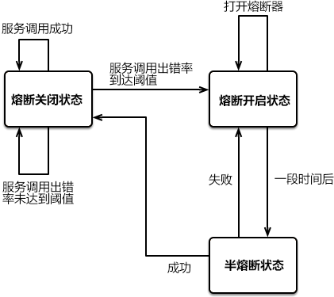

##### Hystrix 实现熔断机制

在 Spring Cloud 中，熔断机制是通过 Hystrix 实现的。Hystrix 会监控微服务间调用的状况，当失败调用到一定比例时（例如 5 秒内失败 20 次），就会启动熔断机制。

Hystrix 实现服务熔断的步骤如下：

1. 当服务的调用出错率达到或超过 Hystix 规定的比率（默认为 50%）后，熔断器进入熔断开启状态。
2. 熔断器进入熔断开启状态后，Hystrix 会启动一个休眠时间窗，在这个时间窗内，该服务的降级逻辑会临时充当业务主逻辑，而原来的业务主逻辑不可用。
3. 当有请求再次调用该服务时，会直接调用降级逻辑快速地返回失败响应，以避免系统雪崩。
4. 当休眠时间窗到期后，Hystrix 会进入半熔断转态，允许部分请求对服务原来的主业务逻辑进行调用，并监控其调用成功率。
5. 如果调用成功率达到预期，则说明服务已恢复正常，Hystrix 进入熔断关闭状态，服务原来的主业务逻辑恢复；否则 Hystrix 重新进入熔断开启状态，休眠时间窗口重新计时，继续重复第 2 到第 5 步。

 4 个与 Hystrix 熔断机制相关的重要参数，这 4 个参数的含义如下表

| 参数                                     | 描述                                                         |
| ---------------------------------------- | ------------------------------------------------------------ |
| metrics.rollingStats.timeInMilliseconds  | 统计时间窗。                                                 |
| circuitBreaker.sleepWindowInMilliseconds | 休眠时间窗，熔断开启状态持续一段时间后，熔断器会自动进入半熔断状态，这段时间就被称为休眠窗口期。 |
| circuitBreaker.requestVolumeThreshold    | 请求总数阀值。  在统计时间窗内，请求总数必须到达一定的数量级，Hystrix 才可能会将熔断器打开进入熔断开启转态，而这个请求数量级就是 请求总数阀值。Hystrix 请求总数阈值默认为 20，这就意味着在统计时间窗内，如果服务调用次数不足 20 次，即使所有的请求都调用出错，熔断器也不会打开。 |
| circuitBreaker.errorThresholdPercentage  | 错误百分比阈值。  当请求总数在统计时间窗内超过了请求总数阀值，且请求调用出错率超过一定的比例，熔断器才会打开进入熔断开启转态，而这个比例就是错误百分比阈值。错误百分比阈值设置为 50，就表示错误百分比为 50%，如果服务发生了 30 次调用，其中有 15 次发生了错误，即超过了 50% 的错误百分比，这时候将熔断器就会打开。 |

> ！在学习过程中，我的熔断器并没有起作用，尚未明确原因

> 已找到问题，通过故障监控发现是统计时间窗时间过短导致达不到请求总数

#### Hystrix 故障监控

Hystrix 还提供了准实时的调用监控（Hystrix Dashboard）功能，Hystrix 会持续地记录所有通过 Hystrix 发起的请求的执行信息，并以统计报表的形式展示给用户，包括每秒执行请求的数量、成功请求的数量和失败请求的数量等。

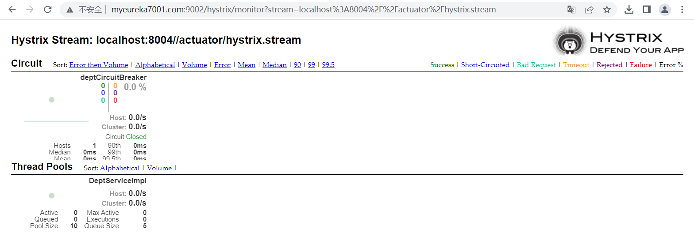

### Spring Cloud Gateway

> Gateway：Spring Cloud API网关组件

在微服务架构中，一个系统往往由多个微服务组成，而这些服务可能部署在不同机房、不同地区、不同域名下。这种情况下，客户端（例如浏览器、手机、软件工具等）想要直接请求这些服务，就需要知道它们具体的地址信息，例如 IP 地址、端口号等。

这种客户端直接请求服务的方式存在以下问题：

- 当服务数量众多时，**客户端需要维护大量的服务地址**，这对于客户端来说，是非常繁琐复杂的。
- 在某些场景下可能会**存在跨域请求的问题**。
- **身份认证的难度大**，每个微服务需要独立认证。

我们可以通过 API 网关来解决这些问题，下面就让我们来看看什么是 API 网关。

#### API 网关

API 网关是一个搭建在客户端和微服务之间的服务，我们可以在 API 网关中处理一些非业务功能的逻辑，例如权限验证、监控、缓存、请求路由等。

**API 网关就像整个微服务系统的门面一样，是系统对外的唯一入口。**有了它，客户端会先将请求发送到 API 网关，然后由 API 网关根据请求的标识信息将请求转发到微服务实例。

两种服务访问方式对比：

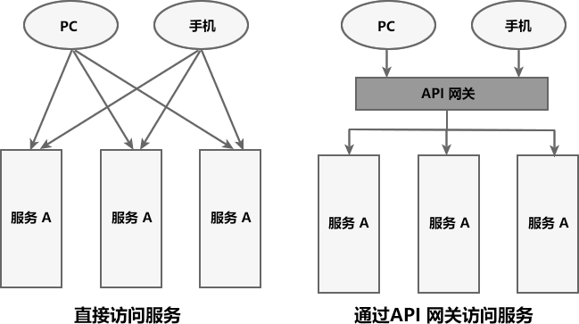

对于服务数量众多、复杂度较高、规模比较大的系统来说，使用 API 网关具有以下好处：

- 客户端通过 API 网关与微服务交互时，客户端只需要知道 API 网关地址即可，而不需要维护大量的服务地址，简化了客户端的开发。
- 客户端直接与 API 网关通信，能够减少客户端与各个服务的交互次数。
- 客户端与后端的服务耦合度降低。
- 节省流量，提高性能，提升用户体验。
- API 网关还提供了安全、流控、过滤、缓存、计费以及监控等 API 管理功能。

常见的 API 网关实现方案主要有以下 5 种：

- Spring Cloud Gateway
- Spring Cloud Netflix Zuul
- Kong
- Nginx+Lua
- Traefik

#### Spring Cloud Gateway 

Spring Cloud Gateway 是 Spring Cloud 团队基于 Spring 5.0、Spring Boot 2.0 和 Project Reactor 等技术开发的高性能 API 网关组件。

Spring Cloud Gateway 旨在提供一种简单而有效的途径来发送 API，并为它们提供横切关注点，例如：安全性，监控/指标和弹性。 

> Spring Cloud Gateway 是基于 WebFlux 框架实现的，而 WebFlux 框架底层则使用了高性能的 Reactor 模式通信框架 Netty。

##### Spring Cloud Gateway 核心概念

Spring Cloud GateWay 最主要的功能就是路由转发，而在定义转发规则时主要涉及了以下三个核心概念，如下表。

| 核心概念          | 描述                                                         |
| ----------------- | ------------------------------------------------------------ |
| Route（路由）     | 网关最基本的模块。它由一个 ID、一个目标 URI、一组断言（Predicate）和一组过滤器（Filter）组成。 |
| Predicate（断言） | 路由转发的判断条件，我们可以通过 Predicate 对 HTTP 请求进行匹配，例如请求方式、请求路径、请求头、参数等，如果请求与断言匹配成功，则将请求转发到相应的服务。 |
| Filter（过滤器）  | 过滤器，我们可以使用它对请求进行拦截和修改，还可以使用它对上文的响应进行再处理。 |

> 注意：其中 Route 和 Predicate 必须同时声明。

##### Spring Cloud Gateway 的特征

Spring Cloud Gateway 具有以下特性：

- 基于 Spring Framework 5、Project Reactor 和 Spring Boot 2.0 构建。
- 能够在任意请求属性上匹配路由。
- Predicates（断言） 和 Filters（过滤器）是特定于路由的。
- 集成了 Hystrix 熔断器。
- 集成了 Spring Cloud DiscoveryClient（服务发现客户端）。
- 易于编写断言和过滤器。
- 能够限制请求频率。
- 能够重写请求路径。

#### Gateway 的工作流程

Spring Cloud Gateway 工作流程如下图。


Spring Cloud Gateway 工作流程说明如下：

1. 客户端将请求发送到 Spring Cloud Gateway 上。
2. Spring Cloud Gateway 通过 Gateway Handler Mapping 找到与请求相匹配的路由，将其发送给 Gateway Web Handler。
3. Gateway Web Handler 通过指定的过滤器链（Filter Chain），将请求转发到实际的服务节点中，执行业务逻辑返回响应结果。
4. 过滤器之间用虚线分开是因为过滤器可能会在转发请求之前（pre）或之后（post）执行业务逻辑。
5. 过滤器（Filter）可以在请求被转发到服务端前，对请求进行拦截和修改，例如参数校验、权限校验、流量监控、日志输出以及协议转换等。
6. 过滤器可以在响应返回客户端之前，对响应进行拦截和再处理，例如修改响应内容或响应头、日志输出、流量监控等。
7. 响应原路返回给客户端。

总而言之，客户端发送到 Spring Cloud Gateway 的请求需要通过一定的匹配条件，才能定位到真正的服务节点。在将请求转发到服务进行处理的过程前后（pre 和 post），我们还可以对请求和响应进行一些精细化控制。

**Predicate 就是路由的匹配条件，而 Filter 就是对请求和响应进行精细化控制的工具。**有了这两个元素，再加上目标 URI，就可以实现一个具体的路由了。

#### Predicate 断言

Spring Cloud Gateway 通过 Predicate 断言来实现 Route 路由的匹配规则。简单点说，**Predicate 是路由转发的判断条件**，请求只有满足了 Predicate 的条件，才会被转发到指定的服务上进行处理。

使用 Predicate 断言需要注意以下 3 点：

- Route 路由与 Predicate 断言的对应关系为**“一对多”**，一个路由可以包含多个不同断言。
- 一个请求想要转发到指定的路由上，就**必须同时匹配路由上的所有断言**。
- 当一个请求同时满足多个路由的断言条件时，请求只会被首个成功匹配的路由转发。


常见的 Predicate 断言如下表（假设转发的 URI 为 http://localhost:8001）。

| 断言    | 示例                                                         | 说明                                                         |
| ------- | ------------------------------------------------------------ | ------------------------------------------------------------ |
| Path    | - Path=/dept/list/**                                         | 当请求路径与 /dept/list/** 匹配时，该请求才能被转发到 http://localhost:8001 上。 |
| Before  | - Before=2021-10-20T11:47:34.255+08:00[Asia/Shanghai]        | 在 2021 年 10 月 20 日 11 时 47 分 34.255 秒之前的请求，才会被转发到 http://localhost:8001 上。 |
| After   | - After=2021-10-20T11:47:34.255+08:00[Asia/Shanghai]         | 在 2021 年 10 月 20 日 11 时 47 分 34.255 秒之后的请求，才会被转发到 http://localhost:8001 上。 |
| Between | - Between=2021-10-20T15:18:33.226+08:00[Asia/Shanghai],2021-10-20T15:23:33.226+08:00[Asia/Shanghai] | 在 2021 年 10 月 20 日 15 时 18 分 33.226 秒 到 2021 年 10 月 20 日 15 时 23 分 33.226 秒之间的请求，才会被转发到 http://localhost:8001 服务器上。 |
| Cookie  | - Cookie=name,c.biancheng.net                                | 携带 Cookie 且 Cookie 的内容为 name=c.biancheng.net 的请求，才会被转发到 http://localhost:8001 上。 |
| Header  | - Header=X-Request-Id,\d+                                    | 请求头上携带属性 X-Request-Id 且属性值为整数的请求，才会被转发到 http://localhost:8001 上。 |
| Method  | - Method=GET                                                 | 只有 GET 请求才会被转发到 http://localhost:8001 上。         |

#### Spring Cloud Gateway 动态路由

默认情况下，Spring Cloud Gateway 会根据服务注册中心（例如 Eureka Server）中维护的服务列表，**以服务名（spring.application.name）作为路径创建动态路由进行转发，从而实现动态路由功能**。

我们可以在配置文件中，将 Route 的 uri 地址修改为以下形式。

```yml
lb://service-name
```

以上配置说明如下：

- lb：uri 的协议，表示开启 Spring Cloud Gateway 的负载均衡功能。
- service-name：服务名，Spring Cloud Gateway 会根据它获取到具体的微服务地址。

#### Filter 过滤器

Spring Cloud Gateway 提供了以下两种类型的过滤器，可以对请求和响应进行精细化控制。

| 过滤器类型 | 说明                                                         |
| ---------- | ------------------------------------------------------------ |
| Pre 类型   | 这种过滤器在请求被转发到微服务之前可以对请求进行拦截和修改，例如参数校验、权限校验、流量监控、日志输出以及协议转换等操作。 |
| Post 类型  | 这种过滤器在微服务对请求做出响应后可以对响应进行拦截和再处理，例如修改响应内容或响应头、日志输出、流量监控等。 |

按照作用范围划分，Spring Cloud gateway 的 Filter 可以分为 2 类：

- GatewayFilter：应用在单个路由或者一组路由上的过滤器。
- GlobalFilter：应用在所有的路由上的过滤器。

##### GatewayFilter 网关过滤器

GatewayFilter 是 Spring Cloud Gateway 网关中提供的**一种应用在单个或一组路由上的过滤器**。它可以对单个路由或者一组路由上传入的请求和传出响应进行拦截，并实现一些与业务无关的功能，比如登陆状态校验、签名校验、权限校验、日志输出、流量监控等。

GatewayFilter 在配置文件（例如 application.yml）中的写法与 Predicate 类似，格式如下。

```yml
spring:
  cloud:
    gateway: 
      routes:
        - id: xxxx
          uri: xxxx
          predicates:
            - Path=xxxx
          filters:
            - AddRequestParameter=X-Request-Id,1024 #过滤器工厂会在匹配的请求头加上一对请求头，名称为 X-Request-Id 值为 1024
            - PrefixPath=/dept #在请求路径前面加上 /dept
            ……
```

Spring Cloud Gateway 内置了多达 31 种 GatewayFilter，下表中列举了几种常用的网关过滤器及其使用示例。

| 路由过滤器             | 描述                                                         | 参数                                                         | 使用示例                                               |
| ---------------------- | ------------------------------------------------------------ | ------------------------------------------------------------ | ------------------------------------------------------ |
| AddRequestHeader       | 拦截传入的请求，并在请求上添加一个指定的请求头参数。         | name：需要添加的请求头参数的 key； value：需要添加的请求头参数的 value。 | - AddRequestHeader=my-request-header,1024              |
| AddRequestParameter    | 拦截传入的请求，并在请求上添加一个指定的请求参数。           | name：需要添加的请求参数的 key； value：需要添加的请求参数的 value。 | - AddRequestParameter=my-request-param,c.biancheng.net |
| AddResponseHeader      | 拦截响应，并在响应上添加一个指定的响应头参数。               | name：需要添加的响应头的 key； value：需要添加的响应头的 value。 | - AddResponseHeader=my-response-header,c.biancheng.net |
| PrefixPath             | 拦截传入的请求，并在请求路径增加一个指定的前缀。             | prefix：需要增加的路径前缀。                                 | - PrefixPath=/consumer                                 |
| PreserveHostHeader     | 转发请求时，保持客户端的 Host 信息不变，然后将它传递到提供具体服务的微服务中。 | 无                                                           | - PreserveHostHeader                                   |
| RemoveRequestHeader    | 移除请求头中指定的参数。                                     | name：需要移除的请求头的 key。                               | - RemoveRequestHeader=my-request-header                |
| RemoveResponseHeader   | 移除响应头中指定的参数。                                     | name：需要移除的响应头。                                     | - RemoveResponseHeader=my-response-header              |
| RemoveRequestParameter | 移除指定的请求参数。                                         | name：需要移除的请求参数。                                   | - RemoveRequestParameter=my-request-param              |
| RequestSize            | 配置请求体的大小，当请求体过大时，将会返回 413 Payload Too Large。 | maxSize：请求体的大小。                                      | - name: RequestSize   args:    maxSize: 5000000        |

##### GlobalFilter 全局过滤器

GlobalFilter 是一种作用于所有的路由上的全局过滤器，通过它，我们可以实现一些统一化的业务功能，例如权限认证、IP 访问限制等。当某个请求被路由匹配时，那么所有的 GlobalFilter 会和该路由自身配置的 GatewayFilter 组合成一个过滤器链。

Spring Cloud Gateway 为我们提供了多种默认的 GlobalFilter，例如与转发、路由、负载均衡等相关的全局过滤器。但在实际的项目开发中，通常我们都会自定义一些自己的 GlobalFilter 全局过滤器以满足我们自身的业务需求，而很少直接使用 Spring Cloud Config 提供这些默认的 GlobalFilter。

> 关于默认的全局过滤器的详细内容，请参考 [Spring Cloud 官网](https://docs.spring.io/spring-cloud-gateway/docs/current/reference/html/#global-filters)。

### Spring Cloud Config

在分布式微服务系统中，几乎所有服务的运行都离不开配置文件的支持，这些配置文件通常由各个服务自行管理，以 properties 或 yml 格式保存在各个微服务的类路径下，例如 application.properties 或 application.yml 等。

这种将配置文件散落在各个服务中的管理方式，存在以下问题：

- **管理难度大**：配置文件散落在各个微服务中，难以管理。
- **安全性低**：配置跟随源代码保存在代码库中，容易造成配置泄漏。
- **时效性差**：微服务中的配置修改后，必须重启服务，否则无法生效。
- **局限性明显**：无法支持动态调整，例如日志开关、功能开关。

为了解决这些问题，通常我们都会使用配置中心对配置进行统一管理。市面上开源的配置中心有很多，例如百度的 Disconf、淘宝的 diamond、360 的 QConf、携程的 Apollo 等都是解决这类问题的。Spring Cloud 也有自己的分布式配置中心，那就是 Spring Cloud Config。

#### Spring Cloud Config

Spring Cloud Config 是由 Spring Cloud 团队开发的项目，它可以为微服务架构中各个微服务提供集中化的外部配置支持。

简单点说就是，**Spring Cloud Config 可以将各个微服务的配置文件集中存储在一个外部的存储仓库或系统（例如 Git 、SVN 等）中，对配置的统一管理，以支持各个微服务的运行。**

Spring Cloud Config 包含以下两个部分：

- Config Server：也被称为分布式配置中心，它是一个独立运行的微服务应用，用来连接配置仓库并为客户端提供获取配置信息、加密信息和解密信息的访问接口。
- Config Client：指的是微服务架构中的各个微服务，它们通过 Config Server 对配置进行管理，并从 Config Sever 中获取和加载配置信息。

Spring Cloud Config 默认使用 Git 存储配置信息，因此使用 Spirng Cloud Config 构建的配置服务器天然就支持对微服务配置的版本管理。我们可以使用 Git 客户端工具方便地对配置内容进行管理和访问。除了 Git 外，Spring Cloud Config 还提供了对其他存储方式的支持，例如 SVN、本地化文件系统等。

#### Spring Cloud Config 工作原理

Spring Cloud Config 工作原理如下图。


Spring Cloud Config 工作流程如下：

1. 开发或运维人员提交配置文件到远程的 Git 仓库。
2. Config 服务端（分布式配置中心）负责连接配置仓库 Git，并对 Config 客户端暴露获取配置的接口。
3. Config 客户端通过 Config 服务端暴露出来的接口，拉取配置仓库中的配置。
4. Config 客户端获取到配置信息，以支持服务的运行。

#### Spring Cloud Config 的特点

Spring Cloud Config 具有以下特点：

- Spring Cloud Config 由 Spring Cloud 团队开发，可以说是 Spring 的亲儿子，能够与 Spring 的生态体系无缝集成。
- Spring Cloud Config 将所有微服务的配置文件集中存储在一个外部的存储仓库或系统（例如 Git）中，统一管理。
- **Spring Cloud Config 配置中心将配置以 REST 接口的形式暴露给各个微服务**，以方便各个微服务获取。
- 微服务可以通过 Spring Cloud Config 向配置中心统一拉取属于它们自己的配置信息。
- 当配置发生变化时，微服务不需要重启即可感知到配置的变化，并自动获取和应用最新配置。
- 一个应用可能有多个环境，例如开发（dev）环境、测试（test）环境、生产（prod）环境等等，开发人员可以通过 Spring Cloud Config 对不同环境的各配置进行管理，且能够确保应用在环境迁移后仍然有完整的配置支持其正常运行。

#### 搭建 Config 服务端

Spring Cloud Config 规定了一套配置文件访问规则，如下表。

| 访问规则                                  | 示例                   |
| ----------------------------------------- | ---------------------- |
| /{application}/{profile}[/{label}]        | /config/dev/master     |
| /{application}-{profile}.{suffix}         | /config-dev.yml        |
| /{label}/{application}-{profile}.{suffix} | /master/config-dev.yml |

访问规则内各参数说明如下。

- {application}：应用名称，即配置文件的名称，例如 config-dev。
- {profile}：环境名，一个项目通常都有开发（dev）版本、测试（test）环境版本、生产（prod）环境版本，配置文件则以 application-{profile}.yml 的形式进行区分，例如 application-dev.yml、application-test.yml、application-prod.yml 等。
- {label}：Git 分支名，默认是 master 分支，当访问默认分支下的配置文件时，该参数可以省略，即第二种访问方式。
- {suffix}：配置文件的后缀，例如 config-dev.yml 的后缀为 yml。

通过这套规则，我们在浏览器上就直接对配置文件进行访问。

#### 搭建 Config 客户端

我们可以得到以下 2 点结论，

- 配置更新后，Spring Cloud Config 服务端（Server）可以直接从 Git 仓库中获取最新的配置。
- 除非重启 Spring Cloud Config 客户端（Client），否则无法通过 Spring Cloud Config 服务端获取最新的配置信息。

#### 手动刷新配置

为了解决不重启 Config 客户端无法获取最新配置的问题，接下来，我们就对 micro-service-cloud-config-client-3355 进行改造，改造步骤如下。

##### 手动刷新配置的问题

在上面的实例中，我们通过在 Config 客户端（端口号：3355）中引入 Spring Boot actuator 监控组件来监控配置的变化，使我们可以在不重启 Config 客户端的情况下获取到了最新配置，原理如下图。


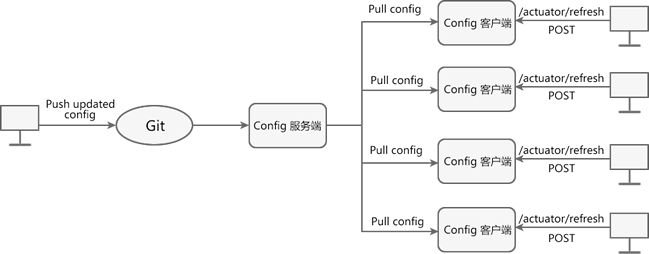
这种方式虽然解决了重启 Config 客户端才能获取最新配置的问题，但另一个问题却也接踵而至，那就是只要配置仓库中的配置发生改变，就需要我们挨个向 Config 客户端手动发送 POST 请求，通知它们重新拉取配置。

我们知道，所谓的 Config 客户端其实就是一个一个的服务。在微服务架构中，一个系统往往包含十几甚至几十个服务，如果因为某一个配置文件的修改而向几十个微服务发送 POST 请求，这显然是不合理的。

那么有没有“一次通知，处处生效”的方式呢？答案是肯定的。Spring Cloud Config 配合 Bus 就可以实现配置的动态刷新。

#### Config+Bus 实现配置的动态刷新

Spring Cloud Bus 又被称为消息总线，它能够通过轻量级的消息代理（例如 RabbitMQ、Kafka 等）将微服务架构中的各个服务连接起来，实现广播状态更改、事件推送等功能，还可以实现微服务之间的通信功能。

目前 Spring Cloud Bus 支持两种消息代理：RabbitMQ 和 Kafka。

##### Spring Cloud Bus 的基本原理

Spring Cloud Bus 会使用一个轻量级的消息代理来构建一个公共的消息主题 Topic（默认为“springCloudBus”），这个 Topic 中的消息会被所有服务实例监听和消费。当其中的一个服务刷新数据时，Spring Cloud Bus 会把信息保存到 Topic 中，这样监听这个 Topic 的服务就收到消息并自动消费。

##### Spring Cloud Bus 动态刷新配置的原理

利用 Spring Cloud Bus 的特殊机制可以实现很多功能，其中配合 Spring Cloud Config 实现配置的动态刷新就是最典型的应用场景之一。

当 Git 仓库中的配置发生了改变，我们只需要向某一个服务（既可以是 Config 服务端，也可以是 Config 客户端）发送一个 POST 请求，Spring Cloud Bus 就可以通过消息代理通知其他服务重新拉取最新配置，以实现配置的动态刷新。

Spring Cloud Bus 动态刷新配置的工作原理，如下图所示。

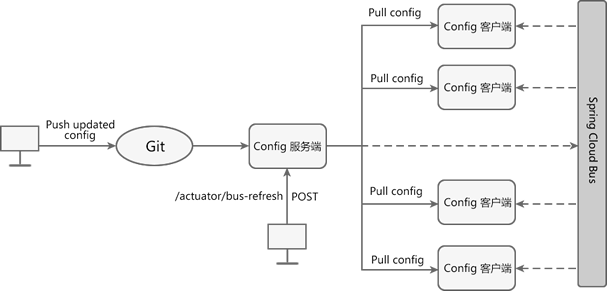

根据图 ，利用 Spring Cloud Bus 实现配置的动态刷新需要以下步骤:

1. 当 Git 仓库中的配置发生改变后，运维人员向 Config 服务端发送一个 POST 请求，请求路径为“/actuator/refresh”。
2. Config 服务端接收到请求后，会将该请求转发给服务总线 Spring Cloud Bus。
3. Spring Cloud Bus 接到消息后，会通知给所有 Config 客户端。
4. Config 客户端接收到通知，请求 Config 服务端拉取最新配置。
5. 所有 Config 客户端都获取到最新的配置。

##### Spring Cloud Bus 动态刷新配置（全局广播）

> 注意：在使用 Spring Cloud Bus 时，必须保证 Bus 所连接的消息代理软件（例如 RabbitMQ）已经正确安装且运行正常。

> 此处一定要安装Erlang和RabbitMQ，找半天发现自己没安装

##### Spring Cloud Bus 动态刷新配置（定点通知）

所谓定点通知，就是不再通知所有的 Config 客户端，而是根据需求只通知其中某一个 Config 客户端。

使用 Spring Cloud Bus 实现定点通知的方法十分简单，只要我们在发送 POST 请求时使用以下格式即可。

```
http://{hostname}:{port}/actuator/bus-refresh/{destination}
```


参数说明如下：

- {hostname}： 表示 Config 服务端的主机地址，既可以是域名，也可以是 IP 地址。
- {port}：表示 Config 服务端的端口号.
- {destination}：表示需要定点通知的 Config 客户端（微服务），由 Config 客户端的服务名（spring.application.name）+端口号（server.port）组成，例如只通知 micro-service-cloud-config-client-3355 刷新配置，则取值为 spring-cloud-config-client:3355。

## Spring Cloud Alibaba

### Spring Cloud Alibaba是什么?

Spring Cloud 本身并不是一个拿来即可用的框架，它是一套微服务规范，这套规范共有两代实现。

- 第一代实现： Spring Cloud Netflix，
- 第二代实现： Spring Cloud Alibaba。

2018 年 12 月12 日，Netflix 公司宣布 Spring Cloud Netflix 系列大部分组件都进入维护模式，不再添加新特性。这严重地限制了 Spring Cloud 的高速发展，于是各大互联网公司和组织开始把目光转向 Spring Cloud 的第二代实现：Spring Cloud Alibaba。

#### Spring Cloud Alibaba

Spring Cloud Alibaba 是阿里巴巴结合自身丰富的微服务实践而推出的微服务开发的一站式解决方案，是 Spring Cloud 第二代实现的主要组成部分。

Spring Cloud Alibaba 吸收了 Spring Cloud Netflix 的核心架构思想，并进行了高性能改进。自 Spring Cloud Netflix 进入停更维护后，Spring Cloud Alibaba 逐渐代替它成为主流的微服务框架。

Spring Cloud Alibaba 是国内首个进入 Spring 社区的开源项目。2018 年 7 月，Spring Cloud Alibaba 正式开源，并进入 Spring Cloud 孵化器中孵化；2019 年 7 月，Spring Cloud 官方宣布 Spring Cloud Alibaba 毕业，并将仓库迁移到 Alibaba Github OSS 下。

虽然 Spring Cloud Alibaba 诞生时间不久，但俗话说的好“大树底下好乘凉”，依赖于阿里巴巴强大的技术影响力，Spring Cloud Alibaba 在业界得到了广泛的使用，成功案例也越来越多。

#### Spring Cloud Alibaba 组件

Spring Cloud Alibaba 包含了多种开发分布式微服务系统的必需组件

- Nacos：阿里巴巴开源产品，一个更易于构建云原生应用的动态服务发现,配置管理和服务管理平台。
- Sentinel：阿里巴巴开源产品，把流量作为切入点,从流量控制,熔断降级,系统负载保护等多个维度保护服务的稳定性。
- RocketMQ：Apache RocketMQ 是一款基于Java 的高性能、高吞吐量的分布式消息和流计算平台。
- Dubbo：Apache Dubbo 是一款高性能的 Java RPC 框架。
- Seata：阿里巴巴开源产品，一个易于使用的高性能微服务分布式事务解决方案。
- Alibaba Cloud OSS：阿里云对象存储服务器（Object Storage Service，简称OSS），是阿里云提供的海量、安全、低成本、高可靠的云存储服务。
- Alibaba Cloud Schedulerx：阿里中间件团队开发的一款分布式调度产品,支持周期性的任务与固定时间点触发任务。

通过 Spring Cloud Alibaba 的这些组件，我们只需要添加一些注解和少量配置，就可以将 Spring Cloud 应用接入阿里微服务解决方案，通过阿里中间件来迅速搭建分布式应用系统。

#### Spring Cloud Alibaba 的应用场景

Spring Cloud Alibaba 的应用场景如下：

- 大型复杂的系统，例如大型电商系统。
- 高并发系统，例如大型门户网站、商品秒杀系统。
- 需求不明确，且变更很快的系统，例如创业公司业务系统。

#### Spring Cloud 两代实现组件对比

下表展示了 Spring Cloud 两代实现的组件对比情况。

| Spring Cloud 第一代实现（Netflix） | 状态                                             | Spring Cloud 第二代实现（Alibaba） | 状态                                                 |
| ---------------------------------- | ------------------------------------------------ | ---------------------------------- | ---------------------------------------------------- |
| Ereka                              | 2.0 孵化失败                                     | Nacos Discovery                    | 性能更好，感知力更强                                 |
| Ribbon                             | 停更进维                                         | Spring Cloud Loadbalancer          | Spring Cloud 原生组件，用于代替 Ribbon               |
| Hystrix                            | 停更进维                                         | Sentinel                           | 可视化配置，上手简单                                 |
| Zuul                               | 停更进维                                         | Spring Cloud Gateway               | 性能为 Zuul 的 1.6 倍                                |
| Spring Cloud Config                | 搭建过程复杂，约定过多，无可视化界面，上手难点大 | Nacos Config                       | 搭建过程简单，有可视化界面，配置管理更简单，容易上手 |

### Spring Cloud Alibaba Nacos

> Nacos：Spring Cloud Alibaba服务注册与配置中心

Nacos 英文全称为 Dynamic Naming and Configuration Service，是一个由阿里巴巴团队使用 Java 语言开发的开源项目。

Nacos 是一个更易于帮助构建云原生应用的动态服务发现、配置和服务管理平台（参考自 [Nacos 官网](https://nacos.io/zh-cn/index.html)）。

Nacos 的命名是由 3 部分组成：

| 组成部分 | 全称              | 描述                                                         |
| -------- | ----------------- | ------------------------------------------------------------ |
| Na       | naming/nameServer | 即服务注册中心，与 Spring Cloud Eureka 的功能类似。          |
| co       | configuration     | 即配置中心，与 Spring Cloud Config+Spring Cloud Bus 的功能类似。 |
| s        | service           | 即服务，表示 Nacos 实现的服务注册中心和配置中心都是以服务为核心的。 |

**我们可以将 Nacos 理解成服务注册中心和配置中心的组合体**，它可以替换 Eureka 作为服务注册中心，实现服务的注册与发现；还可以替换 Spring Cloud Config 作为配置中心，实现配置的动态刷新。

Nacos 作为服务注册中心经历了十年“双十一”的洪峰考验，具有简单易用、稳定可靠、性能卓越等优点，可以帮助用户更敏捷、容易地构建和管理微服务应用。

Nacos 支持几乎所有主流类型“服务”的发现、配置和管理：

- [Kubernetes Service](https://kubernetes.io/docs/concepts/services-networking/service/)
- [gRPC ](https://grpc.io/docs/what-is-grpc/core-concepts#service-definition)& [Dubbo RPC Service](https://dubbo.apache.org/zh/)
- Spring Cloud RESTful Service

#### Nacos 的特性

Nacos 提供了一系列简单易用的特性，能够帮助我们快速地实现动态服务发现、服务配置等功能。

##### 服务发现

Nacos 支持基于 DNS 和 RPC 的服务发现。当服务提供者使用原生 SDK、OpenAPI 或一个独立的 Agent TODO 向 Nacos 注册服务后，服务消费者可以在 Nacos 上通过 DNS TODO 或 HTTP&API 查找、发现服务。

##### 服务健康监测

Nacos 提供对服务的实时健康检查，能够阻止请求发送到不健康主机或服务实例上。Nacos 还提供了一个健康检查仪表盘，能够帮助我们根据健康状态管理服务的可用性及流量。

##### 动态配置服务

动态配置服务可以让我们以中心化、外部化和动态化的方式，管理所有环境的应用配置和服务配置。

动态配置消除了配置变更时重新部署应用和服务的需要，让配置管理变得更加高效、敏捷。

配置中心化管理让实现无状态服务变得更简单，让服务按需弹性扩展变得更容易。

Nacos 提供了一个简洁易用的 UI 帮助我们管理所有服务和应用的配置。Nacos 还提供包括配置版本跟踪、金丝雀发布、一键回滚配置以及客户端配置更新状态跟踪在内的一系列开箱即用的配置管理特性，帮助我们更安全地在生产环境中管理配置变更和降低配置变更带来的风险。

##### 动态 DNS 服务

Nacos 提供了动态 DNS 服务，能够让我们更容易地实现负载均衡、流量控制以及数据中心内网的简单 DNS 解析服务。

Nacos 提供了一些简单的 DNS APIs TODO，可以帮助我们管理服务的关联域名和可用的 IP:PORT 列表。

##### 服务及其元数据管理

Nacos 能让我们从微服务平台建设的视角管理数据中心的所有服务及元数据，包括管理服务的描述、生命周期、服务的静态依赖分析、服务的健康状态、服务的流量管理、路由及安全策略、服务的 SLA 以及 metrics 统计数据。

#### Nacos 两大组件

与 Eureka 类似，Nacos 也采用 CS（Client/Server，客户端/服务器）架构，它包含两大组件，如下表。

| 组件         | 描述                                                         | 功能                                                         |
| ------------ | ------------------------------------------------------------ | ------------------------------------------------------------ |
| Nacos Server | **Nacos 服务端，与 Eureka Server 不同，Nacos Server 由阿里巴巴团队使用 Java 语言编写并将 Nacos Server 的下载地址给用户，用户只需要直接下载并运行即可。** | Nacos Server 可以作为服务注册中心，帮助 Nacos Client 实现服务的注册与发现。Nacos Server 可以作为配置中心，帮助 Nacos Client 在不重启的情况下，实现配置的动态刷新。 |
| Nacos Client | **Nacos 客户端，通常指的是微服务架构中的各个服务，由用户自己搭建，可以使用多种语言编写。** | Nacos Client 通过添加依赖 spring-cloud-starter-alibaba-nacos-discovery，在服务注册中心（Nacos Server）中实现服务的注册与发现。Nacos Client 通过添加依赖 spring-cloud-starter-alibaba-nacos-config，在配置中心（Nacos Server）中实现配置的动态刷新。 |

#### Nacos 服务注册中心

Nacos 作为服务注册中心可以实现服务的注册与发现，流程如下图。

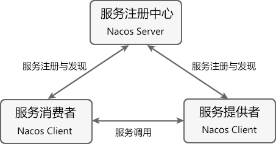

在图中共涉及到以下 3 个角色：

- 服务注册中心（Register Service）：它是一个 Nacos Server，可以为服务提供者和服务消费者提供服务注册和发现功能。
- 服务提供者（Provider Service）：它是一个 Nacos Client，用于对外服务。它将自己提供的服务注册到服务注册中心，以供服务消费者发现和调用。
- 服务消费者（Consumer Service）：它是一个 Nacos Client，用于消费服务。它可以从服务注册中心获取服务列表，调用所需的服务。


Nacos 实现服务注册与发现的流程如下：

1. 从 Nacos 官方提供的下载页面中，下载 Nacos Server 并运行。
2. 服务提供者 Nacos Client 启动时，会把服务以服务名（spring.application.name）的方式注册到服务注册中心（Nacos Server）；
3. 服务消费者 Nacos Client 启动时，也会将自己的服务注册到服务注册中心；
4. 服务消费者在注册服务的同时，它还会从服务注册中心获取一份服务注册列表信息，该列表中包含了所有注册到服务注册中心上的服务的信息（包括服务提供者和自身的信息）；
5. 在获取了服务提供者的信息后，服务消费者通过 HTTP 或消息中间件远程调用服务提供者提供的服务。

##### 安装和运行 Nacos Server

Nacos Server 下各目录说明如下：

- bin：用于存放 Nacos 的可执行命令。
- conf：用于存放 Nacos 配置文件。
- target：用于存放 Nacos 应用的 jar 包。

##### 搭建服务提供者

> 在spring-cloud-alibaba-demo工程的 pom.xml 中，我们通过 dependencyManagement 对 Spring Cloud Alibaba 的版本信息进行管理，该工程下的各个子模块在引入 Spring Cloud Alibaba 的各个组件时就不要单独指定版本号了。

##### 搭建服务消费者

> 注意：由于 Netflix Ribbon 已经进入停更维护状态，Nacos Discovery 已经停了对 Ribbon 的支持，因此我们需要在服务消费者的 pom.xml 中引入 spring-cloud-loadbalancer 才能调用服务提供者提供的服务。

```xml
<!--由于 Netflix Ribbon 进入停更维护阶段，因此新版本的 Nacos discovery 都已经移除了 Ribbon ，此时我们需要引入 loadbalancer 代替 -->
<dependency>
    <groupId>org.springframework.cloud</groupId>
    <artifactId>spring-cloud-loadbalancer</artifactId>
</dependency>
```

#### Nacos 配置中心

Nacos Server 还可以作为配置中心，对 Spring Cloud 应用的外部配置进行统一地集中化管理。而我们只需要在应用的 POM 文件中引入 spring-cloud-starter-alibaba-nacos-config 即可实现配置的获取与动态刷新。

从配置管理的角度看，Nacos 可以说是 Spring Cloud Config 的替代方案，但相比后者 Nacos 的使用更简单，操作步骤也更少。

> 注意：我们使用的 Spring Cloud 2020 版本默认不启用 bootstrap，若想要在应用启动时加载 bootstrap 配置（例如 bootstrap.yml 或 bootstrap.properties），就需要我们在 pom.xml 中显式的引入 spring-cloud-starter-bootstrap 依赖。

在 Nacos Server 中，配置的 dataId（即 Data ID）的完整格式如下：

```
${prefix}-${spring.profiles.active}.${file-extension}
```

dataId 格式中各参数说明如下：

- ${prefix}：默认取值为微服务的服务名，即配置文件中 spring.application.name 的值，我们可以在配置文件中通过配置 spring.cloud.nacos.config.prefix 来指定。
- ${spring.profiles.active}：表示当前环境对应的 Profile，例如 dev、test、prod 等。当没有指定环境的 Profile 时，其对应的连接符也将不存在， dataId 的格式变成 ${prefix}.${file-extension}。
- ${file-extension}：表示配置内容的数据格式，我们可以在配置文件中通过配置项 spring.cloud.nacos.config.file-extension 来配置，例如 properties 和 yaml。

> 这里在添加配置的时候一直出现发布失败，请检查参数配置的问题，发现是数据库config_info表没有encrypted_data_key这个字段导致的，可能是Nacos版本更新的问题

#### Nacos Server 集群化部署

在实际的项目开发中，一个微服务系统往往由十几，几十个甚至几百个微服务组成。 这些服务若全部注册到同一台 Nacos Server，就极有可能导致 Nacos Server 因为不堪重负而崩溃，最终导致整个微服务系统瘫痪。解决这个问题最直接的办法就是使用 Nacos Server 集群。

Nacos Server 的集群化部署有一个十分明显的优点，那就是可以保障系统的高可用性。在集群化部署中，只要不是所有的 Nacos Server 都停止工作，Nacos Client 就还可以从集群中正常的 Nacos Server 上获取服务信息及配置，而不会导致系统的整体瘫痪，这就是 Nacos Server 集群化部署的高可用性。

下图展示了 Nacos Server 集群化部署的基本架构。

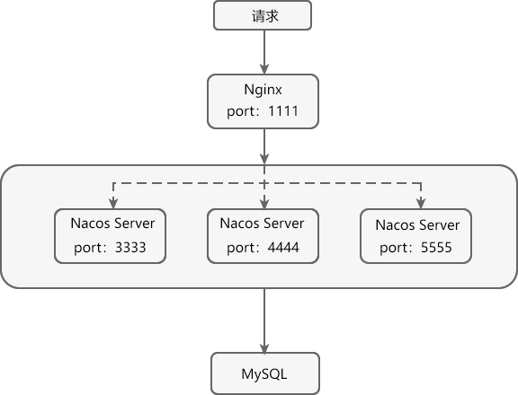

在 Nacos Server 安装目录下的 conf 文件夹中，将 cluster.conf.example 重命名为 cluster.conf，然后在该文件中添加以下内容。

```
192.168.3.138:3333
192.168.3.138:4444
192.168.3.138:5555
```

配置说明如下：

- 192.168.138 为本地电脑主机的 IP 地址，这里最好不要写成 localhost 或 127.0.0.1，否则 Nacos Server 集群可能会搭建失败！
- 本次搭建的 Nacos Server 集群的端口分别为：3333、4444、5555。

> 注意：我发现Nacos的配置管理，yaml配置文件的缩进一定要是2个空格，Nginx启动不了可能是因为没有管理员权限，同一个电脑启动Nacos集群可以使用-p参数指定端口，这里不用内网IP用127.0.0.1好像也不会出现问题

### Spring Cloud Alibaba Sentinel

> Sentinel：Spring Cloud Alibaba高可用流量控制组件

Sentinel 是由阿里巴巴中间件团队开发的开源项目，是一种面向分布式微服务架构的轻量级高可用流量控制组件。

Sentinel 主要以流量为切入点，从流量控制、熔断降级、系统负载保护等多个维度帮助用户保护服务的稳定性。

Sentinel 具有以下优势:

- **丰富的应用场景**：Sentinel 承接了阿里巴巴近 10 年的“双十一”大促流量的核心场景，例如秒杀（将突发流量控制在系统可以承受的范围）、消息削峰填谷、集群流量控制、实时熔断下游不可用服务等。
- **完备的实时监控**：Sentinel 提供了实时监控功能。用户可以在控制台中看到接入应用的单台机器的秒级数据，甚至是 500 台以下规模集群的汇总运行情况。
- **广泛的开源生态**：Sentinel 提供了开箱即用的与其它开源框架或库（例如 Spring Cloud、Apache Dubbo、gRPC、Quarkus）的整合模块。我们只要在项目中引入相应的依赖并进行简单的配置即可快速地接入 Sentinel。此外，Sentinel 还提供 Java、Go 以及 C++ 等多语言的原生实现。
- **完善的 SPI 扩展机制**：Sentinel 提供简单易、完善的 SPI 扩展接口，我们可以通过实现这些扩展接口快速地定制逻辑，例如定制规则管理、适配动态数据源等。

> SPI ，全称为 Service Provider Interface，是一种服务发现机制。它可以在 ClassPath 路径下的 META-INF/services 文件夹查找文件，并自动加载文件中定义的类。

从功能上来说，Sentinel 与 Spring Cloud Netfilx Hystrix 类似，但 Sentinel 要比 Hystrix 更加强大，例如 Sentinel 提供了流量控制功能、比 Hystrix 更加完善的实时监控功能等等。

#### Sentinel 的组成

Sentinel 主要由以下两个部分组成：

- Sentinel 核心库：Sentinel 的核心库不依赖任何框架或库，能够运行于 Java 8 及以上的版本的运行时环境中，同时对 Spring Cloud、Dubbo 等微服务框架提供了很好的支持。
- Sentinel 控制台（Dashboard）：Sentinel 提供的一个轻量级的开源控制台，它为用户提供了机器自发现、簇点链路自发现、监控、规则配置等功能。

Sentinel 核心库不依赖 Sentinel Dashboard，但两者结合使用可以有效的提高效率，让 Sentinel 发挥它最大的作用。

#### Sentinel 的基本概念

Sentinel 的基本概念有两个，它们分别是：资源和规则。

| 基本概念 | 描述                                                         |
| -------- | ------------------------------------------------------------ |
| 资源     | 资源是 Sentinel 的关键概念。**它可以是 Java 应用程序中的任何内容**，例如由应用程序提供的服务或者是服务里的方法，甚至可以是一段代码。  我们可以通过 Sentinel 提供的 API 来定义一个资源，使其能够被 Sentinel 保护起来。通常情况下，我们可以使用方法名、URL 甚至是服务名来作为资源名来描述某个资源。 |
| 规则     | 围绕资源而设定的规则。Sentinel 支持流量控制、熔断降级、系统保护、来源访问控制和热点参数等多种规则，所有这些规则都可以动态实时调整。 |

#### @SentinelResource 注解

@SentinelResource 注解是 Sentinel 提供的最重要的注解之一，它还包含了多个属性，如下表。

| 属性               | 说明                                                         | 必填与否                       | 使用要求                                                     |
| ------------------ | ------------------------------------------------------------ | ------------------------------ | ------------------------------------------------------------ |
| value              | 用于指定资源的名称                                           | 必填                           | -                                                            |
| entryType          | entry 类型                                                   | 可选项（默认为 EntryType.OUT） | -                                                            |
| blockHandler       | 服务限流后会抛出 BlockException 异常，而 blockHandler 则是用来指定一个函数来处理 BlockException 异常的。  简单点说，该属性用于指定服务限流后的后续处理逻辑。 | 可选项                         | blockHandler 函数访问范围需要是 public；返回类型需要与原方法相匹配；参数类型需要和原方法相匹配并且最后加一个额外的参数，类型为 BlockException；blockHandler 函数默认需要和原方法在同一个类中，若希望使用其他类的函数，则可以指定 blockHandler 为对应的类的 Class 对象，注意对应的函数必需为 static 函数，否则无法解析。 |
| blockHandlerClass  | 若 blockHandler 函数与原方法不在同一个类中，则需要使用该属性指定 blockHandler 函数所在的类。 | 可选项                         | 不能单独使用，必须与 blockHandler 属性配合使用；该属性指定的类中的 blockHandler 函数必须为 static 函数，否则无法解析。 |
| fallback           | 用于在抛出异常（包括 BlockException）时，提供 fallback 处理逻辑。  fallback 函数可以针对所有类型的异常（除了 exceptionsToIgnore 里面排除掉的异常类型）进行处理。 | 可选项                         | 返回值类型必须与原函数返回值类型一致；方法参数列表需要和原函数一致，或者可以额外多一个 Throwable 类型的参数用于接收对应的异常；fallback 函数默认需要和原方法在同一个类中，若希望使用其他类的函数，则可以指定 fallbackClass 为对应的类的 Class 对象，注意对应的函数必需为 static 函数，否则无法解析。 |
| fallbackClass      | 若 fallback 函数与原方法不在同一个类中，则需要使用该属性指定 blockHandler 函数所在的类。 | 可选项                         | 不能单独使用，必须与 fallback 或 defaultFallback 属性配合使用；该属性指定的类中的 fallback 函数必须为 static 函数，否则无法解析。 |
| defaultFallback    | 默认的 fallback 函数名称，通常用于通用的 fallback 逻辑（即可以用于很多服务或方法）。  默认 fallback 函数可以针对所以类型的异常（除了 exceptionsToIgnore 里面排除掉的异常类型）进行处理。 | 可选项                         | 返回值类型必须与原函数返回值类型一致；方法参数列表需要为空，或者可以额外多一个 Throwable 类型的参数用于接收对应的异常；defaultFallback 函数默认需要和原方法在同一个类中。若希望使用其他类的函数，则可以指定 fallbackClass 为对应的类的 Class 对象，注意对应的函数必需为 static 函数，否则无法解析。 |
| exceptionsToIgnore | 用于指定哪些异常被排除掉，不会计入异常统计中，也不会进入 fallback 逻辑中，而是会原样抛出。 | 可选项                         | -                                                            |

> 注：在 Sentinel 1.6.0 之前，fallback 函数只针对降级异常（DegradeException）进行处理，不能处理业务异常。

#### Sentinel 控制台

Sentinel 提供了一个轻量级的开源控制台 Sentinel Dashboard，它提供了机器发现与健康情况管理、监控（单机和集群）、规则管理与推送等多种功能。

Sentinel 控制台提供的功能如下:

- **查看机器列表以及健康情况**：Sentinel 控制台能够收集 Sentinel 客户端发送的心跳包，判断机器是否在线。
- **监控（单机和集群聚合）**：Sentinel 控制台通过 Sentinel 客户端暴露的监控 API，可以实现秒级的实时监控。
- **规则管理和推送**：通过 Sentinel 控制台，我们还能够针对资源定义和推送规则。
- **鉴权**：从 Sentinel 1.6.0 起，Sentinel 控制台引入基本的登录功能，默认用户名和密码都是 sentinel。

Sentinel Dashboard 是我们配置和管理规则（例如流控规则、熔断降级规则等）的重要入口之一。通过它，我们不仅可以对规则进行配置和管理，还能实时查看规则的效果。

#### Sentinel 的开发流程

Sentinel 的开发流程如下：

1. **引入 Sentinel 依赖**：在项目中引入 Sentinel 的依赖，将 Sentinel 整合到项目中；
2. **定义资源**：通过对主流框架提供适配或 Sentinel 提供的显式 API 和注解，可以定义需要保护的资源，此外 Sentinel 还提供了资源的实时统计和调用链路分析；
3. **定义规则**：根据实时统计信息，对资源定义规则，例如流控规则、熔断规则、热点规则、系统规则以及授权规则等。
4. **检验规则是否在生效**：运行程序，检验规则是否生效，查看效果。

#### 引入 Sentinel 依赖

为了减少开发的复杂程度，Sentinel 对大部分的主流框架都进行了适配，例如 Web Servlet、Dubbo、Spring Cloud、gRPC、Spring WebFlux 和 Reactor 等。以 Spring Cloud 为例，我们只需要引入 spring-cloud-starter-alibaba-sentinel 的依赖，就可以方便地将 Sentinel 整合到项目中。

#### 定义资源

资源是 Sentinel 中的核心概念之一。在项目开发时，我们只需要考虑这个服务、方法或代码是否需要保护，**如果需要保护，就可以将它定义为一个资源。**

Sentinel 为我们提供了多种定义资源的方式：

- 适配主流框架自动定义资源
- 通过 SphU 手动定义资源
- 通过 SphO 手动定义资源
- 注解方式定义资源

##### 适配主流框架自动定义资源

Sentinel 对大部分的主流框架都进行了适配，我们只要引入相关的适配模块（例如 spring-cloud-starter-alibaba-sentinel），Sentinel 就会自动将项目中的服务（包括调用端和服务端）定义为资源，资源名就是服务的请求路径。此时，我们只要再定义一些规则，这些资源就可以享受到 Sentinel 的保护。

##### 通过 SphU 手动定义资源

Sentinel 提供了一个名为 SphU 的类，它包含的 try-catch 风格的 API ，可以帮助我们手动定义资源。

##### 通过 SphO 手动定义资源

Sentinel 还提供了一个名为 SphO 的类，它包含了 if-else 风格的 API，能帮助我们手动定义资源。通过这种方式定义的资源，发生了限流之后会返回 false，此时我们可以根据返回值，进行限流之后的逻辑处理。

##### 注解方式定义资源（推荐）

除了以上两种方式外，我们还可以通过 Sentinel 提供的 @SentinelResource 注解定义资源。

```java
@GetMapping("/testC")
@SentinelResource(value = "testCbyAnnotation") //通过注解定义资源
public String testC() {
    log.info("c语言中文网提醒您，服务访问成功------testC：" + serverPort);
    return "c语言中文网提醒您，服务访问成功------testC：" + serverPort;
}
```

#### Sentinel 流量控制

任何系统处理请求的能力都是有限的，但任意时间内到达系统的请求量往往是随机且不可控的，如果在某一个瞬时时刻请求量急剧增，那么系统就很有可能被瞬时的流量高峰冲垮。为了避免此类情况发生，我们都需要根据系统的处理能力对请求流量进行控制，这就是我们常说的“流量控制”，简称“流控”。

Sentinel 作为一种轻量级高可用流量控制组件，**流量控制是它最主要的工作之一**。

我们可以针对资源定义流控规则，Sentinel 会根据这些规则对流量相关的各项指标进行监控。当这些指标当达到或超过流控规则规定的阈值时，Sentinel 会对请求的流量进行限制（即“限流”），以避免系统被瞬时的流量高峰冲垮，保障系统的高可用性。

一条流量规则主要由下表中的属性组成，我们可以通过组合这些属性来实现不同的限流效果。

| 属性     | 说明                                                         | 默认值                      |
| -------- | ------------------------------------------------------------ | --------------------------- |
| 资源名   | 流控规则的作用对象。                                         | -                           |
| 阈值     | 流控的阈值。                                                 | -                           |
| 阈值类型 | 流控阈值的类型，包括 QPS 或并发线程数。                      | QPS                         |
| 针对来源 | 流控针对的调用来源。                                         | default，表示不区分调用来源 |
| 流控模式 | 调用关系限流策略，包括直接、链路和关联。                     | 直接                        |
| 流控效果 | 流控效果（直接拒绝、Warm Up、匀速排队），不支持按调用关系限流。 | 直接拒绝                    |

> 注：QPS 表示并发请求数，换句话说就是，每秒钟最多通过的请求数。

同一个资源可以创建多条流控规则，Sentinel 会遍历这些规则，直到有规则触发限流或者所有规则遍历完毕为止。

Sentinel 触发限流时，资源会抛出 BlockException 异常，此时我们可以捕捉 BlockException 来自定义被限流之后的处理逻辑。

> 注意：这里我们主要讲解 Sentinel 流控规则的定义与使用，至于详细的流控规则配置，请参考 [Sentinel 官方流控文档](https://sentinelguard.io/zh-cn/docs/flow-control.html)。

##### 通过 Sentinel 控制台定义流控规则

我们可以通过 Sentinel 控制台，直接对资源定义流控规则。

我们通过 `@SentinelResource` 注解的 blockHandler 属性指定了一个 blockHandler 函数，进行限流之后的后续处理。

 使用 `@SentinelResource` 注解的 blockHandler 属性时，需要注意以下事项：

- blockHandler 函数访问范围需要是 public；
- 返回类型需要与原方法相匹配；
- 参数类型需要和原方法相匹配并且最后加一个额外的参数，类型为 BlockException；
- blockHandler 函数默认需要和原方法在同一个类中，若希望使用其他类的函数，则可以指定 blockHandler 为对应的类的 Class 对象，注意对应的函数必需为 static 函数，否则无法解析。
- 请务必添加 blockHandler 属性来指定自定义的限流处理方法，若不指定，则会跳转到错误页（用户体验不好）。

##### 通过代码定义流控规则

我们还可以在服务代码中，调用 FlowRuleManager 类的 loadRules() 方法来定义流控规则，该方法需要一个 FlowRule 类型的 List 集合作为其参数，示例代码如下。

```java
public static void loadRules(List<FlowRule> rules) {
    currentProperty.updateValue(rules); 
}
```

FlowRule 可以通过以下属性定义流控规则，如下表。

| 属性            | 说明                                                         | 默认值                      |
| --------------- | ------------------------------------------------------------ | --------------------------- |
| resource        | 资源名，即流控规则的作用对象                                 | -                           |
| count           | 限流的阈值。                                                 | -                           |
| grade           | 流控阈值的类型，包括 QPS 或并发线程数                        | QPS                         |
| limitApp        | 流控针对的调用来源                                           | default，表示不区分调用来源 |
| strategy        | 调用关系限流策略，包括直接、链路和关联                       | 直接                        |
| controlBehavior | 流控效果（直接拒绝、Warm Up、匀速排队），不支持按调用关系限流 | 直接拒绝                    |

#### 熔断降级规则

**除了流量控制以外，对调用链路中不稳定资源的熔断降级，也是保障服务高可用的重要措施之一。**

在分布式微服务架构中，一个系统往往由多个服务组成，不同服务之间相互调用，组成复杂的调用链路。如果链路上的某一个服务出现故障，那么故障就会沿着调用链路在系统中蔓延，最终导致整个系统瘫痪。Sentinel 提供了熔断降级机制就可以解决这个问题。

Sentinel 的熔断将机制会在调用链路中某个资源出现不稳定状态时（例如调用超时或异常比例升高），暂时切断对这个资源的调用，以避免局部不稳定因素导致整个系统的雪崩。

熔断降级作为服务保护自身的手段，通常在客户端（调用端）进行配置，资源被熔断降级最直接的表现就是抛出 DegradeException 异常。

##### Sentinel 熔断策略

Sentinel 提供了 3 种熔断策略，如下表所示。

| 熔断策略                         | 说明                                                         |
| -------------------------------- | ------------------------------------------------------------ |
| 慢调用比例 (SLOW_REQUEST_RATIO） | 选择以慢调用比例作为阈值，需要设置允许的慢调用 RT（即最大响应时间），若请求的响应时间大于该值则统计为慢调用。  当单位统计时长（statIntervalMs）内请求数目大于设置的最小请求数目，且慢调用的比例大于阈值，则接下来的熔断时长内请求会自动被熔断。  经过熔断时长后熔断器会进入探测恢复状态（HALF-OPEN 状态），若接下来的一个请求响应时间小于设置的慢调用 RT 则结束熔断，若大于设置的慢调用 RT 则再次被熔断。 |
| 异常比例 (ERROR_RATIO)           | 当单位统计时长（statIntervalMs）内请求数目大于设置的最小请求数目且异常的比例大于阈值，则在接下来的熔断时长内请求会自动被熔断。  经过熔断时长后熔断器会进入探测恢复状态（HALF-OPEN 状态），若接下来的一个请求成功完成（没有错误）则结束熔断，否则会再次被熔断。异常比率的阈值范围是 [0.0, 1.0]，代表 0% - 100%。 |
| 异常数 (ERROR_COUNT)             | 当单位统计时长内的异常数目超过阈值之后会自动进行熔断。  经过熔断时长后熔断器会进入探测恢复状态（HALF-OPEN 状态），若接下来的一个请求成功完成（没有错误）则结束熔断，否则会再次被熔断。 |

> 注意：Sentinel 1.8.0 版本对熔断降级特性进行了全新的改进升级，以上熔断策略针对的是 Sentinel 1.8.0 及以上版本。

##### Sentinel 熔断状态

Sentinel 熔断降级中共涉及 3 种状态，熔断状态的之间的转换过程如下图。

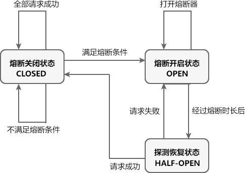

Sentinel 熔断降级中共涉及 3 种状态，如下表。

| 状态                       | 说明                                                         | 触发条件                                                     |
| -------------------------- | ------------------------------------------------------------ | ------------------------------------------------------------ |
| 熔断关闭状态 （CLOSED）    | 处于关闭状态时，请求可以正常调用资源。                       | 满足以下任意条件，Sentinel 熔断器进入熔断关闭状态：全部请求访问成功。单位统计时长（statIntervalMs）内请求数目小于设置的最小请求数目。未达到熔断标准，例如服务超时比例、异常数、异常比例未达到阈值。处于探测恢复状态时，下一个请求访问成功。 |
| 熔断开启状态 （OPEN）      | 处于熔断开启状态时，熔断器会一定的时间（规定的熔断时长）内，暂时切断所有请求对该资源的调用，并调用相应的降级逻辑使请求快速失败避免系统崩溃。 | 满足以下任意条件，Sentinel 熔断器进入熔断开启状态：单位统计时长内请求数目大于设置的最小请求数目，且已达到熔断标准，例如请求超时比例、异常数、异常比例达到阈值。处于探测恢复状态时，下一个请求访问失败。 |
| 探测恢复状态 （HALF-OPEN） | 处于探测恢复状态时，Sentinel 熔断器会允许一个请求调用资源。则若接下来的一个请求成功完成（没有错误）则结束熔断，熔断器进入熔断关闭（CLOSED）状态；否则会再次被熔断，熔断器进入熔断开启（OPEN）状态。 | 在熔断开启一段时间（降级窗口时间或熔断时长，单位为 s）后，Sentinel 熔断器自动会进入探测恢复状态。 |

##### Sentinel 熔断规则属性

Sentinel 熔断降级规则包含多个重要属性，如下表所示。

| 属性       | 说明                                                         | 默认值     | 使用范围              |
| ---------- | ------------------------------------------------------------ | ---------- | --------------------- |
| 资源名     | 规则的作用对象。                                             | -          | 所有熔断策略          |
| 熔断策略   | Sentinel 支持3 中熔断策略：慢调用比例、异常比例、异常数策略。 | 慢调用比例 | 所有熔断策略          |
| 最大 RT    | 请求的最大相应时间，请求的响应时间大于该值则统计为慢调用。   | -          | 慢调用比例            |
| 熔断时长   | 熔断开启状态持续的时间，超过该时间熔断器会切换为探测恢复状态（HALF-OPEN），单位为 s。 | -          | 所有熔断策略          |
| 最小请求数 | 熔断触发的最小请求数，请求数小于该值时即使异常比率超出阈值也不会熔断（1.7.0 引入）。 | 5          | 所有熔断策略          |
| 统计时长   | 熔断触发需要统计的时长（单位为 ms），如 60*1000 代表分钟级（1.8.0 引入）。 | 1000 ms    | 所有熔断策略          |
| 比例阈值   | 分为慢调用比例阈值和异常比例阈值，即慢调用或异常调用占所有请求的百分比，取值范围 [0.0,1.0]。 | -          | 慢调用比例 、异常比例 |
| 异常数     | 请求或调用发生的异常的数量。                                 | -          | 异常数                |

##### Sentinel 实现熔断降级过程

Sentinel 实现熔断降级的步骤如下：

1. 在项目中，使用 `@SentinelResource` 注解的 fallback 属性可以为资源指定熔断降级逻辑（方法）。
2. 通过 Sentinel 控制台或代码定义熔断规则，包括熔断策略、最小请求数、阈值、熔断时长以及统计时长等。
3. 若单位统计时长（statIntervalMs）内，请求数目大于设置的最小请求数目且达到熔断标准（例如请求超时比例、异常数、异常比例达到阈值），Sentinel 熔断器进入熔断开启状态（OPEN）。
4. 处于熔断开启状态时， `@SentinelResource` 注解的 fallback 属性指定的降级逻辑会临时充当主业务逻辑，而原来的主逻辑则暂时不可用。当有请求访问该资源时，会直接调用降级逻辑使请求快速失败，而不会调用原来的主业务逻辑。
5. 在经过一段时间（在熔断规则中设置的熔断时长）后，熔断器会进入探测恢复状态（HALF-OPEN），此时 Sentinel 会允许一个请求对原来的主业务逻辑进行调用，并监控其调用结果。
6. 若请求调用成功，则熔断器进入熔断关闭状态（CLOSED），服务原来的主业务逻辑恢复，否则重新进入熔断开启状态（OPEN）。

##### 通过 Sentinel 控制台定义熔断降级规则

我们可以通过 Sentinel 控制台直接对资源定义熔断降级规则。

我们通过 `@SentinelResource` 注解的 fallback 属性指定了一个 fallback 函数，进行熔断降级的后续处理。

使用 `@SentinelResource` 注解的 blockHandler 属性时，需要注意以下事项：

- 返回值类型必须与原函数返回值类型一致；
- 方法参数列表需要和原函数一致，或者可以额外多一个 Throwable 类型的参数用于接收对应的异常；
- fallback 函数默认需要和原方法在同一个类中，若希望使用其他类的函数，则可以指定 fallbackClass 为对应的类的 Class 对象，注意对应的函数必需为 static 函数，否则无法解析。

##### 通过代码定义熔断规则

Sentinel 核心库中提供了的一个名为 DegradeRuleManager 类，我们可以通过调用它的 loadRules() 方法来定义熔断降级规则，该方法需要一个 DegradeRule 类型的 List 参数。

```java
public static void loadRules(List<DegradeRule> rules) {
    try {
        currentProperty.updateValue(rules);
    } catch (Throwable var2) {
        RecordLog.error("[DegradeRuleManager] Unexpected error when loading degrade rules", var2);
    }
}
```

DegradeRule 类可以用来定义一条熔断规则，它包含多个与熔断规则相关的属性，如下表。

| 属性               | 说明                                                         | 默认值     |
| ------------------ | ------------------------------------------------------------ | ---------- |
| resource           | 资源名，即规则的作用对象                                     |            |
| grade              | 熔断策略，支持慢调用比例/异常比例/异常数策略                 | 慢调用比例 |
| count              | 慢调用比例模式下为慢调用临界 RT（超出该值计为慢调用）；异常比例/异常数模式下为对应的阈值 |            |
| timeWindow         | 熔断时长，单位为 s                                           |            |
| minRequestAmount   | 熔断触发的最小请求数，请求数小于该值时即使异常比率超出阈值也不会熔断（1.7.0 引入） | 5          |
| statIntervalMs     | 统计时长（单位为 ms），如 60*1000 代表分钟级（1.8.0 引入）   | 1000 ms    |
| slowRatioThreshold | 慢调用比例阈值，仅慢调用比例模式有效（1.8.0 引入）           |            |

### Spring Cloud Alibaba Seata

> Seata：Spring Cloud Alibaba分布式事务组件

随着业务的不断发展，单体架构已经无法满足我们的需求，分布式微服务架构逐渐成为大型互联网平台的首选，但所有使用分布式微服务架构的应用都必须面临一个十分棘手的问题，那就是“分布式事务”问题。

在分布式微服务架构中，几乎所有业务操作都需要多个服务协作才能完成。对于其中的某个服务而言，它的数据一致性可以交由其自身数据库事务来保证，但从整个分布式微服务架构来看，其全局数据的一致性却是无法保证的。

例如，用户在某电商系统下单购买了一件商品后，电商系统会执行下 4 步：

1. 调用订单服务创建订单数据
2. 调用库存服务扣减库存
3. 调用账户服务扣减账户金额
4. 最后调用订单服务修改订单状态

**为了保证数据的正确性和一致性**，我们必须保证所有这些操作要么全部成功，要么全部失败，否则就可能出现类似于商品库存已扣减，但用户账户资金尚未扣减的情况。各服务自身的事务特性显然是无法实现这一目标的，此时，我们可以通过分布式事务框架来解决这个问题。

Seata 就是这样一个分布式事务处理框架，它是由阿里巴巴和蚂蚁金服共同开源的分布式事务解决方案，能够在微服务架构下提供高性能且简单易用的分布式事务服务。

#### Seata 的发展历程

阿里巴巴作为国内最早一批进行应用分布式（微服务化）改造的企业，很早就遇到微服务架构下的分布式事务问题。

阿里巴巴对于分布式事务问题先后发布了以下解决方案：

- 2014 年，阿里中间件团队发布 TXC（Taobao Transaction Constructor），为集团内应用提供分布式事务服务。
- 2016 年，TXC 在经过产品化改造后，以 GTS（Global Transaction Service） 的身份登陆阿里云，成为当时业界唯一一款云上分布式事务产品。在阿云里的公有云、专有云解决方案中，开始服务于众多外部客户。
- 2019 年起，基于 TXC 和 GTS 的技术积累，阿里中间件团队发起了开源项目 Fescar（Fast & EaSy Commit And Rollback, FESCAR），和社区一起建设这个分布式事务解决方案。
- 2019 年 fescar 被重命名为了seata（simple extensiable autonomous transaction architecture）。
- TXC、GTS、Fescar 以及 seata 一脉相承，为解决微服务架构下的分布式事务问题交出了一份与众不同的答卷。

#### 分布式事务相关概念

分布式事务主要涉及以下概念：

- **事务**：由一组操作构成的可靠、独立的工作单元，事务具备 ACID 的特性，即原子性、一致性、隔离性和持久性。
- **本地事务**：本地事务由本地资源管理器（通常指数据库管理系统 DBMS，例如 MySQL、Oracle 等）管理，严格地支持 ACID 特性，高效可靠。本地事务不具备分布式事务的处理能力，隔离的最小单位受限于资源管理器，即本地事务只能对自己数据库的操作进行控制，对于其他数据库的操作则无能为力。
- **全局事务**：全局事务指的是一次性操作多个资源管理器完成的事务，由一组分支事务组成。
- **分支事务**：在分布式事务中，就是一个个受全局事务管辖和协调的本地事务。

**我们可以将分布式事务理解成一个包含了若干个分支事务的全局事务。**全局事务的职责是协调其管辖的各个分支事务达成一致，要么一起成功提交，要么一起失败回滚。此外，通常分支事务本身就是一个满足 ACID 特性的本地事务。

#### Seata 整体工作流程

Seata 对分布式事务的协调和控制，主要是通过 XID 和 3 个核心组件实现的。

##### XID

XID 是全局事务的唯一标识，它可以在服务的调用链路中传递，绑定到服务的事务上下文中。

##### 核心组件

Seata 定义了 3 个核心组件：

- TC（Transaction Coordinator）：事务协调器，它是事务的协调者（这里指的是 Seata 服务器），主要负责维护全局事务和分支事务的状态，驱动全局事务提交或回滚。
- TM（Transaction Manager）：事务管理器，它是事务的发起者，负责定义全局事务的范围，并根据 TC 维护的全局事务和分支事务状态，做出开始事务、提交事务、回滚事务的决议。
- RM（Resource Manager）：资源管理器，它是资源的管理者（这里可以将其理解为各服务使用的数据库）。它负责管理分支事务上的资源，向 TC 注册分支事务，汇报分支事务状态，驱动分支事务的提交或回滚。


以上三个组件相互协作，TC 以 Seata 服务器（Server）形式独立部署，TM 和 RM 则是以 Seata Client 的形式集成在微服务中运行，其整体工作流程如下图。

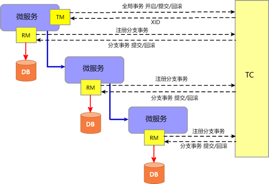

Seata 的整体工作流程如下：

1. TM 向 TC 申请开启一个全局事务，全局事务创建成功后，TC 会针对这个全局事务生成一个全局唯一的 XID；
2. XID 通过服务的调用链传递到其他服务;
3. RM 向 TC 注册一个分支事务，并将其纳入 XID 对应全局事务的管辖；
4. TM 根据 TC 收集的各个分支事务的执行结果，向 TC 发起全局事务提交或回滚决议；
5. TC 调度 XID 下管辖的所有分支事务完成提交或回滚操作。

#### Seata AT 模式

Seata 提供了 AT、TCC、SAGA 和 XA 四种事务模式，可以快速有效地对分布式事务进行控制。

在这四种事务模式中使用最多，最方便的就是 AT 模式。与其他事务模式相比，AT 模式可以应对大多数的业务场景，且基本可以做到无业务入侵，开发人员能够有更多的精力关注于业务逻辑开发。

##### AT 模式的前提

任何应用想要使用 Seata 的 AT 模式对分布式事务进行控制，必须满足以下 2 个前提：

- 必须使用支持本地 ACID 事务特性的关系型数据库，例如 MySQL、Oracle 等；
- 应用程序必须是使用 JDBC 对数据库进行访问的 JAVA 应用。

此外，我们还需要针对业务中涉及的各个数据库表，分别创建一个 UNDO_LOG（回滚日志）表。不同数据库在创建 UNDO_LOG 表时会略有不同，以 MySQL 为例，其 UNDO_LOG 表的创表语句如下：

```mysql
CREATE TABLE `undo_log` (
  `id` bigint(20) NOT NULL AUTO_INCREMENT,
  `branch_id` bigint(20) NOT NULL,
  `xid` varchar(100) NOT NULL,
  `context` varchar(128) NOT NULL,
  `rollback_info` longblob NOT NULL,
  `log_status` int(11) NOT NULL,
  `log_created` datetime NOT NULL,
  `log_modified` datetime NOT NULL,
  PRIMARY KEY (`id`),
  UNIQUE KEY `ux_undo_log` (`xid`,`branch_id`)
) ENGINE=InnoDB AUTO_INCREMENT=1 DEFAULT CHARSET=utf8;
```

##### AT 模式的工作机制

Seata 的 AT 模式工作时大致可以分为以两个阶段，下面我们就结合一个实例来对 AT 模式的工作机制进行介绍。

假设某数据库中存在一张名为 webset 的表，表结构如下。

| 列名 | 类型         | 主键 |
| ---- | ------------ | ---- |
| id   | bigint(20)   | √    |
| name | varchar(255) |      |
| url  | varchar(255) |      |

在某次分支事务中，我们需要在 webset 表中执行以下操作。

```mysql
update webset set url = 'c.biancheng.net' where name = 'C语言中文网';
```

###### 一阶段

Seata AT 模式一阶段的工作流程如下图所示。

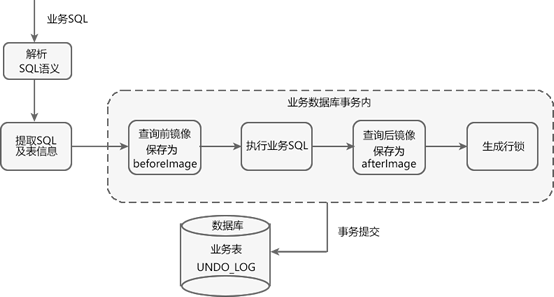


Seata AT 模式一阶段工作流程如下。

1. 获取 SQL 的基本信息：Seata 拦截并解析业务 SQL，得到 SQL 的操作类型（UPDATE）、表名（webset）、判断条件（where name = 'C语言中文网'）等相关信息。

2. 查询前镜像：根据得到的业务 SQL 信息，生成“前镜像查询语句”。

```mysql
select id, name, url from webset where name='C语言中文网';
```

执行“前镜像查询语句”，得到即将执行操作的数据，并将其保存为“前镜像数据（beforeImage）”。

| id   | name        | url           |
| ---- | ----------- | ------------- |
| 1    | C语言中文网 | biancheng.net |

3. 执行业务 SQL（update webset set url = 'c.biancheng.net' where name = 'C语言中文网';），将这条记录的 url 修改为 c.biancheng.net。

4. 查询后镜像：根据“前镜像数据”的主键（id : 1），生成“后镜像查询语句”。

```mysql
select id, name, url from webset where id= 1;
```


执行“后镜像查询语句”，得到执行业务操作后的数据，并将其保存为“后镜像数据（afterImage）”。

| id   | name        | url             |
| ---- | ----------- | --------------- |
| 1    | C语言中文网 | c.biancheng.net |

5. 插入回滚日志：将前后镜像数据和业务 SQL 的信息组成一条回滚日志记录，插入到 UNDO_LOG 表中，示例回滚日志如下。

```json
{
  "@class": "io.seata.rm.datasource.undo.BranchUndoLog",
  "xid": "172.26.54.1:8091:5962967415319516023",
  "branchId": 5962967415319516027,
  "sqlUndoLogs": [
    "java.util.ArrayList",
    [
      {
        "@class": "io.seata.rm.datasource.undo.SQLUndoLog",
        "sqlType": "UPDATE",
        "tableName": "webset",
        "beforeImage": {
          "@class": "io.seata.rm.datasource.sql.struct.TableRecords",
          "tableName": "webset",
          "rows": [
            "java.util.ArrayList",
            [
              {
                "@class": "io.seata.rm.datasource.sql.struct.Row",
                "fields": [
                  "java.util.ArrayList",
                  [
                    {
                      "@class": "io.seata.rm.datasource.sql.struct.Field",
                      "name": "id",
                      "keyType": "PRIMARY_KEY",
                      "type": -5,
                      "value": [
                        "java.lang.Long",
                        1
                      ]
                    },
                    {
                      "@class": "io.seata.rm.datasource.sql.struct.Field",
                      "name": "url",
                      "keyType": "NULL",
                      "type": 12,
                      "value": "biancheng.net"
                    }
                  ]
                ]
              }
            ]
          ]
        },
        "afterImage": {
          "@class": "io.seata.rm.datasource.sql.struct.TableRecords",
          "tableName": "webset",
          "rows": [
            "java.util.ArrayList",
            [
              {
                "@class": "io.seata.rm.datasource.sql.struct.Row",
                "fields": [
                  "java.util.ArrayList",
                  [
                    {
                      "@class": "io.seata.rm.datasource.sql.struct.Field",
                      "name": "id",
                      "keyType": "PRIMARY_KEY",
                      "type": -5,
                      "value": [
                        "java.lang.Long",
                        1
                      ]
                    },
                    {
                      "@class": "io.seata.rm.datasource.sql.struct.Field",
                      "name": "url",
                      "keyType": "NULL",
                      "type": 12,
                      "value": "c.biancheng.net"
                    }
                  ]
                ]
              }
            ]
          ]
        }
      }
    ]
  ]
}
```

6. 注册分支事务，生成行锁：在这次业务操作的本地事务提交前，RM 会向 TC 注册分支事务，并针对主键 id 为 1 的记录生成行锁。

> 以上所有操作均在同一个数据库事务内完成，可以保证一阶段的操作的原子性。

7. 本地事务提交：将业务数据的更新和前面生成的 UNDO_LOG 一并提交。

8. 上报执行结果：将本地事务提交的结果上报给 TC。

###### 二阶段：提交

当所有的 RM 都将自己分支事务的提交结果上报给 TC 后，TM 根据 TC 收集的各个分支事务的执行结果，来决定向 TC 发起全局事务的提交或回滚。

若所有分支事务都执行成功，TM 向 TC 发起全局事务的提交，并批量删除各个 RM 保存的 UNDO_LOG 记录和行锁；否则全局事务回滚。

###### 二阶段：回滚

若全局事务中的任何一个分支事务失败，则 TM 向 TC 发起全局事务的回滚，并开启一个本地事务，执行如下操作。

1. 查找 UNDO_LOG 记录：通过 XID 和分支事务 ID（Branch ID） 查找所有的 UNDO_LOG 记录。

2. 数据校验：将 UNDO_LOG 中的后镜像数据（afterImage）与当前数据进行比较，如果有不同，则说明数据被当前全局事务之外的动作所修改，需要人工对这些数据进行处理。

3. 生成回滚语句：根据 UNDO_LOG 中的前镜像（beforeImage）和业务 SQL 的相关信息生成回滚语句：

```mysql
update webset set url= 'biancheng.net' where id = 1;
```

4. 还原数据：执行回滚语句，并将前镜像数据、后镜像数据以及行锁删除。

5. 提交事务：提交本地事务，并把本地事务的执行结果（即分支事务回滚的结果）上报给 TC。

#### Seata 服务器

Seata Server 目录中包含以下子目录：

- bin：用于存放 Seata Server 可执行命令。
- conf：用于存放 Seata Server 的配置文件。
- lib：用于存放 Seata Server 依赖的各种 Jar 包。
- logs：用于存放 Seata Server 的日志。

#### Seata 配置中心

所谓“配置中心”，就像是一个“大衣柜”，内部存放着各种各样的配置文件，我们可以根据自己的需要从其中获取指定的配置文件，加载到对应的客户端中。

Seata 支持多种配置中心：

- nacos
- consul
- apollo
- etcd
- zookeeper
- file （读本地文件，包含 conf、properties、yml 等配置文件）

##### Seata 整合 Nacos 配置中心

对于 Seata 来说，Nacos 是一种重要的配置中心实现。

###### 添加 Maven 依赖

```xml
<!--引入 seata 依赖-->
<dependency>
    <groupId>com.alibaba.cloud</groupId>
    <artifactId>spring-cloud-starter-alibaba-seata</artifactId>
</dependency>
```

###### Seata Server 配置

在 Seata Server 安装目录下的 config/registry.conf 中，将配置方式（config.type）修改为 Nacos，并对 Nacos 配置中心的相关信息进行配置，示例配置如下。

```
config {
  # Seata 支持 file、nacos 、apollo、zk、consul、etcd3 等多种配置中心
  #配置方式修改为 nacos
  type = "nacos"
  nacos {
    #修改为使用的 nacos 服务器地址
    serverAddr = "127.0.0.1:1111"
    #配置中心的命名空间
    namespace = ""
    #配置中心所在的分组
    group = "SEATA_GROUP"
    #Nacos 配置中心的用户名
    username = "nacos"
    #Nacos 配置中心的密码
    password = "nacos"
  }
}
```

###### Seata Client 配置

我们可以在 Seata Client（即微服务架构中的服务）中，通过 application.yml 等配置文件对 Nacos 配置中心进行配置，示例代码如下。

```yml
seata:
  config:
    type: nacos
    nacos:
      server-addr: 127.0.0.1:1111 # Nacos 配置中心的地址
      group : "SEATA_GROUP"  #分组
      namespace: ""
      username: "nacos"   #Nacos 配置中心的用于名
      password: "nacos"  #Nacos 配置中心的密码
```

###### 上传配置到 Nacos 配置中心

在完成了 Seata 服务端和客户端的相关配置后，接下来，我们就可以将配置上传的 Nacos 配置中心了，操作步骤如下。

1. 我们需要获取一个名为 config.txt 的文本文件，该文件包含了 Seata 配置的所有参数明细。

我们可以通过 [Seata Server 源码](https://github.com/seata/seata/archive/refs/tags/v1.4.2.zip)/script/config-center 目录中获取 config.txt，然后根据自己需要修改其中的配置。

2. 在 /script/config-center/nacos 目录中，有以下 2 个 Seata 脚本：

- nacos-config.py：python 脚本。
- nacos-config.sh：为 Linux 脚本，我们可以在 Windows 下通过 Git 命令，将 config.txt 中的 Seata 配置上传到 Nacos 配置中心。

在 seata-1.4.2\script\config-center\nacos 目录下，右键鼠标选择 Git Bush Here，并在弹出的 Git 命令窗口中执行以下命令，将 config.txt 中的配置上传到 Nacos 配置中心。

```sh
sh nacos-config.sh -h 127.0.0.1 -p 1111 -g SEATA_GROUP -u nacos -w nacos
```

Git 命令各参数说明如下：

- -h：Nacos 的 host，默认取值为 localhost
- -p：端口号，默认取值为 8848
- -g：Nacos 配置的分组，默认取值为 SEATA_GROUP
- -u：Nacos 用户名
- -w：Nacos 密码

#### Seata 注册中心

所谓“注册中心”，可以说是微服务架构中的“通讯录”，它记录了服务与服务地址的映射关系。

在分布式微服务架构中，各个微服务都可以将自己注册到注册中心，当其他服务需要调用某个服务时，就可以从这里找到它的服务地址进行调用，常见的服务注册中心有 Nacos、Eureka、zookeeper 等。

Seata 支持多种服务注册中心：

- eureka
- consul
- nacos
- etcd
- zookeeper
- sofa
- redis
- file （直连）

Seata 通过这些服务注册中心，我们可以获取 Seata Sever 的服务地址，进行调用

##### Seata 整合 Nacos 注册中心

对于 Seata 来说，Nacos 是一种重要的注册中心实现。

###### 添加 Maven 依赖

```xml
<!--引入 seata 依赖-->
<dependency>
    <groupId>com.alibaba.cloud</groupId>
    <artifactId>spring-cloud-starter-alibaba-seata</artifactId>
</dependency>
```

###### Seata Server 配置注册中心

在 Seata Server 安装目录下的 config/registry.conf 中，将注册方式（registry.type）修改为 Nacos，并对 Nacos 注册中心的相关信息进行配置，示例配置如下。

```
registry {
  # Seata 支持 file 、nacos 、eureka、redis、zk、consul、etcd3、sofa 作为其注册中心
  # 将注册方式修改为 nacos
  type = "nacos"
  nacos {
    application = "seata-server"
    # 修改 nacos 注册中心的地址
    serverAddr = "127.0.0.1:1111"
    group = "SEATA_GROUP"
    namespace = ""
    cluster = "default"
    username = ""
    password = ""
  }
}
```

###### Seata Client 配置注册中心

我们可以在 Seata Client 的 application.yml 中，对 Nacos 注册中心进行配置，示例配置如下。

```yml
seata:
  registry:
    type: nacos
    nacos:
      application: seata-server  
      server-addr: 127.0.0.1:1111 # Nacos 注册中心的地址
      group : "SEATA_GROUP" #分组
      namespace: ""   
      username: "nacos"   #Nacos 注册中心的用户名
      password: "nacos"   # Nacos 注册中心的密码
```

#### Seata 事务分组

事务分组是 Seata 提供的一种 TC（Seata Server） 服务查找机制。

Seata 通过事务分组获取 TC 服务，流程如下：

1. 在应用中配置事务分组。
2. 应用通过配置中心去查找配置：`service.vgroupMapping.{事务分组}`，该配置的值就是 TC 集群的名称。
3. 获得集群名称后，应用通过一定的前后缀 + 集群名称去构造服务名。
4. 得到服务名后，去注册中心去拉取服务列表，获得后端真实的 TC 服务列表。

##### Seata Server 配置

在 Seata Server 的 config/registry.conf 中，进行如下配置。

```
registry {
  # file 、nacos 、eureka、redis、zk、consul、etcd3、sofa
  type = "nacos"                #使用 Nacos作为注册中心
  nacos {
    serverAddr = "127.0.0.1:1111"    # Nacos 注册中心的地址
    namespace = ""              # Nacos 命名空间id，"" 为 Nacos 保留 public 空间控件，用户勿配置 namespace = "public"
    cluster = "c.biancheng.net"         # seata-server在 Nacos 的集群名
  }
}
config {
  # file、nacos 、apollo、zk、consul、etcd3
  type = "nacos"                # 使用nacos作为配置中心
  nacos {
    serverAddr = "localhost"
    namespace = ""
    cluster = "default"
  }
}
```

##### Seata Client 配置

Seata Client 中 application.yml 的配置如下。

```yml
spring:
  alibaba:
    seata:
        tx-service-group: service-order-group  #事务分组名
seata:
  registry:
    type: nacos   #从 Nacos 获取 TC 服务
    nacos:
      server-addr: 127.0.0.1:1111
  config:
    type: nacos   #使用 Nacos 作为配置中心
    nacos:
      server-addr: 127.0.0.1:1111
      name
```

在以上配置中，我们通过 spring.cloud.alibaba.seata.tx-service-group 来配置 Seata 事务分组名，其默认取值为：`服务名-fescar-service-group`。

##### 上传配置到 Nacos

将以下配置上传到 Nacos 配置中心。

```
service.vgroupMapping.service-order-group=c.biancheng.net
```

在以上配置中，

- service-order-group：为事务分组的名称；
- c.biancheng.net：为 TC 集群的名称。

##### 获取事务分组

1. 先启动 Nacos，再启动 Seata Server，最后再启动 Seata Client。

2. Seata Client 在启动时，会从 application.yml 的配置中，根据 spring.cloud.alibaba.seata.tx-service-group 获取事务分组的名称：service-order-group。

##### 获取 TC 集群名

使用事务分组名“service-order-group”拼接成“service.vgroupMapping.service-order-group”，并从 Nacos 配置中心获取该配置的取值，这个值就是 TC 集群的名称：“c.biancheng.net”。

##### 查找 TC 服务

根据 TC 集群名、Nacos 注册中心的地址（server-addr）以及命名空间（namespace），在 Nacos 注册中心找到真实的 TC 服务列表。

通过事务分组获取服务名，共需要以下 3 步：

1. 服务启动时，从配置文件中获取服务分组的名称；
2. 从配置中心，通过事务分组名获取 TC 集群名；
3. 根据 TC 群组名以及其他信息构建服务名，获取真实的 TC 服务列表。

#### 启动 Seata Server

1. ##### 建表


Seata Server 共有以下 3 种存储模式（store.mode）:

| 模式  | 说明                                                         | 准备工作              |
| ----- | ------------------------------------------------------------ | --------------------- |
| file  | 文件存储模式，默认存储模式；  该模式为单机模式，全局事务的会话信息在内存中读写，并持久化本地文件 root.data，性能较高 | -                     |
| db    | 数据库存储模式；  该模式为高可用模式，全局事务会话信息通过数据库共享，性能较低。 | 建数据库表            |
| redis | 缓存处处模式；  Seata Server 1.3 及以上版本支持该模式，性能较高，但存在事务信息丢失风险, | 配置 redis 持久化配置 |

在 db 模式下，我们需要针对全局事务的会话信息创建以下 3 张数据库表。

- 全局事务表，对应的表为：global_table
- 分支事务表，对应的表为：branch_table
- 全局锁表，对应的表为：lock_table

在 MySQL 中，创建一个名为 seata 的数据库实例，并在该数据库内执行seata\script\server\db\mysql.sql。

 2.  ##### 修改 Seata Server 配置

在 seata-server-1.4.2/conf/ 目录下的 registry.conf 中，将 Seata Server 的服务注册方式（registry.type）和配置方式（config.type）都修改为 Nacos。

> 注意：在使用 Git 命令将配置上传到 Nacos 前，应该先确保 Nacos 服务器已启动。

 3. ##### 将 Seata 配置上传到 Nacos

修改 seata\script\config-center 目录下的 config.txt

执行以下命令，将 config.txt 中的配置上传到 Nacos 配置中心。

```sh
sh nacos-config.sh -h 127.0.0.1 -p 1111 -g SEATA_GROUP -u nacos -w nacos
```

 4. ##### 启动 Seata Server

双击 Seata Server 端 bin 目录下的启动脚本 seata-server.bat ，启动 Seata Server。

#### 业务系统集成 Seata 

接下来，我们就以电商系统为例，来演示下业务系统是如何集成 Seata 的。

在电商系统中，用户下单购买一件商品，需要以下 3 个服务提供支持：

- Order（订单服务）：创建和修改订单。
- Storage（库存服务）：对指定的商品扣除仓库库存。
- Account（账户服务） ：从用户帐户中扣除商品金额。

这三个微服务分别使用三个不同的数据库，架构图如下所示。


当用户从这个电商网站购买了一件商品后，其服务调用步骤如下：

1. 调用 Order 服务，创建一条订单数据，订单状态为“未完成”；
2. 调用 Storage 服务，扣减商品库存；
3. 调用 Account 服务，从用户账户中扣除商品金额；
4. 调用 Order 服务，将订单状态修改为“已完成”。

> 包括8005、8006、8007三个模块

#### @GlobalTransactional 注解

在分布式微服务架构中，我们可以使用 Seata 提供的 @GlobalTransactional 注解实现分布式事务的开启、管理和控制。

当调用 @GlobalTransaction 注解的方法时，TM 会先向 TC 注册全局事务，TC 生成一个全局唯一的 XID，返回给 TM。

@GlobalTransactional 注解既可以在类上使用，也可以在类方法上使用，该注解的使用位置决定了全局事务的范围，具体关系如下：

- 在类中某个方法使用时，全局事务的范围就是该方法以及它所涉及的所有服务。
- 在类上使用时，全局事务的范围就是这个类中的所有方法以及这些方法涉及的服务。

> 注意JDK版本，seata最好使用JDK8

> 要在管理员模式下运行