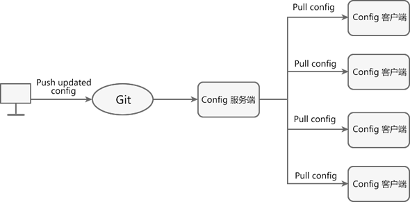

# 学习文档

## Spring Cloud

Spring Cloud 是分布式微服务架构的一站式解决方案，它提供了一套简单易用的编程模型，使我们能在 Spring Boot 的基础上轻松地实现微服务系统的构建。

Spring Cloud 被称为构建分布式微服务系统的“全家桶”，它并不是某一门技术，而是一系列微服务解决方案或框架的有序集合。它将市面上成熟的、经过验证的微服务框架整合起来，并通过 Spring Boot 的思想进行再封装，屏蔽调其中复杂的配置和实现原理，最终为开发人员提供了一套简单易懂、易部署和易维护的分布式系统开发工具包。

Spring Cloud 本身并不是一个拿来即可用的框架，它是一套微服务规范，共有两代实现。

- Spring Cloud Netflix 是 Spring Cloud 的第一代实现，主要由 Eureka、Ribbon、Feign、Hystrix 等组件组成。
- Spring Cloud Alibaba 是 Spring Cloud 的第二代实现，主要由 Nacos、Sentinel、Seata 等组件组成。

### 微服务是什么?

微服务（MicroServices）最初是由 Martin Fowler 于 2014 年发表的论文 《[MicroServices](https://martinfowler.com/articles/microservices.html)》 中提出的名词，它一经提出就成为了技术圈的热门话题。

微服务，我们可以从字面上去理解，即“微小的服务”，我们可以分为“服务”和“微小”两个方面：

1. 所谓“服务”，其实指的是项目中的功能模块，它可以帮助用户解决某一个或一组问题，在开发过程中表现为 IDE（集成开发环境，例如 Eclipse 或 IntelliJ IDEA）中的一个工程或 Moudle。
2. “微小”则强调的是单个服务的大小，主要体现为以下两个方面：
    - 微服务体积小，复杂度低：一个微服务通常只提供单个业务功能的服务，即一个微服务只专注于做好一件事，因此微服务通常代码较少，体积较小，复杂度也较低。
    - 微服务团队所需成员少：一般情况下，一个微服务团队只需要 8 到 10 名人员（开发人员 2 到 5 名）即可完成从设计、开发、测试到运维的全部工作。

#### 微服务架构

**微服务架构是一种系统架构的设计风格**。与传统的单体式架构（ALL IN ONE）不同，微服务架构提倡将一个单一的应用程序拆分成多个小型服务，这些小型服务都在各自独立的进程中运行，服务之间使用轻量级通信机制（通常是 HTTP RESTFUL API）进行通讯。

通常情况下，**这些小型服务都是围绕着某个特定的业务进行构建的，每一个服务只专注于完成一项任务并把它做好** ，即“专业的人做专业的事”。

每个服务都能够独立地部署到各种环境中，例如开发环境、测试环境和生产环境等，每个服务都能独立启动或销毁而不会对其他服务造成影响。

这些服务之间的交互是使用标准的通讯技术进行的，因此不同的服务可以使用不同数据存储技术，甚至使用不同的编程语言。

#### 微服务架构 vs 单体架构

单体架构是微服务架构出现之前业界最经典的软件架构类型，许多早期的项目采用的也都是单体架构。单体架构将应用程序中所有业务逻辑都编写在同一个工程中，最终经过编译、打包，部署在一台服务器上运行。

在项目的初期，单体架构无论是在开发速度还是运维难度上都具有明显的优势。但随着业务复杂度的不断提高，单体架构的许多弊端也逐渐凸显出来：

- 随着业务复杂度的提高，单体应用（采用单体架构的应用程序）的代码量也越来越大，**导致代码的可读性、可维护性以及扩展性下降**。
- 随着用户越来越多，程序所承受的并发越来越高，而**单体应用处理高并发的能力有限**。
- 单体应用将所有的业务都集中在同一个工程中，修改或增加业务都可能会对其他业务造成一定的影响，**导致测试难度增加**。

对比微服务架构和单体架构的不同

| 不同点       | 微服务架构                                                   | 单体架构                                                     |
| ------------ | ------------------------------------------------------------ | ------------------------------------------------------------ |
| 团队规模     | 微服务架构可以将传统模式下的单个应用拆分为多个独立的服务，每个微服务都可以单独开发、部署和维护。每个服务从设计、开发到维护所需的团队规模小，团队管理成本小。 | 单体架构的应用程序通常需要一个大型团队，围绕一个庞大的应用程序工作，团队管理的成本大。 |
| 数据存储方式 | 不同的微服务可以使用不同的数据存储方式，例如有的用 Redis，有的使用 MySQL。 | 单一架构的所有模块共享同一个公共数据库，存储方式相对单一。   |
| 部署方式     | 微服务架构中每个服务都可以独立部署，也可以独立于其他服务进行扩展。如果部署得当，基于微服务的架构可以帮助企业提高应用程序的部署效率。 | 采用单体架构的应用程序的每一次功能更改或 bug 修复都必须对整个应用程序重新进行部署。 |
| 开发模式     | 在采用微服务架构的应用程序中，不同模块可以使用不同的技术或语言进行开发，开发模式更加灵活。 | 在采用单体架构的应用程序中，所有模块使用的技术和语言必须相同，开发模式受限。 |
| 故障隔离     | 在微服务架构中，故障被隔离在单个服务中，避免系统的整体崩溃。 | 在单体架构中，当一个组件出现故障时，故障很可能会在进程中蔓延，导致系统全局不可用。 |
| 项目结构     | 微服务架构将单个应用程序拆分为多个独立的小型服务，每个服务都可以独立的开发、部署和维护，每个服务都能完成一项特定的业务需求。 | 单体架构的应用程序，所有的业务逻辑都集中在同一个工程中。     |

#### 微服务特点

微服务具有以下特点：

- 服务按照业务来划分，每个服务通常**只专注于某一个特定的业务、所需代码量小，复杂度低、易于维护**。
- 每个微服都可以独立开发、部署和运行，且代码量较少，因此启动和运行速度较快。
- 每个服务从设计、开发、测试到维护所需的团队规模小，一般 8 到 10 人，团队管理成本小。
- 采用单体架构的应用程序只要有任何修改，就需要重新部署整个应用才能生效，而微服务则完美地解决了这一问题。在微服架构中，某个微服务修改后，只需要重新部署这个服务即可，而不需要重新部署整个应用程序。
- 在微服务架构中，开发人员可以结合项目业务及团队的特点，合理地选择语言和工具进行开发和部署，**不同的微服务可以使用不同的语言和工具**。
- **微服务具备良好的可扩展性**。随着业务的不断增加，微服务的体积和代码量都会急剧膨胀，此时我们可以根据业务将微服务再次进行拆分；除此之外，当用户量和并发量的增加时，我们还可以将微服务集群化部署，从而增加系统的负载能力。
- 微服务能够与容器（Docker）配合使用，**实现快速迭代、快速构建、快速部署**。
- 微服务具有良好的**故障隔离能力**，当应用程序中的某个微服发生故障时，该故障会被隔离在当前服务中，而不会波及到其他微服务造成整个系统的瘫痪。
- 微服务系统**具有链路追踪的能力**。

#### 微服务框架

微服务架构是一种系统架构风格和思想，想要真正地搭建一套微服务系统，则需要微服务框架的支持。

##### Java微服务框架

市面上的 Java 微服务框架主要有以下 5 种：

- Spring Cloud：它能够基于 REST 服务来构建服务，帮助架构师构建出一套完整的微服务技术生态链。
- Dropwizard：用于开发高性能和 Restful 的 Web 服务，对配置、应用程序指标、日志记录和操作工具都提供了开箱即用的支持。
- Restlet： 该框架遵循 RST 架构风格，可以帮助 Java 开发人员构建微服务。
- Spark：最好的 Java 微服务框架之一，该框架支持通过 Java 8 和 Kotlin 创建微服务架构的应用程序。
- Dubbo：由阿里巴巴开源的分布式服务治理框架。

### Spring Cloud是什么?

Spring Cloud 是一款基于 Spring Boot 实现的微服务框架。Spring Cloud 源自 Spring 社区，主要由 Pivotal 和 Netflix 两大公司提供技术迭代和维护。

随着微服务的火爆流行，国内外各大互联网公司都相继分享了他们在微服务架构中，针对不同场景出现的各种问题的解决方案和开源框架。

- **服务治理**：阿里巴巴开源的 Dubbo 和当当网在其基础上扩展出来的 DubboX、Netflix 的 Eureka 以及 Apache 的 Consul 等。
- **分布式配置管理**：百度的 Disconf、Netflix 的 Archaius、360 的 QConf、携程的 Apollo 以及 Spring Cloud 的 Config 等。
- **批量任务**：当当网的 Elastic-Job、LinkedIn 的 Azkaban 以及 Spring Cloud 的 Task 等。
- **服务跟踪**：京东的 Hydra、Spring Cloud 的 Sleuth 以及 Twitter 的 Zipkin 等。
- **……**

以上这些微服务框架或解决方案都具有以下 2 个特点：

- 对于同一个微服务问题，**各互联网公司给出的解决方案各不相同**。
- **一个微服务框架或解决方案都只能解决微服务中的某一个或某几个问题**，对于其他问题则无能为力。

Spring Cloud 被称为构建分布式微服务系统的“全家桶”，它并不是某一门技术，而是一系列微服务解决方案或框架的有序集合。它将市面上成熟的、经过验证的微服务框架整合起来，并通过 Spring Boot 的思想进行再封装，屏蔽调其中复杂的配置和实现原理，最终为开发人员提供了一套简单易懂、易部署和易维护的分布式系统开发工具包。

#### Spring Cloud常用组件

Spring Cloud 包括 Spring Cloud Gateway、Spring Cloud Config、Spring Cloud Bus 等近 20 个服务组件，这些组件提供了服务治理、服务网关、智能路由、负载均衡、熔断器、监控跟踪、分布式消息队列、配置管理等领域的解决方案。

| Spring Cloud 组件            | 描述                                                         |
| ---------------------------- | ------------------------------------------------------------ |
| Spring Cloud Netflix Eureka  | Spring Cloud Netflix 中的服务治理组件，包含服务注册中心、服务注册与发现机制的实现。 |
| Spring Cloud Netflix Ribbon  | Spring Cloud Netflix 中的服务调用和客户端负载均衡组件。      |
| Spring Cloud Netflix Hystrix | 人称“豪猪哥”，Spring Cloud Netflix 的容错管理组件，为服务中出现的延迟和故障提供强大的容错能力。 |
| Spring Cloud Netflix Feign   | 基于 Ribbon 和 Hystrix 的声明式服务调用组件。                |
| Spring Cloud Netflix Zuul    | Spring Cloud Netflix 中的网关组件，提供了智能路由、访问过滤等功能。 |
| Spring Cloud Gateway         | 一个基于 Spring 5.0，Spring Boot 2.0 和 Project Reactor 等技术开发的网关框架，它使用 Filter 链的方式提供了网关的基本功能，例如安全、监控/指标和限流等。 |
| Spring Cloud Config          | Spring Cloud 的配置管理工具，支持使用 Git 存储配置内容，实现应用配置的外部化存储，并支持在客户端对配置进行刷新、加密、解密等操作。 |
| Spring Cloud Bus             | Spring Cloud 的事件和消息总线，主要用于在集群中传播事件或状态变化，以触发后续的处理，例如动态刷新配置。 |
| Spring Cloud Stream          | Spring Cloud 的消息中间件组件，它集成了 Apache Kafka 和 RabbitMQ 等消息中间件，并通过定义绑定器作为中间层，完美地实现了应用程序与消息中间件之间的隔离。通过向应用程序暴露统一的 Channel 通道，使得应用程序不需要再考虑各种不同的消息中间件实现，就能轻松地发送和接收消息。 |
| Spring Cloud Sleuth          | Spring Cloud 分布式链路跟踪组件，能够完美的整合 Twitter 的 Zipkin。 |

#### Spring Boot 和 Spring Cloud的区别和联系

Spring Boot 和 Spring Cloud 都是 Spring 大家族的一员，它们在微服务开发中都扮演着十分重要的角色，两者之间既存在区别也存在联系。

1. Spring Boot 和 Sprng Cloud 分工不同

    Spring Boot 是一个基于 Spring 的快速开发框架，它能够帮助开发者迅速搭 Web 工程。在微服务开发中，Spring Boot 专注于快速、方便地开发单个微服务。

    Spring Cloud 是微服务架构下的一站式解决方案。Spring Cloud 专注于全局微服务的协调和治理工作。换句话说，Spring Cloud 相当于微服务的大管家，负责将 Spring Boot 开发的一个个微服务管理起来，并为它们提供配置管理、服务发现、断路器、路由、微代理、事件总线、决策竞选以及分布式会话等服务。

2. Spring Cloud 是基于 Spring Boot 实现的

    Spring Cloud 是基于 Spring Boot 实现的。与 Spring Boot 类似，Spring Cloud 也为提供了一系列 Starter，这些 Starter 是 Spring Cloud 使用 Spring Boot 思想对各个微服务框架进行再封装的产物。它们屏蔽了这些微服务框架中复杂的配置和实现原理，使开发人员能够快速、方便地使用 Spring Cloud 搭建一套分布式微服务系统。

3. Spring Boot 和 Spring Cloud 依赖项数量不同

    Spring Boot 属于一种轻量级的框架，构建 Spring Boot 工程所需的依赖较少。

    Spring Cloud 是一系列微服务框架技术的集合体，它的每个组件都需要一个独立的依赖项（Starter POM），因此想要构建一套完整的 Spring Cloud 工程往往需要大量的依赖项。

4. Spring Cloud 不能脱离 Spring Boot 单独运行

    Spring Boot 不需要 Spring Cloud，就能直接创建可独立运行的工程或模块。

    Spring Cloud 是基于 Spring Boot 实现的，它不能独立创建工程或模块，更不能脱离 Spring Boot 独立运行。

### Spring Cloud Eureka

> Eureka：Spring Cloud服务注册与发现组件

Eureka 一词来源于古希腊词汇，是“发现了”的意思。在软件领域，Eureka 是 Netflix 公司开发的一款开源的服务注册与发现组件。

Spring Cloud 将 Eureka 与 Netflix 中的其他开源服务组件（例如 Ribbon、Feign 以及 Hystrix 等）一起整合进 Spring Cloud Netflix 模块中，整合后的组件全称为 Spring Cloud Netflix Eureka。

Eureka 是 Spring Cloud Netflix 模块的子模块，它是 Spring Cloud 对 Netflix Eureka 的二次封装，主要负责 Spring Cloud 的服务注册与发现功能。

Spring Cloud 使用 Spring Boot 思想为 Eureka 增加了自动化配置，开发人员只需要引入相关依赖和注解，就能将 Spring Boot 构建的微服务轻松地与 Eureka 进行整合。

#### Eureka 两大组件

Eureka 采用 CS（Client/Server，客户端/服务器） 架构，它包括以下两大组件：

- **Eureka Server**：Eureka 服务注册中心，**主要用于提供服务注册功能**。当微服务启动时，会将自己的服务注册到 Eureka Server。Eureka Server 维护了一个可用服务列表，存储了所有注册到 Eureka Server 的可用服务的信息，这些可用服务可以在 Eureka Server 的管理界面中直观看到。
- **Eureka Client**：Eureka 客户端，**通常指的是微服务系统中各个微服务**，主要用于和 Eureka Server 进行交互。在微服务应用启动后，Eureka Client 会向 Eureka Server 发送心跳（默认周期为 30 秒）。若 Eureka Server 在多个心跳周期内没有接收到某个 Eureka Client 的心跳，Eureka Server 将它从可用服务列表中移除（默认 90 秒）。

#### Eureka 服务注册与发现

Eureka实现服务注册与发现的原理图


上图中共涉及到以下 3 个角色：

- **服务注册中心（Register Service）**：它是一个 Eureka Server，用于提供服务注册和发现功能。
- **服务提供者（Provider Service）**：它是一个 Eureka Client，用于提供服务。它将自己提供的服务注册到服务注册中心，以供服务消费者发现。
- **服务消费者（Consumer Service）**：它是一个 Eureka Client，用于消费服务。它可以从服务注册中心获取服务列表，调用所需的服务。


Eureka 实现服务注册与发现的流程如下：

1. 搭建一个 Eureka Server 作为服务注册中心；
2. 服务提供者 Eureka Client 启动时，会把当前服务器的信息以服务名（spring.application.name）的方式注册到服务注册中心；
3. 服务消费者 Eureka Client 启动时，也会向服务注册中心注册；
4. 服务消费者还会获取一份可用服务列表，该列表中包含了所有注册到服务注册中心的服务信息（包括服务提供者和自身的信息）；
5. 在获得了可用服务列表后，服务消费者通过 HTTP 或消息中间件远程调用服务提供者提供的服务。

服务注册中心（Eureka Server）所扮演的角色十分重要，它是服务提供者和服务消费者之间的桥梁。服务提供者只有将自己的服务注册到服务注册中心才可能被服务消费者调用，而服务消费者也只有通过服务注册中心获取可用服务列表后，才能调用所需的服务。

#### Eureka Server集群

在微服务架构中，一个系统往往由十几甚至几十个服务组成，若将这些服务全部注册到同一个 Eureka Server 中，就极有可能导致 Eureka Server 因不堪重负而崩溃，最终导致整个系统瘫痪。**解决这个问题最直接的办法就是部署 Eureka Server 集群。**

我们知道，在 Eureka 实现服务注册与发现时一共涉及了 3 个角色：服务注册中心、服务提供者以及服务消费者，这三个角色分工明确，各司其职。但是其实在 Eureka 中，**所有服务都既是服务消费者也是服务提供者**，服务注册中心 Eureka Server 也不例外。

我们在搭建服务注册中心时，在 application.yml 中涉及了这样的配置：

```yml
eureka:  
  client:    
    register-with-eureka: false  #false 表示不向注册中心注册自己。    
    fetch-registry: false  #false表示自己端就是注册中心，职责就是维护服务实例，并不需要去检索服务
```

举个例子，有两个 Eureka Server 分别为 A 和 B，虽然 A 不能将自己注册到 A 上，B 也不能将自己注册到 B 上，但 A 是可以作为一个服务把自己注册到 B 上的，同理 B 也可以将自己注册到 A 上。

这样就可以**形成一组互相注册的 Eureka Server 集群**，当服务提供者发送注册请求到 Eureka Server 时，Eureka Server 会将请求转发给集群中所有与之相连的 Eureka Server 上，以实现 Eureka Server 之间的服务同步。

通过服务同步，服务消费者可以在集群中的任意一台 Eureka Server 上获取服务提供者提供的服务。这样，即使集群中的某个服务注册中心发生故障，服务消费者仍然可以从集群中的其他 Eureka Server 中获取服务信息并调用，而不会导致系统的整体瘫痪，这就是 Eureka Server 集群的高可用性。

#### Eureka 自我保护机制


这个警告是触发了 Eureka 的自我保护机制而出现的。默认情况下，如果 Eureka Server 在一段时间内（默认为 90 秒）没有接收到某个服务提供者（Eureka Client）的心跳，就会将这个服务提供者提供的服务从服务注册表中移除。 这样服务消费者就再也无法从服务注册中心中获取到这个服务了，更无法调用该服务。

但在实际的分布式微服务系统中，健康的服务（Eureka Client）也有可能会由于网络故障（例如网络延迟、卡顿、拥挤等原因）而无法与 Eureka Server 正常通讯。若此时 Eureka Server 因为没有接收心跳而误将健康的服务从服务列表中移除，这显然是不合理的。而 Eureka 的自我保护机制就是来解决此问题的。

**所谓 “Eureka 的自我保护机制”，其中心思想就是“好死不如赖活着”。**如果 Eureka Server 在一段时间内没有接收到 Eureka Client 的心跳，那么 Eureka Server 就会开启自我保护模式，**将所有的 Eureka Client 的注册信息保护起来，而不是直接从服务注册表中移除**。一旦网络恢复，这些 Eureka Client 提供的服务还可以继续被服务消费者消费。

综上，Eureka 的自我保护机制是一种应对网络异常的安全保护措施。它的架构哲学是：宁可同时保留所有微服务（健康的服务和不健康的服务都会保留）也不盲目移除任何健康的服务。通过 Eureka 的自我保护机制，可以让 Eureka Server 集群更加的健壮、稳定。

默认情况下，Eureka 的自我保护机制是开启的，如果想要关闭，则需要在配置文件中添加以下配置。

```yml
eureka:
  server:
    enable-self-preservation: false # false 关闭 Eureka 的自我保护机制，默认是开启,一般不建议大家修改
```

### Spring Cloud Ribbon

> Ribbon：Spring Cloud负载均衡与服务调用组件

Spring Cloud Ribbon 是一套基于 Netflix Ribbon 实现的**客户端负载均衡和服务调用工具**。

Netflix Ribbon 是 Netflix 公司发布的开源组件，其主要功能是提供客户端的负载均衡算法和服务调用。Spring Cloud 将其与 Netflix 中的其他开源服务组件（例如 Eureka、Feign 以及 Hystrix 等）一起整合进 Spring Cloud Netflix 模块中，整合后全称为 Spring Cloud Netflix Ribbon。

Ribbon 是 Spring Cloud Netflix 模块的子模块，它是 Spring Cloud 对 Netflix Ribbon 的二次封装。通过它，我们可以将面向服务的 REST 模板（RestTemplate）请求转换为客户端负载均衡的服务调用。

Ribbon 是 Spring Cloud 体系中最核心、最重要的组件之一。它虽然只是一个工具类型的框架，并不像 Eureka Server（服务注册中心）那样需要独立部署，但它几乎存在于每一个使用 Spring Cloud 构建的微服务中。

**Spring Cloud 微服务之间的调用，API 网关的请求转发等内容，实际上都是通过 Spring Cloud Ribbon 来实现的**，包括后续我们要介绍的 [OpenFeign](http://c.biancheng.net/springcloud/open-feign.html) 也是基于它实现的。

#### 负载均衡

在任何一个系统中，负载均衡都是一个十分重要且不得不去实施的内容，它是系统处理高并发、缓解网络压力和服务端扩容的重要手段之一。

负载均衡（Load Balance） ，简单点说就是将用户的请求平摊分配到多个服务器上运行，以达到扩展服务器带宽、增强数据处理能力、增加吞吐量、提高网络的可用性和灵活性的目的。

常见的负载均衡方式有两种：

- 服务端负载均衡
- 客户端负载均衡

##### 服务器负载均衡

服务端负载均衡是最常见的负载均衡方式，其工作原理如下图。


服务端负载均衡是在客户端和服务端之间建立一个独立的负载均衡服务器，该服务器既可以是硬件设备（例如 F5），也可以是软件（例如 Nginx）。这个负载均衡服务器维护了一份可用服务端清单，然后通过心跳机制来删除故障的服务端节点，以保证清单中的所有服务节点都是可以正常访问的。

当客户端发送请求时，该请求不会直接发送到服务端进行处理，而是全部交给负载均衡服务器，由负载均衡服务器按照某种算法（例如轮询、随机等），从其维护的可用服务清单中选择一个服务端，然后进行转发。

服务端负载均衡具有以下特点：

- 需要建立一个独立的负载均衡服务器。
- 负载均衡是在客户端发送请求后进行的，因此客户端并不知道到底是哪个服务端提供的服务。
- 可用服务端清单存储在负载均衡服务器上。

##### 客户端负载均衡

相较于服务端负载均衡，客户端服务在均衡则是一个比较小众的概念，客户端负载均衡的工作原理如下图。


客户端负载均衡是将负载均衡逻辑以代码的形式封装到客户端上，即负载均衡器位于客户端。客户端通过服务注册中心（例如 Eureka Server）获取到一份服务端提供的可用服务清单。有了服务清单后，负载均衡器会在客户端发送请求前通过负载均衡算法选择一个服务端实例再进行访问，以达到负载均衡的目的。

客户端负载均衡也需要心跳机制去维护服务端清单的有效性，这个过程需要配合服务注册中心一起完成。

**Ribbon 就是一个基于 HTTP 和 TCP 的客户端负载均衡器**，当我们将 Ribbon 和 Eureka 一起使用时，Ribbon 会从 Eureka Server（服务注册中心）中获取服务端列表，然后通过负载均衡策略将请求分摊给多个服务提供者，从而达到负载均衡的目的。

客户端负载均衡具有以下特点：

- 负载均衡器位于客户端，不需要单独搭建一个负载均衡服务器。
- 负载均衡是在客户端发送请求前进行的，因此客户端清楚地知道是哪个服务端提供的服务。
- 客户端都维护了一份可用服务清单，而这份清单都是从服务注册中心获取的。

##### 服务器负载均衡 VS 客户端负载均衡

| 不同点                       | 服务端负载均衡                                               | 客户端负载均衡                                               |
| ---------------------------- | ------------------------------------------------------------ | ------------------------------------------------------------ |
| 是否需要建立负载均衡服务器   | 需要在客户端和服务端之间建立一个独立的负载均衡服务器。       | 将负载均衡的逻辑以代码的形式封装到客户端上，因此不需要单独建立负载均衡服务器。 |
| 是否需要服务注册中心         | 不需要服务注册中心。                                         | 需要服务注册中心。  在客户端负载均衡中，所有的客户端和服务端都需要将其提供的服务注册到服务注册中心上。 |
| 可用服务清单存储的位置       | 可用服务清单存储在位于客户端与服务器之间的负载均衡服务器上。 | 所有的客户端都维护了一份可用服务清单，这些清单都是从服务注册中心获取的。 |
| 负载均衡的时机               | 先将请求发送到负载均衡服务器，然后由负载均衡服务器通过负载均衡算法，在多个服务端之间选择一个进行访问；即在服务器端再进行负载均衡算法分配。  简单点说就是，先发送请求，再进行负载均衡。 | 在发送请求前，由位于客户端的服务负载均衡器（例如 Ribbon）通过负载均衡算法选择一个服务器，然后进行访问。  简单点说就是，先进行负载均衡，再发送请求。 |
| 客户端是否了解服务提供方信息 | 由于负载均衡是在客户端发送请求后进行的，因此客户端并不知道到底是哪个服务端提供的服务。 | 负载均衡是在客户端发送请求前进行的，因此客户端清楚的知道是哪个服务端提供的服务。 |

#### Ribbon 实现服务调用

Ribbon 可以与 RestTemplate（Rest 模板）配合使用，以实现微服务之间的调用。

RestTemplate 是 Spring 家族中的一个用于消费第三方 REST 服务的请求框架。RestTemplate 实现了对 HTTP 请求的封装，提供了一套模板化的服务调用方法。通过它，Spring 应用可以很方便地对各种类型的 HTTP 请求进行访问。

RestTemplate 针对各种类型的 HTTP 请求都提供了相应的方法进行处理，例如 HEAD、GET、POST、PUT、DELETE 等类型的 HTTP 请求，分别对应 RestTemplate 中的 headForHeaders()、getForObject()、postForObject()、put() 以及 delete() 方法。

#### Ribbon 实现负载均衡

Ribbon 是一个客户端的负载均衡器，它可以与 Eureka 配合使用轻松地实现客户端的负载均衡。Ribbon 会先从 Eureka Server（服务注册中心）去获取服务端列表，然后通过负载均衡策略将请求分摊给多个服务端，从而达到负载均衡的目的。

Spring Cloud Ribbon 提供了一个 IRule 接口，该接口主要用来定义负载均衡策略，它有 7 个默认实现类，每一个实现类都是一种负载均衡策略。

| 序号 | 实现类                    | 负载均衡策略                                                 |
| ---- | ------------------------- | ------------------------------------------------------------ |
| 1    | RoundRobinRule            | 按照线性轮询策略，即按照一定的顺序依次选取服务实例           |
| 2    | RandomRule                | 随机选取一个服务实例                                         |
| 3    | RetryRule                 | 按照 RoundRobinRule（轮询）的策略来获取服务，如果获取的服务实例为 null 或已经失效，则在指定的时间之内不断地进行重试（重试时获取服务的策略还是 RoundRobinRule 中定义的策略），如果超过指定时间依然没获取到服务实例则返回 null 。 |
| 4    | WeightedResponseTimeRule  | WeightedResponseTimeRule 是 RoundRobinRule 的一个子类，它对 RoundRobinRule 的功能进行了扩展。  根据平均响应时间，来计算所有服务实例的权重，响应时间越短的服务实例权重越高，被选中的概率越大。刚启动时，如果统计信息不足，则使用线性轮询策略，等信息足够时，再切换到 WeightedResponseTimeRule。 |
| 5    | BestAvailableRule         | 继承自 ClientConfigEnabledRoundRobinRule。先过滤点故障或失效的服务实例，然后再选择并发量最小的服务实例。 |
| 6    | AvailabilityFilteringRule | 先过滤掉故障或失效的服务实例，然后再选择并发量较小的服务实例。 |
| 7    | ZoneAvoidanceRule         | 默认的负载均衡策略，综合判断服务所在区域（zone）的性能和服务（server）的可用性，来选择服务实例。在没有区域的环境下，该策略与轮询策略类似。 |

#### 切换负载均衡策略

Spring Cloud Ribbon 默认使用轮询策略选取服务实例，我们也可以根据自身的需求切换负载均衡策略。

切换负载均衡策略的方法很简单，我们只需要在服务消费者（客户端）的配置类中，将 IRule 的其他实现类注入到容器中即可。

```java
@Bean
public IRule myRule() {
    // RandomRule 为随机策略
    return  new RandomRule();
}
```

#### 定制负载均衡策略

通常情况下，Ribbon 提供的这些默认负载均衡策略是可以满足我们的需求的，如果有特殊的要求，我们还可以根据自身需求定制负载均衡策略。

```java
//自定义 Ribbon 负载均衡策略在主启动类上使用 RibbonClient 注解，在该微服务启动时，就能自动去加载我们自定义的 Ribbon 配置类，从而是配置生效
// name 为需要定制负载均衡策略的微服务名称（application name）
// configuration 为定制的负载均衡策略的配置类，
// 且官方文档中明确提出，该配置类不能在 ComponentScan 注解（SpringBootApplication 注解中包含了该注解）下的包或其子包中，即自定义负载均衡配置类不能在 net.biancheng.c 包及其子包下
@RibbonClient(name = "MICROSERVICECLOUDPROVIDERDEPT", configuration = MySelfRibbonRuleConfig.class)
```

### Spring Cloud OpenFeign

> OpenFeign：Spring Cloud声明式服务调用组件

Netflix Feign 是 Netflix 公司发布的一种实现负载均衡和服务调用的开源组件。Spring Cloud 将其与 Netflix 中的其他开源服务组件（例如 Eureka、Ribbon 以及 Hystrix 等）一起整合进 Spring Cloud Netflix 模块中，整合后全称为 Spring Cloud Netflix Feign。

Feign 对 [Ribbon](http://c.biancheng.net/springcloud/ribbon.html) 进行了集成，利用 Ribbon 维护了一份可用服务清单，并通过 Ribbon 实现了客户端的负载均衡。

Feign 是一种声明式服务调用组件，它在 RestTemplate 的基础上做了进一步的封装。通过 Feign，我们只需要声明一个接口并通过注解进行简单的配置（类似于 Dao 接口上面的 Mapper 注解一样）即可实现对 HTTP 接口的绑定。

通过 Feign，我们可以像调用本地方法一样来调用远程服务，而完全感觉不到这是在进行远程调用。

Feign 支持多种注解，例如 Feign 自带的注解以及 JAX-RS 注解等，但遗憾的是 **Feign 本身并不支持 Spring MVC 注解**，这无疑会给广大 Spring 用户带来不便。

2019 年 Netflix 公司宣布 Feign 组件正式进入停更维护状态，于是 Spring 官方便推出了一个名为 OpenFeign 的组件作为 Feign 的替代方案。

#### OpenFeign

OpenFeign 全称 Spring Cloud OpenFeign，它是 Spring 官方推出的一种声明式服务调用与负载均衡组件，它的出现就是为了替代进入停更维护状态的 Feign。

OpenFeign 是 Spring Cloud 对 Feign 的二次封装，它具有 Feign 的所有功能，并在 Feign 的基础上增加了对 Spring MVC 注解的支持，例如 @RequestMapping、@GetMapping 和 @PostMapping 等。

##### OpenFeign常用注解

| 注解                | 说明                                                         |
| ------------------- | ------------------------------------------------------------ |
| @FeignClient        | 该注解用于通知 OpenFeign 组件对 @RequestMapping 注解下的接口进行解析，并通过动态代理的方式产生实现类，实现负载均衡和服务调用。 |
| @EnableFeignClients | 该注解用于开启 OpenFeign 功能，当 Spring Cloud 应用启动时，OpenFeign 会扫描标有 @FeignClient 注解的接口，生成代理并注册到 Spring 容器中。 |
| @RequestMapping     | Spring MVC 注解，在 Spring MVC 中使用该注解映射请求，通过它来指定控制器（Controller）可以处理哪些 URL 请求，相当于 Servlet 中 web.xml 的配置。 |
| @GetMapping         | Spring MVC 注解，用来映射 GET 请求，它是一个组合注解，相当于 @RequestMapping(method = RequestMethod.GET) 。 |
| @PostMapping        | Spring MVC 注解，用来映射 POST 请求，它是一个组合注解，相当于 @RequestMapping(method = RequestMethod.POST) 。 |

#### Feign VS OpenFeign

下面我们就来对比下 Feign 和 OpenFeign 的异同。

##### 相同点

Feign 和 OpenFegin 具有以下相同点：

- Feign 和 OpenFeign 都是 Spring Cloud 下的远程调用和负载均衡组件。
- Feign 和 OpenFeign 作用一样，都可以实现服务的远程调用和负载均衡。
- Feign 和 OpenFeign 都对 Ribbon 进行了集成，都利用 Ribbon 维护了可用服务清单，并通过 Ribbon 实现了客户端的负载均衡。
- Feign 和 OpenFeign 都是在服务消费者（客户端）定义服务绑定接口并通过注解的方式进行配置，以实现远程服务的调用。

##### 不同点

Feign 和 OpenFeign 具有以下不同：

- Feign 和 OpenFeign 的依赖项不同，Feign 的依赖为 spring-cloud-starter-feign，而 OpenFeign 的依赖为 spring-cloud-starter-openfeign。
- Feign 和 OpenFeign 支持的注解不同，Feign 支持 Feign 注解和 JAX-RS 注解，但不支持 Spring MVC 注解；OpenFeign 除了支持 Feign 注解和 JAX-RS 注解外，还支持 Spring MVC 注解。

#### OpenFeign 实现远程服务调用

由于 OpenFeign 集成了 Ribbon，因此它也实现了客户端的负载均衡，其默认负载均衡策略为轮询策略。

在编写服务绑定接口时，需要注意以下 2 点：

- 在 @FeignClient 注解中，value 属性的取值为：服务提供者的服务名，即服务提供者配置文件（application.yml）中 spring.application.name 的取值。
- 接口中定义的每个方法都与服务提供者（即 micro-service-cloud-provider-dept-8001 等）中 Controller 定义的服务方法对应。

Spring Cloud 应用在启动时，OpenFeign 会扫描标有 @FeignClient 注解的接口生成代理，并注入到 Spring 容器中。

#### OpenFeign 超时控制

OpenFeign 客户端的默认超时时间为 1 秒钟，如果服务端处理请求的时间超过 1 秒就会报错。为了避免这样的情况，我们需要对 OpenFeign 客户端的超时时间进行控制。

> 注：由于 OpenFeign 集成了 Ribbon ，其服务调用以及负载均衡在底层都是依靠 Ribbon 实现的，因此 OpenFeign 超时控制也是通过 Ribbon 来实现的。

#### OpenFeign 日志增强

OpenFeign 提供了日志打印功能，我们可以通过配置调整日志级别，来了解请求的细节。

Feign 为每一个 FeignClient 都提供了一个 feign.Logger 实例，通过它可以对 OpenFeign 服务绑定接口的调用情况进行监控。

```yml
logging:
  level:
    #feign 日志以什么样的级别监控该接口
    net.biancheng.c.service.DeptFeignService: debug
```

以上配置说明如下：

- net.biancheng.c.service.DeptFeignService 是开启 @FeignClient 注解的接口（即服务绑定接口）的完整类名。也可以只配置部分路径，表示监控该路径下的所有服务绑定接口
- debug：表示监听该接口的日志级别。

以上配置的含义就是，OpenFeign 以 debug 级别监控 net.biancheng.c.service.DeptFeignService 接口。

### Spring Cloud Hystrix

> Hystrix：Spring Cloud服务熔断与降级组件

在微服务架构中，一个应用往往由多个服务组成，这些服务之间相互依赖，依赖关系错综复杂。

例如一个微服务系统中存在 A、B、C、D、E、F 等多个服务，它们的依赖关系如下图。


通常情况下，一个用户请求往往需要多个服务配合才能完成。如图 1 所示，在所有服务都处于可用状态时，请求 1 需要调用 A、D、E、F 四个服务才能完成，请求 2 需要调用 B、E、D 三个服务才能完成，请求 3 需要调用服务 C、F、E、D 四个服务才能完成。

当服务 E 发生故障或网络延迟时，会出现以下情况：

1. 即使其他所有服务都可用，由于服务 E 的不可用，那么用户请求 1、2、3 都会处于阻塞状态，等待服务 E 的响应。在高并发的场景下，会导致整个服务器的线程资源在短时间内迅速消耗殆尽。

2. 所有依赖于服务 E 的其他服务，例如服务 B、D 以及 F 也都会处于线程阻塞状态，等待服务 E 的响应，导致这些服务的不可用。

3. 所有依赖服务B、D 和 F 的服务，例如服务 A 和服务 C 也会处于线程阻塞状态，以等待服务 D 和服务 F 的响应，导致服务 A 和服务 C 也不可用。

从以上过程可以看出，**当微服务系统的一个服务出现故障时，故障会沿着服务的调用链路在系统中疯狂蔓延，最终导致整个微服务系统的瘫痪，这就是“雪崩效应”**。为了防止此类事件的发生，微服务架构引入了“熔断器”的一系列服务容错和保护机制。

#### 熔断器

熔断器（Circuit Breaker）一词来源物理学中的电路知识，它的作用是当线路出现故障时，迅速切断电源以保护电路的安全。

在微服务领域，熔断器最早是由 Martin Fowler 在他发表的 《[Circuit Breake](https://martinfowler.com/bliki/CircuitBreaker.html)r》一文中提出。与物理学中的熔断器作用相似，**微服务架构中的熔断器能够在某个服务发生故障后，向服务调用方返回一个符合预期的、可处理的降级响应（FallBack）**，而不是长时间的等待或者抛出调用方无法处理的异常。这样就保证了服务调用方的线程不会被长时间、不必要地占用，避免故障在微服务系统中的蔓延，防止系统雪崩效应的发生。

#### Spring Cloud Hystrix 

Spring Cloud Hystrix 是一款优秀的服务容错与保护组件，也是 Spring Cloud 中最重要的组件之一。

Spring Cloud Hystrix 是基于 Netflix 公司的开源组件 Hystrix 实现的，它提供了熔断器功能，能够有效地阻止分布式微服务系统中出现联动故障，以提高微服务系统的弹性。Spring Cloud Hystrix 具有服务降级、服务熔断、线程隔离、请求缓存、请求合并以及实时故障监控等强大功能。

> Hystrix [hɪst'rɪks]，中文含义是豪猪，豪猪的背上长满了棘刺，使它拥有了强大的自我保护能力。而 Spring Cloud Hystrix 作为一个服务容错与保护组件，也可以让服务拥有自我保护的能力，因此也有人将其戏称为“豪猪哥”。

在微服务系统中，Hystrix 能够帮助我们实现以下目标：

- **保护线程资源**：防止单个服务的故障耗尽系统中的所有线程资源。
- **快速失败机制**：当某个服务发生了故障，不让服务调用方一直等待，而是直接返回请求失败。
- **提供降级（FallBack）方案**：在请求失败后，提供一个设计好的降级方案，通常是一个兜底方法，当请求失败后即调用该方法。
- **防止故障扩散**：使用熔断机制，防止故障扩散到其他服务。
- **监控功能**：提供熔断器故障监控组件 Hystrix Dashboard，随时监控熔断器的状态。.

#### Hystrix 服务降级

Hystrix 提供了服务降级功能，能够保证当前服务不受其他服务故障的影响，提高服务的健壮性。

服务降级的使用场景有以下 2 种：

- 在服务器压力剧增时，根据实际业务情况及流量，对一些不重要、不紧急的服务进行有策略地不处理或简单处理，从而释放服务器资源以保证核心服务正常运作。
- 当某些服务不可用时，为了避免长时间等待造成服务卡顿或雪崩效应，而主动执行备用的降级逻辑立刻返回一个友好的提示，以保障主体业务不受影响。

我们可以通过重写 HystrixCommand 的 getFallBack() 方法或 HystrixObservableCommand 的 resumeWithFallback() 方法，使服务支持服务降级。

Hystrix 服务降级 FallBack 既可以放在服务端进行，也可以放在客户端进行。

Hystrix 会在以下场景下进行服务降级处理：

- 程序运行异常
- 服务超时
- 熔断器处于打开状态
- 线程池资源耗尽

##### 服务端服务降级

deptInfo_Timeout() 方法上使用 @HystrixCommand 注解，该注解说明如下：

- 参数 fallbackMethod 属性用于指定降级方法。
- 参数 execution.isolation.thread.timeoutInMilliseconds 用于设置自身调用超时时间的峰值，峰值内可以正常运行，否则执行降级方法

##### 客户端服务降级

通常情况下，我们都会在客户端进行服务降级，当客户端调用的服务端的服务不可用时，客户端直接进行服务降级处理，避免其线程被长时间、不必要地占用。

在配置文件中设计请求的超时时间时，需要注意以下 2 点： 

1. Hystrix 可以来为所有请求（方法）设置超时时间（单位为毫秒），若请求超时则触发全局的回退方法进行处理。

```properties
hystrix.command.default.execution.isolation.thread.timeoutInMilliseconds=mmm
```

2. Hystrix 还可以为某个特定的服务请求（方法）设置超时时间，格式如下：


```properties
hystrix.command.xxx#yyy(zzz).execution.isolation.thread.timeoutInMilliseconds=mmm
```

格式说明如下：

- xxx：为包含该服务方法的类的名称（通常为服务绑定接口的名称），例如 DeptHystrixService 接口。
- yyy：服务方法名，例如 deptInfo_Timeout() 方法。
- zzz：方法内的参数类型，例如 Integer、String 等等
- mmm：要设置的超时时间，单位为毫秒（1 秒 =1000 毫秒）

##### 全局降级方法

通过上面的方式实现服务降级时，需要针对所有业务方法都配置降级方法，这极有可能会造成代码的急剧膨胀。为了解决该问题，我们还可以为所有业务方法指定一个全局的回退方法。

> **注意**：降级（FallBack）方法必须与其对应的业务方法在同一个类中，否则无法生效。

1. 全局的 fallback 方法，
2. 回退方法必须和 hystrix 的执行方法在相同类中
3. 如果使用`@DefaultProperties(defaultFallback = "dept_Global_FallbackMethod")` 类上注解，请求方法上使用 `@HystrixCommand` 注解

> **注意**：全局降级方法的优先级较低，只有业务方法没有指定其降级方法时，服务降级时才会触发全局回退方法。若业务方法指定它自己的回退方法，那么在服务降级时，就只会直接触发它自己的回退方法，而非全局回退方法。

##### 解耦降级逻辑

不管是业务方法指定的降级方法还是全局降级方法，它们都必须和业务方法在同一个类中才能生效，业务逻辑与降级逻辑耦合度极高。

下面我们对业务逻辑与降级逻辑进行解耦。

> **注意**：该类必须以组件的形式添加 Spring 容器中才能生效，最常用的方式就是在类上标注 @Component 注解。

#### Hystrix 服务熔断

**熔断机制是为了应对雪崩效应而出现的一种微服务链路保护机制。**

当微服务系统中的某个微服务不可用或响应时间太长时，为了保护系统的整体可用性，熔断器会暂时切断请求对该服务的调用，并快速返回一个友好的错误响应。这种熔断状态不是永久的，在经历了一定的时间后，熔断器会再次检测该微服务是否恢复正常，若服务恢复正常则恢复其调用链路。

##### 熔断状态

在熔断机制中涉及了三种熔断状态：

- 熔断关闭状态（Closed）：当服务访问正常时，熔断器处于关闭状态，服务调用方可以正常地对服务进行调用。
- 熔断开启状态（Open）：默认情况下，在固定时间内接口调用出错比率达到一个阈值（例如 50%），熔断器会进入熔断开启状态。进入熔断状态后，后续对该服务的调用都会被切断，熔断器会执行本地的降级（FallBack）方法。
- 半熔断状态（Half-Open）： 在熔断开启一段时间之后，熔断器会进入半熔断状态。在半熔断状态下，熔断器会尝试恢复服务调用方对服务的调用，允许部分请求调用该服务，并监控其调用成功率。如果成功率达到预期，则说明服务已恢复正常，熔断器进入关闭状态；如果成功率仍旧很低，则重新进入熔断开启状态。

三种熔断状态之间的转化关系如下图：


##### Hystrix 实现熔断机制

在 Spring Cloud 中，熔断机制是通过 Hystrix 实现的。Hystrix 会监控微服务间调用的状况，当失败调用到一定比例时（例如 5 秒内失败 20 次），就会启动熔断机制。

Hystrix 实现服务熔断的步骤如下：

1. 当服务的调用出错率达到或超过 Hystix 规定的比率（默认为 50%）后，熔断器进入熔断开启状态。
2. 熔断器进入熔断开启状态后，Hystrix 会启动一个休眠时间窗，在这个时间窗内，该服务的降级逻辑会临时充当业务主逻辑，而原来的业务主逻辑不可用。
3. 当有请求再次调用该服务时，会直接调用降级逻辑快速地返回失败响应，以避免系统雪崩。
4. 当休眠时间窗到期后，Hystrix 会进入半熔断转态，允许部分请求对服务原来的主业务逻辑进行调用，并监控其调用成功率。
5. 如果调用成功率达到预期，则说明服务已恢复正常，Hystrix 进入熔断关闭状态，服务原来的主业务逻辑恢复；否则 Hystrix 重新进入熔断开启状态，休眠时间窗口重新计时，继续重复第 2 到第 5 步。

 4 个与 Hystrix 熔断机制相关的重要参数，这 4 个参数的含义如下表

| 参数                                     | 描述                                                         |
| ---------------------------------------- | ------------------------------------------------------------ |
| metrics.rollingStats.timeInMilliseconds  | 统计时间窗。                                                 |
| circuitBreaker.sleepWindowInMilliseconds | 休眠时间窗，熔断开启状态持续一段时间后，熔断器会自动进入半熔断状态，这段时间就被称为休眠窗口期。 |
| circuitBreaker.requestVolumeThreshold    | 请求总数阀值。  在统计时间窗内，请求总数必须到达一定的数量级，Hystrix 才可能会将熔断器打开进入熔断开启转态，而这个请求数量级就是 请求总数阀值。Hystrix 请求总数阈值默认为 20，这就意味着在统计时间窗内，如果服务调用次数不足 20 次，即使所有的请求都调用出错，熔断器也不会打开。 |
| circuitBreaker.errorThresholdPercentage  | 错误百分比阈值。  当请求总数在统计时间窗内超过了请求总数阀值，且请求调用出错率超过一定的比例，熔断器才会打开进入熔断开启转态，而这个比例就是错误百分比阈值。错误百分比阈值设置为 50，就表示错误百分比为 50%，如果服务发生了 30 次调用，其中有 15 次发生了错误，即超过了 50% 的错误百分比，这时候将熔断器就会打开。 |

> ！在学习过程中，我的熔断器并没有起作用，尚未明确原因

> 已找到问题，通过故障监控发现是统计时间窗时间过短导致达不到请求总数

#### Hystrix 故障监控

Hystrix 还提供了准实时的调用监控（Hystrix Dashboard）功能，Hystrix 会持续地记录所有通过 Hystrix 发起的请求的执行信息，并以统计报表的形式展示给用户，包括每秒执行请求的数量、成功请求的数量和失败请求的数量等。


### Spring Cloud Gateway

> Gateway：Spring Cloud API网关组件

在微服务架构中，一个系统往往由多个微服务组成，而这些服务可能部署在不同机房、不同地区、不同域名下。这种情况下，客户端（例如浏览器、手机、软件工具等）想要直接请求这些服务，就需要知道它们具体的地址信息，例如 IP 地址、端口号等。

这种客户端直接请求服务的方式存在以下问题：

- 当服务数量众多时，**客户端需要维护大量的服务地址**，这对于客户端来说，是非常繁琐复杂的。
- 在某些场景下可能会**存在跨域请求的问题**。
- **身份认证的难度大**，每个微服务需要独立认证。

我们可以通过 API 网关来解决这些问题，下面就让我们来看看什么是 API 网关。

#### API 网关

API 网关是一个搭建在客户端和微服务之间的服务，我们可以在 API 网关中处理一些非业务功能的逻辑，例如权限验证、监控、缓存、请求路由等。

**API 网关就像整个微服务系统的门面一样，是系统对外的唯一入口。**有了它，客户端会先将请求发送到 API 网关，然后由 API 网关根据请求的标识信息将请求转发到微服务实例。

两种服务访问方式对比：


对于服务数量众多、复杂度较高、规模比较大的系统来说，使用 API 网关具有以下好处：

- 客户端通过 API 网关与微服务交互时，客户端只需要知道 API 网关地址即可，而不需要维护大量的服务地址，简化了客户端的开发。
- 客户端直接与 API 网关通信，能够减少客户端与各个服务的交互次数。
- 客户端与后端的服务耦合度降低。
- 节省流量，提高性能，提升用户体验。
- API 网关还提供了安全、流控、过滤、缓存、计费以及监控等 API 管理功能。

常见的 API 网关实现方案主要有以下 5 种：

- Spring Cloud Gateway
- Spring Cloud Netflix Zuul
- Kong
- Nginx+Lua
- Traefik

#### Spring Cloud Gateway 

Spring Cloud Gateway 是 Spring Cloud 团队基于 Spring 5.0、Spring Boot 2.0 和 Project Reactor 等技术开发的高性能 API 网关组件。

Spring Cloud Gateway 旨在提供一种简单而有效的途径来发送 API，并为它们提供横切关注点，例如：安全性，监控/指标和弹性。 

> Spring Cloud Gateway 是基于 WebFlux 框架实现的，而 WebFlux 框架底层则使用了高性能的 Reactor 模式通信框架 Netty。

##### Spring Cloud Gateway 核心概念

Spring Cloud GateWay 最主要的功能就是路由转发，而在定义转发规则时主要涉及了以下三个核心概念，如下表。

| 核心概念          | 描述                                                         |
| ----------------- | ------------------------------------------------------------ |
| Route（路由）     | 网关最基本的模块。它由一个 ID、一个目标 URI、一组断言（Predicate）和一组过滤器（Filter）组成。 |
| Predicate（断言） | 路由转发的判断条件，我们可以通过 Predicate 对 HTTP 请求进行匹配，例如请求方式、请求路径、请求头、参数等，如果请求与断言匹配成功，则将请求转发到相应的服务。 |
| Filter（过滤器）  | 过滤器，我们可以使用它对请求进行拦截和修改，还可以使用它对上文的响应进行再处理。 |

> 注意：其中 Route 和 Predicate 必须同时声明。

##### Spring Cloud Gateway 的特征

Spring Cloud Gateway 具有以下特性：

- 基于 Spring Framework 5、Project Reactor 和 Spring Boot 2.0 构建。
- 能够在任意请求属性上匹配路由。
- Predicates（断言） 和 Filters（过滤器）是特定于路由的。
- 集成了 Hystrix 熔断器。
- 集成了 Spring Cloud DiscoveryClient（服务发现客户端）。
- 易于编写断言和过滤器。
- 能够限制请求频率。
- 能够重写请求路径。

#### Gateway 的工作流程

Spring Cloud Gateway 工作流程如下图。


Spring Cloud Gateway 工作流程说明如下：

1. 客户端将请求发送到 Spring Cloud Gateway 上。
2. Spring Cloud Gateway 通过 Gateway Handler Mapping 找到与请求相匹配的路由，将其发送给 Gateway Web Handler。
3. Gateway Web Handler 通过指定的过滤器链（Filter Chain），将请求转发到实际的服务节点中，执行业务逻辑返回响应结果。
4. 过滤器之间用虚线分开是因为过滤器可能会在转发请求之前（pre）或之后（post）执行业务逻辑。
5. 过滤器（Filter）可以在请求被转发到服务端前，对请求进行拦截和修改，例如参数校验、权限校验、流量监控、日志输出以及协议转换等。
6. 过滤器可以在响应返回客户端之前，对响应进行拦截和再处理，例如修改响应内容或响应头、日志输出、流量监控等。
7. 响应原路返回给客户端。

总而言之，客户端发送到 Spring Cloud Gateway 的请求需要通过一定的匹配条件，才能定位到真正的服务节点。在将请求转发到服务进行处理的过程前后（pre 和 post），我们还可以对请求和响应进行一些精细化控制。

**Predicate 就是路由的匹配条件，而 Filter 就是对请求和响应进行精细化控制的工具。**有了这两个元素，再加上目标 URI，就可以实现一个具体的路由了。

#### Predicate 断言

Spring Cloud Gateway 通过 Predicate 断言来实现 Route 路由的匹配规则。简单点说，**Predicate 是路由转发的判断条件**，请求只有满足了 Predicate 的条件，才会被转发到指定的服务上进行处理。

使用 Predicate 断言需要注意以下 3 点：

- Route 路由与 Predicate 断言的对应关系为**“一对多”**，一个路由可以包含多个不同断言。
- 一个请求想要转发到指定的路由上，就**必须同时匹配路由上的所有断言**。
- 当一个请求同时满足多个路由的断言条件时，请求只会被首个成功匹配的路由转发。


常见的 Predicate 断言如下表（假设转发的 URI 为 http://localhost:8001）。

| 断言    | 示例                                                         | 说明                                                         |
| ------- | ------------------------------------------------------------ | ------------------------------------------------------------ |
| Path    | - Path=/dept/list/**                                         | 当请求路径与 /dept/list/** 匹配时，该请求才能被转发到 http://localhost:8001 上。 |
| Before  | - Before=2021-10-20T11:47:34.255+08:00[Asia/Shanghai]        | 在 2021 年 10 月 20 日 11 时 47 分 34.255 秒之前的请求，才会被转发到 http://localhost:8001 上。 |
| After   | - After=2021-10-20T11:47:34.255+08:00[Asia/Shanghai]         | 在 2021 年 10 月 20 日 11 时 47 分 34.255 秒之后的请求，才会被转发到 http://localhost:8001 上。 |
| Between | - Between=2021-10-20T15:18:33.226+08:00[Asia/Shanghai],2021-10-20T15:23:33.226+08:00[Asia/Shanghai] | 在 2021 年 10 月 20 日 15 时 18 分 33.226 秒 到 2021 年 10 月 20 日 15 时 23 分 33.226 秒之间的请求，才会被转发到 http://localhost:8001 服务器上。 |
| Cookie  | - Cookie=name,c.biancheng.net                                | 携带 Cookie 且 Cookie 的内容为 name=c.biancheng.net 的请求，才会被转发到 http://localhost:8001 上。 |
| Header  | - Header=X-Request-Id,\d+                                    | 请求头上携带属性 X-Request-Id 且属性值为整数的请求，才会被转发到 http://localhost:8001 上。 |
| Method  | - Method=GET                                                 | 只有 GET 请求才会被转发到 http://localhost:8001 上。         |

#### Spring Cloud Gateway 动态路由

默认情况下，Spring Cloud Gateway 会根据服务注册中心（例如 Eureka Server）中维护的服务列表，**以服务名（spring.application.name）作为路径创建动态路由进行转发，从而实现动态路由功能**。

我们可以在配置文件中，将 Route 的 uri 地址修改为以下形式。

```yml
lb://service-name
```

以上配置说明如下：

- lb：uri 的协议，表示开启 Spring Cloud Gateway 的负载均衡功能。
- service-name：服务名，Spring Cloud Gateway 会根据它获取到具体的微服务地址。

#### Filter 过滤器

Spring Cloud Gateway 提供了以下两种类型的过滤器，可以对请求和响应进行精细化控制。

| 过滤器类型 | 说明                                                         |
| ---------- | ------------------------------------------------------------ |
| Pre 类型   | 这种过滤器在请求被转发到微服务之前可以对请求进行拦截和修改，例如参数校验、权限校验、流量监控、日志输出以及协议转换等操作。 |
| Post 类型  | 这种过滤器在微服务对请求做出响应后可以对响应进行拦截和再处理，例如修改响应内容或响应头、日志输出、流量监控等。 |

按照作用范围划分，Spring Cloud gateway 的 Filter 可以分为 2 类：

- GatewayFilter：应用在单个路由或者一组路由上的过滤器。
- GlobalFilter：应用在所有的路由上的过滤器。

##### GatewayFilter 网关过滤器

GatewayFilter 是 Spring Cloud Gateway 网关中提供的**一种应用在单个或一组路由上的过滤器**。它可以对单个路由或者一组路由上传入的请求和传出响应进行拦截，并实现一些与业务无关的功能，比如登陆状态校验、签名校验、权限校验、日志输出、流量监控等。

GatewayFilter 在配置文件（例如 application.yml）中的写法与 Predicate 类似，格式如下。

```yml
spring:
  cloud:
    gateway: 
      routes:
        - id: xxxx
          uri: xxxx
          predicates:
            - Path=xxxx
          filters:
            - AddRequestParameter=X-Request-Id,1024 #过滤器工厂会在匹配的请求头加上一对请求头，名称为 X-Request-Id 值为 1024
            - PrefixPath=/dept #在请求路径前面加上 /dept
            ……
```

Spring Cloud Gateway 内置了多达 31 种 GatewayFilter，下表中列举了几种常用的网关过滤器及其使用示例。

| 路由过滤器             | 描述                                                         | 参数                                                         | 使用示例                                               |
| ---------------------- | ------------------------------------------------------------ | ------------------------------------------------------------ | ------------------------------------------------------ |
| AddRequestHeader       | 拦截传入的请求，并在请求上添加一个指定的请求头参数。         | name：需要添加的请求头参数的 key； value：需要添加的请求头参数的 value。 | - AddRequestHeader=my-request-header,1024              |
| AddRequestParameter    | 拦截传入的请求，并在请求上添加一个指定的请求参数。           | name：需要添加的请求参数的 key； value：需要添加的请求参数的 value。 | - AddRequestParameter=my-request-param,c.biancheng.net |
| AddResponseHeader      | 拦截响应，并在响应上添加一个指定的响应头参数。               | name：需要添加的响应头的 key； value：需要添加的响应头的 value。 | - AddResponseHeader=my-response-header,c.biancheng.net |
| PrefixPath             | 拦截传入的请求，并在请求路径增加一个指定的前缀。             | prefix：需要增加的路径前缀。                                 | - PrefixPath=/consumer                                 |
| PreserveHostHeader     | 转发请求时，保持客户端的 Host 信息不变，然后将它传递到提供具体服务的微服务中。 | 无                                                           | - PreserveHostHeader                                   |
| RemoveRequestHeader    | 移除请求头中指定的参数。                                     | name：需要移除的请求头的 key。                               | - RemoveRequestHeader=my-request-header                |
| RemoveResponseHeader   | 移除响应头中指定的参数。                                     | name：需要移除的响应头。                                     | - RemoveResponseHeader=my-response-header              |
| RemoveRequestParameter | 移除指定的请求参数。                                         | name：需要移除的请求参数。                                   | - RemoveRequestParameter=my-request-param              |
| RequestSize            | 配置请求体的大小，当请求体过大时，将会返回 413 Payload Too Large。 | maxSize：请求体的大小。                                      | - name: RequestSize   args:    maxSize: 5000000        |

##### GlobalFilter 全局过滤器

GlobalFilter 是一种作用于所有的路由上的全局过滤器，通过它，我们可以实现一些统一化的业务功能，例如权限认证、IP 访问限制等。当某个请求被路由匹配时，那么所有的 GlobalFilter 会和该路由自身配置的 GatewayFilter 组合成一个过滤器链。

Spring Cloud Gateway 为我们提供了多种默认的 GlobalFilter，例如与转发、路由、负载均衡等相关的全局过滤器。但在实际的项目开发中，通常我们都会自定义一些自己的 GlobalFilter 全局过滤器以满足我们自身的业务需求，而很少直接使用 Spring Cloud Config 提供这些默认的 GlobalFilter。

> 关于默认的全局过滤器的详细内容，请参考 [Spring Cloud 官网](https://docs.spring.io/spring-cloud-gateway/docs/current/reference/html/#global-filters)。

### Spring Cloud Config

在分布式微服务系统中，几乎所有服务的运行都离不开配置文件的支持，这些配置文件通常由各个服务自行管理，以 properties 或 yml 格式保存在各个微服务的类路径下，例如 application.properties 或 application.yml 等。

这种将配置文件散落在各个服务中的管理方式，存在以下问题：

- **管理难度大**：配置文件散落在各个微服务中，难以管理。
- **安全性低**：配置跟随源代码保存在代码库中，容易造成配置泄漏。
- **时效性差**：微服务中的配置修改后，必须重启服务，否则无法生效。
- **局限性明显**：无法支持动态调整，例如日志开关、功能开关。

为了解决这些问题，通常我们都会使用配置中心对配置进行统一管理。市面上开源的配置中心有很多，例如百度的 Disconf、淘宝的 diamond、360 的 QConf、携程的 Apollo 等都是解决这类问题的。Spring Cloud 也有自己的分布式配置中心，那就是 Spring Cloud Config。

#### Spring Cloud Config

Spring Cloud Config 是由 Spring Cloud 团队开发的项目，它可以为微服务架构中各个微服务提供集中化的外部配置支持。

简单点说就是，**Spring Cloud Config 可以将各个微服务的配置文件集中存储在一个外部的存储仓库或系统（例如 Git 、SVN 等）中，对配置的统一管理，以支持各个微服务的运行。**

Spring Cloud Config 包含以下两个部分：

- Config Server：也被称为分布式配置中心，它是一个独立运行的微服务应用，用来连接配置仓库并为客户端提供获取配置信息、加密信息和解密信息的访问接口。
- Config Client：指的是微服务架构中的各个微服务，它们通过 Config Server 对配置进行管理，并从 Config Sever 中获取和加载配置信息。

Spring Cloud Config 默认使用 Git 存储配置信息，因此使用 Spirng Cloud Config 构建的配置服务器天然就支持对微服务配置的版本管理。我们可以使用 Git 客户端工具方便地对配置内容进行管理和访问。除了 Git 外，Spring Cloud Config 还提供了对其他存储方式的支持，例如 SVN、本地化文件系统等。

#### Spring Cloud Config 工作原理

Spring Cloud Config 工作原理如下图。


Spring Cloud Config 工作流程如下：

1. 开发或运维人员提交配置文件到远程的 Git 仓库。
2. Config 服务端（分布式配置中心）负责连接配置仓库 Git，并对 Config 客户端暴露获取配置的接口。
3. Config 客户端通过 Config 服务端暴露出来的接口，拉取配置仓库中的配置。
4. Config 客户端获取到配置信息，以支持服务的运行。

#### Spring Cloud Config 的特点

Spring Cloud Config 具有以下特点：

- Spring Cloud Config 由 Spring Cloud 团队开发，可以说是 Spring 的亲儿子，能够与 Spring 的生态体系无缝集成。
- Spring Cloud Config 将所有微服务的配置文件集中存储在一个外部的存储仓库或系统（例如 Git）中，统一管理。
- **Spring Cloud Config 配置中心将配置以 REST 接口的形式暴露给各个微服务**，以方便各个微服务获取。
- 微服务可以通过 Spring Cloud Config 向配置中心统一拉取属于它们自己的配置信息。
- 当配置发生变化时，微服务不需要重启即可感知到配置的变化，并自动获取和应用最新配置。
- 一个应用可能有多个环境，例如开发（dev）环境、测试（test）环境、生产（prod）环境等等，开发人员可以通过 Spring Cloud Config 对不同环境的各配置进行管理，且能够确保应用在环境迁移后仍然有完整的配置支持其正常运行。

#### 搭建 Config 服务端

Spring Cloud Config 规定了一套配置文件访问规则，如下表。

| 访问规则                                  | 示例                   |
| ----------------------------------------- | ---------------------- |
| /{application}/{profile}[/{label}]        | /config/dev/master     |
| /{application}-{profile}.{suffix}         | /config-dev.yml        |
| /{label}/{application}-{profile}.{suffix} | /master/config-dev.yml |

访问规则内各参数说明如下。

- {application}：应用名称，即配置文件的名称，例如 config-dev。
- {profile}：环境名，一个项目通常都有开发（dev）版本、测试（test）环境版本、生产（prod）环境版本，配置文件则以 application-{profile}.yml 的形式进行区分，例如 application-dev.yml、application-test.yml、application-prod.yml 等。
- {label}：Git 分支名，默认是 master 分支，当访问默认分支下的配置文件时，该参数可以省略，即第二种访问方式。
- {suffix}：配置文件的后缀，例如 config-dev.yml 的后缀为 yml。

通过这套规则，我们在浏览器上就直接对配置文件进行访问。

#### 搭建 Config 客户端

我们可以得到以下 2 点结论，

- 配置更新后，Spring Cloud Config 服务端（Server）可以直接从 Git 仓库中获取最新的配置。
- 除非重启 Spring Cloud Config 客户端（Client），否则无法通过 Spring Cloud Config 服务端获取最新的配置信息。

#### 手动刷新配置

为了解决不重启 Config 客户端无法获取最新配置的问题，接下来，我们就对 micro-service-cloud-config-client-3355 进行改造，改造步骤如下。

##### 手动刷新配置的问题

在上面的实例中，我们通过在 Config 客户端（端口号：3355）中引入 Spring Boot actuator 监控组件来监控配置的变化，使我们可以在不重启 Config 客户端的情况下获取到了最新配置，原理如下图。
 


这种方式虽然解决了重启 Config 客户端才能获取最新配置的问题，但另一个问题却也接踵而至，那就是只要配置仓库中的配置发生改变，就需要我们挨个向 Config 客户端手动发送 POST 请求，通知它们重新拉取配置。

我们知道，所谓的 Config 客户端其实就是一个一个的服务。在微服务架构中，一个系统往往包含十几甚至几十个服务，如果因为某一个配置文件的修改而向几十个微服务发送 POST 请求，这显然是不合理的。

那么有没有“一次通知，处处生效”的方式呢？答案是肯定的。Spring Cloud Config 配合 Bus 就可以实现配置的动态刷新。

#### Config+Bus 实现配置的动态刷新

Spring Cloud Bus 又被称为消息总线，它能够通过轻量级的消息代理（例如 RabbitMQ、Kafka 等）将微服务架构中的各个服务连接起来，实现广播状态更改、事件推送等功能，还可以实现微服务之间的通信功能。

目前 Spring Cloud Bus 支持两种消息代理：RabbitMQ 和 Kafka。

##### Spring Cloud Bus 的基本原理

Spring Cloud Bus 会使用一个轻量级的消息代理来构建一个公共的消息主题 Topic（默认为“springCloudBus”），这个 Topic 中的消息会被所有服务实例监听和消费。当其中的一个服务刷新数据时，Spring Cloud Bus 会把信息保存到 Topic 中，这样监听这个 Topic 的服务就收到消息并自动消费。

##### Spring Cloud Bus 动态刷新配置的原理

利用 Spring Cloud Bus 的特殊机制可以实现很多功能，其中配合 Spring Cloud Config 实现配置的动态刷新就是最典型的应用场景之一。

当 Git 仓库中的配置发生了改变，我们只需要向某一个服务（既可以是 Config 服务端，也可以是 Config 客户端）发送一个 POST 请求，Spring Cloud Bus 就可以通过消息代理通知其他服务重新拉取最新配置，以实现配置的动态刷新。

Spring Cloud Bus 动态刷新配置的工作原理，如下图所示。


根据图 ，利用 Spring Cloud Bus 实现配置的动态刷新需要以下步骤:

1. 当 Git 仓库中的配置发生改变后，运维人员向 Config 服务端发送一个 POST 请求，请求路径为“/actuator/refresh”。
2. Config 服务端接收到请求后，会将该请求转发给服务总线 Spring Cloud Bus。
3. Spring Cloud Bus 接到消息后，会通知给所有 Config 客户端。
4. Config 客户端接收到通知，请求 Config 服务端拉取最新配置。
5. 所有 Config 客户端都获取到最新的配置。

##### Spring Cloud Bus 动态刷新配置（全局广播）

> 注意：在使用 Spring Cloud Bus 时，必须保证 Bus 所连接的消息代理软件（例如 RabbitMQ）已经正确安装且运行正常。

> 此处一定要安装Erlang和RabbitMQ，找半天发现自己没安装

##### Spring Cloud Bus 动态刷新配置（定点通知）

所谓定点通知，就是不再通知所有的 Config 客户端，而是根据需求只通知其中某一个 Config 客户端。

使用 Spring Cloud Bus 实现定点通知的方法十分简单，只要我们在发送 POST 请求时使用以下格式即可。

```
http://{hostname}:{port}/actuator/bus-refresh/{destination}
```


参数说明如下：

- {hostname}： 表示 Config 服务端的主机地址，既可以是域名，也可以是 IP 地址。
- {port}：表示 Config 服务端的端口号.
- {destination}：表示需要定点通知的 Config 客户端（微服务），由 Config 客户端的服务名（spring.application.name）+端口号（server.port）组成，例如只通知 micro-service-cloud-config-client-3355 刷新配置，则取值为 spring-cloud-config-client:3355。